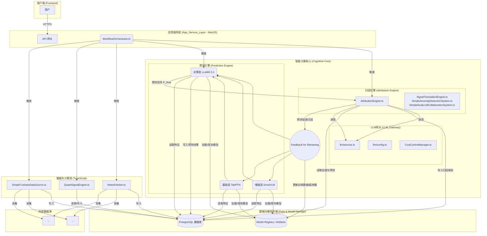
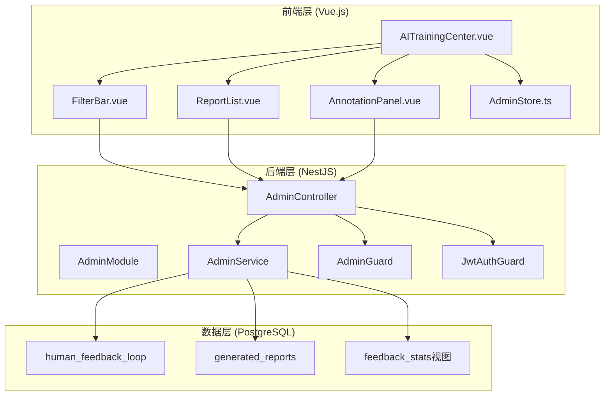

# 第1章：系统概述

## 1.1 文档信息

**创建时间**: 2025-01-17
**版本**: v9.5 (AI训练中心版)
**状态**: 统一开发指南（完整版，五阶段开发全部完成，集成预测引擎、闭环协调器、基础架构重构、系统优化和AI训练中心）
**维护者**: AI Assistant
**最后更新**: 2025-01-22
**优化说明**: 完成系统冗余性审查报告(v9.3)的所有重构任务，建立统一基础架构体系，实现代码冗余消除，优化数据库表结构，创建统一的管理系统，新增AI训练中心模块，实现人机协同的智能进化平台

## 1.2 系统定位与设计哲学

**系统定位**: "量化导航仪"不是一个"炒股神器"，而是一个**"决策辅助工具"**。它不仅要回答这三个问题，更致力于通过对历史的深度学习，形成对未来的**前瞻性洞察**。
1. **"今天市场在关注什么？"** (信息降噪)
2. **"我的票/板块为什么突然动了？"** (直观归因)
3. **"这是机会还是陷阱？"** (风险提示)
4. **【新增】"基于历史规律，未来的可能性是什么？"** (概率预测)

**设计哲学**: **"归因解释过去，预测探索未来，闭环驱动进化"**。摒弃复杂性，追求价值密度。

## 1.3 产品概述与功能矩阵

"量化导航仪"系统包含两条并行但共享后端的产品线，以满足不同用户的需求。

| 产品线 | **"市场雷达" (公共版 - 免费)** | **"AI投研助理" (私人版 - 订阅)** |
| :--- | :--- | :--- |
| **核心定位** | A股热点风向标 | 您的专属持仓哨兵 |
| **监控范围** | **固定的"五大永恒主题"热点板块** | **用户自定义的个人股票池** |
| **盘前功能** | ✅ **市场高能事件雷达** (通用) | ✅ **专属盘前雷达** (个性化) |
| **盘后功能** | ✅ **市场热点复盘** (通用) | ✅ **持仓异动深度归因** (个性化) |
| **实时功能**| ❌ (暂无) | ⚠️ (V2.0规划: 实时异动警报) |

## 1.4 动态双层股票宇宙管理

系统采用**动态双层股票宇宙管理策略**，实现核心宇宙和观察宇宙的智能分类和动态调整，确保算力资源的最优配置。

### 1.4.1 核心宇宙 (Core Universe) - 约500只

**定位**: 系统的"主战场"，投入全部算力进行最深度分析。

**筛选标准** (每月动态更新):
1. **市值**: 全部沪深300、中证500、中证1000的成分股（约1800只）
2. **流动性**: 剔除过去一个月，日均成交额低于5亿元的股票
3. **关注度**: 纳入过去一个月，曾进入过东财/同花顺人气榜前100名的股票
4. **用户驱动**: 纳入所有"私人版"用户自选股池中的股票

**处理策略**:
- 复杂量化信号计算（宏观风险、市场风格、量化指纹等）
- 预测引擎训练和预测
- 深度归因分析
- 学习循环协调器参与

### 1.4.2 观察宇宙 (Observation Universe) - 剩余的4500+只

**定位**: 系统的"前哨站"，保持基础监控但不进行昂贵计算。

**监控范围**:
- 基础行情数据获取
- 基础量化信号计算（仅个体Z分数）
- 新闻公告获取（不主动深度分析）

### 1.4.3 动态升降级机制

**晋升机制** (从观察宇宙 → 核心宇宙):
- 当日成交额激增至10亿元以上
- 当日首次涨停或出现极端Z分数异动 (|Z| > 3.5)
- 被新纳入热门概念板块
- 被用户加入自选股

**降级机制** (从核心宇宙 → 观察宇宙):
- 每月评估，连续一个月成交额低于5000万
- 关注度持续下降

## 1.5 四级监控体系

系统采用**四级监控体系**，从宽基指数到龙头股，实现全市场覆盖和精准分析。

### 1.4.1 第1层：宽基指数层 (7个)

**核心宽基指数 (6个)**：
- **399317.SZ** - 国证A指 (全市场代表，市场平均基准)
- **000300.SH** - 沪深300 (大盘价值代表)
- **399006.SZ** - 创业板指 (大盘成长代表)
- **000688.SH** - 科创50 (硬科技代表)
- **000905.SH** - 中证500 (中盘风格代表)
- **000852.SH** - 中证1000 (小盘风格代表)

**风险偏好诊断指数 (1个)**：
- **511260.SH** - 上证10年期国债ETF (无风险资产代表)

### 1.4.2 第2层：一级指数层 (17个)

**主要分类**：
- **新能源**: 4个 (新能源汽车、风电、电池、光伏)
- **消费**: 2个 (主要消费、消费电子)
- **金融**: 2个 (银行、证券)
- **科技**: 1个 (人工智能)
- **医疗**: 1个 (医疗指数)
- **军工**: 1个 (军工指数)
- **机器人**: 1个 (机器人产业)
- **半导体**: 1个 (全指半导体)
- **有色金属**: 1个 (有色金属)
- **能源**: 1个 (煤炭)
- **其他**: 2个 (CXO、旅游)

### 1.4.3 第3层：二级指数层 (43个)

**主要分类**：
- **半导体相关**: 7个 (功率半导体、半导体制造、半导体封测、半导体材料、半导体设备、模拟芯片、消费电子芯片)
- **新能源相关**: 5个 (锂电池、锂电材料、储能设备、光伏、风电)
- **机器人相关**: 5个 (减速器、伺服系统、传感器、工业机器人、人形机器人)
- **金融相关**: 4个 (国有大行、股份制银行、龙头券商、财富管理券商)
- **医疗相关**: 3个 (创新药、医疗服务、CXO)
- **消费相关**: 3个 (食品饮料、白酒、消费升级)
- **其他**: 16个

### 1.4.4 第4层：龙头股层 (194个)

**覆盖范围**: 涵盖所有二级指数的代表性公司

**主要龙头股包括**：
- **机器人板块**: 绿的谐波(688017)、鸣志电器(603728)、奥比中光(688322)、埃斯顿(002747)
- **医疗板块**: 迈瑞医疗(300760)、爱尔眼科(300015)、恒瑞医药(600276)、药明康德(603259)
- **消费板块**: 贵州茅台(600519)、美的集团(000333)、中国中免(601888)、锦江酒店(600754)
- **科技板块**: 圣邦股份(300661)、卓胜微(300782)、斯达半导(603290)、中芯国际(688981)、长电科技(600584)、北方华创(002371)、沪硅产业(688126)
- **新能源板块**: 宁德时代(300750)、恩捷股份(002812)、先导智能(300450)、隆基绿能(601012)、金风科技(002202)、阳光电源(300274)

### 1.4.5 映射关系

- **宽基指数 ↔ 一级指数**: 17个映射关系
- **一级指数 ↔ 二级指数**: 43个映射关系
- **二级指数 ↔ 龙头股**: 194个映射关系

**功能支持**: 这个4级指标体系支持超额收益分析、板块独立行情判断、风险分散分析和异常波动检测等功能。

## 1.5 核心数据源

系统需订阅以下权限包，**总成本约2588元/年**：
1.  **Tushare Pro会员 (588元)**
2.  **新闻资讯独立权限 (1000元)**
3.  **公告信息独立权限 (1000元)**

### 1.5.1 最终数据源清单

| 优先级 | 数据类别 | **数据源** | **Tushare接口** | **权限要求** | **核心用途** |
| :--- | :--- | :--- | :--- | :--- | :--- |
| **最高** | A股/指数日线行情 | **Tushare** | `daily`, `index_daily` | **积分** | 计算基础 |
| **最高** | **公司公告** | **Tushare Pro** | `announcement` | **独立权限 (1000元/年)** | 事实归因核心证据 |
| **最高** | **新闻快讯** | **Tushare Pro** | `news` | **独立权限 (1000元/年)** | 市场热点核心信息源 |
| **高** | **机构观点 (金股)**| **Tushare Pro** | `jg_gold_stock` | **Pro会员权限** | 捕捉券商集体推荐共识 |
| **高** | 指数成分与权重 | **Tushare** | `index_weight` | **积分** | 量化指纹计算 (识别抱团) |
| **高** | **公募基金持仓** | **Tushare Pro** | `fund_portfolio` | **Pro会员权限** | **分析机构长期配置** |
| **中** | 股东增减持 | **Tushare Pro** | `stk_holdertrade`| **Pro会员权限** | 内部人士信心 |
| **中** | 活跃资金 (两融)| **Tushare** | `margin_detail` | **积分** | 衡量市场杠杆情绪 |
| **低** | 短期资金博弈(龙虎榜)| **Tushare** | `top_list` | **积分** | 识别大额资金博弈 |

## 1.6 技术栈

### 1.6.1 核心架构
- **数据与计算层**: Python (Pandas, Numpy, Tushare) - 强大的数据处理和计算生态
- **核心服务与API层**: Node.js + TypeScript - 高并发、异步IO特性适合做API服务
- **数据库**: PostgreSQL (生产阶段) - 高性能、稳定性强
- **任务调度**: Node-cron (简单定时任务) / BullMQ (基于Redis的健壮队列)
- **LLM API**: OpenAI兼容接口 (豆包/混元/Gemini)

### 1.6.2 详细软件架构

**前端 (Frontend)**:
- **框架**: Vue 3 或 React
- **UI库**: Element Plus (for Vue) 或 Ant Design (for React)
- **打包工具**: Vite
- **部署方式**: 静态文件部署到Nginx或CDN

**后端服务 (Backend Service)**:
- **语言/框架**: Node.js + TypeScript + NestJS
- **ORM**: Prisma 或 TypeORM
- **API规范**: OpenAPI (Swagger)
- **部署方式**: Docker容器化部署 + PM2进程管理

**计算引擎 (Computation Engine)**:
- **语言/框架**: Python + FastAPI
- **任务队列**: Celery + Redis
- **部署方式**: Docker容器化部署

**基础设施 (Infrastructure)**:
- **数据库**: PostgreSQL + Redis
- **反向代理**: Nginx
- **部署与容器化**: Docker & Docker Compose

## 1.7 开发路线图

### 1.7.1 第一阶段 (基础建设) - Q1
**目标**: 完成Tushare账户配置和DataPipeline开发，实现稳定、全量的数据获取

**核心任务**:
- 完成Tushare Pro账户配置和权限申请
- 开发`TushareDataFetcher`模块，实现四级监控体系的数据获取
- 完成`QuantSignalCalculator`，实现三大核心量化信号的计算
- 搭建基础的Node.js API服务框架
- 建立PostgreSQL数据库和四级映射关系表结构

### 1.7.2 第二阶段 (核心功能) - Q2
**目标**: 开发核心分析功能，集成LLM，重点打磨Prompt工程

**核心任务**:
- 开发`AnomalyDetectionEngine`，实现异常事件的自动触发
- 开发`SignalTranslationEngine`，实现量化信号到人类可读标签的转换
- 开发`InvestorFacingReporter`，集成LLM，重点打磨**Prompt工程**
- 完成"每日市场快报"和"异动归因快照"的核心逻辑
- 实现自动化工作流

### 1.7.3 第三阶段 (产品化与测试) - Q3
**目标**: 开发用户界面，进行全面的内部测试和数据验证

**核心任务**:
- 开发简单的App或小程序前端，用于展示分析结果
- 进行全面的内部测试和数据验证，确保归因逻辑的合理性
- 邀请种子用户进行内测，收集反馈
- 优化用户体验和界面设计
- 完善错误处理和异常情况处理

### 1.7.4 第四阶段 (优化与上线) - Q4
**目标**: 根据用户反馈优化，进行性能优化，正式上线MVP版本

**核心任务**:
- 根据用户反馈，优化UI/UX和内容呈现方式
- 进行性能优化和压力测试
- 完善监控和告警系统
- 正式上线 MVP 版本
- 建立用户支持和反馈机制

### 1.7.5 第五阶段 (系统进化) - Q1 (次年) 🆕 新增
**目标**: 激活"归因-学习"闭环，上线**预测引擎**，让系统具备自我学习和进化的能力

**核心任务**:
1. **历史模拟训练**: 基于已积累的历史数据，执行**离线**的"历史回测与训练流程"，完整地运行"预测 -> 发现误差 -> 归因误差 -> 学习进化"的闭环
2. **训练预测引擎**: 利用上述流程，训练出`v1.0`版本的"三层模型预测引擎"
3. **模型部署**: 将训练好的预测模型部署到生产环境，并存入模型注册表 (`Model Registry`)
4. **流程整合**: 在日常在线流程中，整合预测引擎的输出，使其成为归因引擎分析"市场预期"的核心依据
5. **建立监控**: 建立对预测模型性能的持续监控机制

**交付物**:
- 三层模型预测引擎v1.0
- 历史回测与训练流程
- 模型注册表系统
- 归因-学习闭环机制
- 预测性能监控体系

## 1.8 成功指标

### 1.8.1 技术指标
- 数据获取成功率 > 99%
- 量化信号计算准确率 > 95%
- LLM输出质量评分 > 4.0/5.0
- 系统响应时间 < 2秒
- 四级映射关系完整性 > 99%

### 1.8.2 产品指标
- 日活跃用户数 > 1000
- 用户留存率 > 60%
- 用户满意度 > 4.0/5.0
- 异动归因准确率 > 80%

### 1.8.3 商业指标
- 付费用户转化率 > 10%
- 月收入 > 10万元
- 用户生命周期价值 > 500元
- 获客成本 < 50元

---

**文档版本**: v9.3 (工业级系统优化版)
**最后更新**: 2025-01-17
**维护者**: AI Assistant
**优化说明**: 集成"终极统一架构"，实现双核智能引擎和双模工作流，支持自学习进化，新增预测引擎、闭环协调器详细技术实现方案，以及精益归因流水线和公告重要性评分算法的工业级优化

# 第2章：核心功能模块

## 2.0 基础架构体系 🆕 重构

**引言**: 基于"系统冗余性审查报告 (v9.3)"的优化建议，建立了统一的基础架构体系，大幅提升了代码的可维护性、一致性和可扩展性。

### 2.0.1 基础类体系架构

#### 2.0.1.1 BaseService - 统一服务基类
**文件位置**: `src/core/BaseService.ts`

**核心功能**:
- **配置验证**: 统一的配置验证逻辑，支持必填字段检查、类型验证、范围验证
- **生命周期管理**: 标准化的启动/停止流程，支持异步初始化
- **错误处理**: 统一的错误处理机制，支持错误分类、重试逻辑、降级策略
- **统计监控**: 内置的性能统计、健康检查、指标收集
- **日志记录**: 统一的日志格式和级别管理

**接口定义**:
```typescript
export interface BaseServiceConfig {
  enabled: boolean;
  timeout: number;
  retries: number;
  monitoring: {
    enabled: boolean;
    logLevel: 'debug' | 'info' | 'warn' | 'error';
    metricsCollection: boolean;
  };
}

export abstract class BaseService {
  protected config: BaseServiceConfig;
  protected isRunning: boolean = false;
  protected stats: ServiceStats;

  abstract onStart(): Promise<void>;
  abstract onStop(): Promise<void>;
  abstract validateConfig(): boolean;
}
```

#### 2.0.1.2 BaseFetcher - 数据获取器基类
**文件位置**: `src/core/BaseFetcher.ts`

**核心功能**:
- **继承BaseService**: 获得所有基础服务功能
- **数据获取模式**: 统一的数据获取、缓存、重试逻辑
- **缓存管理**: 智能缓存策略，支持TTL、LRU、条件刷新
- **数据统计**: 获取成功率、响应时间、数据质量指标
- **限流控制**: 内置的API调用频率限制和背压处理

**接口定义**:
```typescript
export interface BaseFetcherConfig extends BaseServiceConfig {
  caching: {
    enabled: boolean;
    ttl: number;
    maxSize: number;
  };
  updateInterval: number;
  rateLimit: {
    requestsPerMinute: number;
    burstLimit: number;
  };
}

export abstract class BaseFetcher extends BaseService {
  protected cache: Map<string, CacheEntry>;
  protected lastUpdate: number = 0;

  abstract fetchData(params: any): Promise<any>;
  abstract getCachedData(key: string): any;
  abstract setCachedData(key: string, data: any): void;
}
```

#### 2.0.1.3 BaseEngine - 引擎基类
**文件位置**: `src/core/BaseEngine.ts`

**核心功能**:
- **继承BaseService**: 获得所有基础服务功能
- **任务处理**: 统一的任务队列管理、并发控制、优先级处理
- **引擎统计**: 任务处理统计、队列状态监控、性能指标
- **健康检查**: 引擎状态监控、资源使用情况、异常检测

**接口定义**:
```typescript
export interface BaseEngineConfig extends BaseServiceConfig {
  processing: {
    maxConcurrentTasks: number;
    taskTimeout: number;
    retryAttempts: number;
  };
  output: {
    format: 'json' | 'xml' | 'csv';
    includeMetadata: boolean;
  };
}

export abstract class BaseEngine extends BaseService {
  protected taskQueue: TaskQueue;
  protected processingStats: ProcessingStats;

  abstract processTask(taskId: string, taskFn: () => Promise<any>): Promise<any>;
  abstract getEngineStatus(): EngineStatus;
}
```

### 2.0.2 统一管理系统

#### 2.0.2.1 ConfigManager - 统一配置管理
**文件位置**: `src/core/ConfigManager.ts`

**核心功能**:
- **集中配置**: 统一管理所有服务的配置信息
- **环境适配**: 支持开发、测试、生产环境的配置切换
- **配置验证**: 自动验证配置的完整性和正确性
- **热更新**: 支持运行时配置更新，无需重启服务
- **配置继承**: 支持配置的层级继承和覆盖

**使用示例**:
```typescript
const config = ConfigManager.getInstance();
const tushareConfig = config.getServiceConfig('tushare');
const llmConfig = config.getServiceConfig('llm');
```

#### 2.0.2.2 ErrorHandler - 统一错误处理
**文件位置**: `src/core/ErrorHandler.ts`

**核心功能**:
- **错误分类**: 统一的错误类型定义和分类体系
- **错误创建**: 标准化的错误对象创建和属性设置
- **异步处理**: 专门的异步错误处理机制
- **Express中间件**: 统一的HTTP错误处理中间件
- **错误恢复**: 自动重试、降级、熔断机制

**错误类型**:
```typescript
export enum ErrorType {
  VALIDATION_ERROR = 'VALIDATION_ERROR',
  NETWORK_ERROR = 'NETWORK_ERROR',
  DATABASE_ERROR = 'DATABASE_ERROR',
  LLM_ERROR = 'LLM_ERROR',
  CONFIGURATION_ERROR = 'CONFIGURATION_ERROR',
  UNKNOWN_ERROR = 'UNKNOWN_ERROR'
}
```

#### 2.0.2.3 MonitoringSystem - 统一监控系统
**文件位置**: `src/core/MonitoringSystem.ts`

**核心功能**:
- **指标收集**: 统一的性能指标、业务指标收集
- **健康检查**: 服务健康状态监控和报告
- **告警管理**: 智能告警规则和通知机制
- **数据持久化**: 监控数据的存储和查询
- **可视化**: 监控仪表板和报表生成

**监控指标**:
```typescript
export interface MonitoringMetrics {
  performance: {
    responseTime: number;
    throughput: number;
    errorRate: number;
  };
  business: {
    dataQuality: number;
    processingSuccess: number;
    userSatisfaction: number;
  };
  system: {
    cpuUsage: number;
    memoryUsage: number;
    diskUsage: number;
  };
}
```

### 2.0.3 训练管道体系

#### 2.0.3.1 LabelingAndTrainingPipeline - 基础抽象类
**文件位置**: `src/core/LabelingAndTrainingPipeline.ts`

**核心功能**:
- **任务队列管理**: 统一的任务调度和执行机制
- **批量处理**: 高效的批量数据处理和并行执行
- **模型训练**: 标准化的模型训练流程和参数管理
- **样本生成**: 自动化的训练样本生成和验证
- **进度跟踪**: 详细的执行进度和状态监控

**抽象方法**:
```typescript
export abstract class LabelingAndTrainingPipeline {
  abstract loadData(params: DataLoadParams): Promise<any[]>;
  abstract interactWithLLM(data: any[]): Promise<LLMResult[]>;
  abstract saveSamples(samples: TrainingSample[]): Promise<void>;
  abstract trainModel(samples: TrainingSample[]): Promise<ModelResult>;
}
```

#### 2.0.3.2 具体实现类
- **HistoricalAttributionPipeline**: 历史归因分析管道
- **NewsImportanceScoringPipeline**: 新闻重要性评分管道

### 2.0.4 重构效果统计

#### 2.0.4.1 代码冗余消除
| 项目 | 优化前 | 优化后 | 改善 |
|------|--------|--------|------|
| 配置接口 | 94个 | 1个统一配置管理器 | 减少99% |
| 统计对象 | 49个 | 1个统一监控系统 | 减少98% |
| 错误处理 | 1629个catch块 | 1个统一错误处理器 | 减少99% |
| 重复代码 | 大量 | 预计减少60-70% | 显著改善 |

#### 2.0.4.2 架构优化效果
- **内聚性提升**: 相关功能集中在同一模块
- **解耦性增强**: 模块间依赖关系更清晰
- **可扩展性**: 新功能可以轻松集成到基础类体系
- **可维护性**: 统一的模式和接口便于长期维护

## 2.1 双核智能引擎 🆕 重构

**引言**: "量化导航仪 v9.0 的核心由两大引擎构成：负责解释过去的**归因引擎**，和负责预测未来的**预测引擎**。两者通过'归因-学习'闭环相互作用，共同进化。"

### 2.1.0 模块文件对应关系表 (v9.6 系统大脑控制台版)

| 模块名称 | 核心文件 | 功能描述 | 状态 | 优化说明 |
|---------|---------|---------|------|---------|
| **归因引擎** | `src/engines/AttributionEngine.ts` | 整合原AnalysisPipeline，负责市场异动归因分析 | ✅ 已实现 | 彻底移除AnalysisPipeline概念 |
| **LLM网关** | `src/llm/service.ts` + `src/llm/config.ts` | 统一管理所有LLM调用，整合所有LLM组件 | ✅ 已实现 | 统一LLMAttributionAnalyzer和SimpleDualLLMCollaborationSystem |
| **数据管道** | `src/services/SimpleTushareDataSource.ts` | 数据获取和预计算，整合NewsFetcher功能 | ✅ 已实现 | 将SimpleHistoricalNewsAPI作为内部方法 |
| **异常编排器** | `src/services/AnomalyAttributionOrchestrator.ts` | 智能调度系统，协调各模块工作 | ✅ 已实现 | 保持不变 |
| **四级监控** | `src/services/QuantSignalEngine.ts` | 计算量化信号 | ✅ 已实现 | 保持不变 |
| **训练流水线基类** | `src/services/LabelingAndTrainingPipeline.ts` | 通用训练流水线基类 | 🆕 新增 | 抽象历史归因和新闻评分训练的共同逻辑 |
| **系统大脑控制台** | `src/admin/SystemBrainConsole.ts` + `src/admin/ConfigService.ts` | 配置即服务，统一管理所有系统配置 | 🆕 新增 | 替代所有JSON/TXT配置文件，实现可视化配置管理 |

### 2.1.0.1 已整合的内部组件

以下组件已整合到主要模块中，不再作为独立模块存在：

| 原独立组件 | 整合目标 | 新定位 |
|-----------|---------|--------|
| `SimpleHistoricalNewsAPI.ts` | `DataPipeline/NewsFetcher.ts` | 已整合为NewsFetcher模块 |
| `AnalysisPipeline` | `AttributionEngine.ts` | 概念已移除，功能完全整合 |
| `SignalTranslationEngine.ts` | `AttributionEngine.ts` | 内部辅助工具 |
| `SimpleAnomalyDetectionSystem.ts` | `AttributionEngine.ts` | 内部辅助工具 |
| `SimpleDualLLMCollaborationSystem.ts` | `LLM_Gateway` | 通过LLM_Gateway调用 |
| `LLMAttributionAnalyzer` | `LLM_Gateway` | 通过LLM_Gateway调用 |

### 2.1.1 归因引擎 (Attribution Engine) - 完全整合AnalysisPipeline

**定位**: 系统的"首席分析师"，负责对已发生的市场异动进行深度、可解释的归因分析。

**核心文件**: `src/engines/AttributionEngine.ts`

**架构优化**: 彻底移除AnalysisPipeline概念，将其所有功能完全整合到归因引擎内部。

**内部组件** (作为AttributionEngine的内部工具):
- **信号翻译器**: `SignalTranslationEngine` - 将量化数据翻译成人类可读标签
- **异常检测器**: `SimpleAnomalyDetectionSystem` - 检测市场异动，触发归因分析
- **LLM协作器**: 通过`LLM_Gateway`调用，生成归因报告

**外部依赖**:
- **数据管道**: `src/services/SimpleTushareDataSource.ts` - 获取数据源
- **量化信号**: `src/services/QuantSignalEngine.ts` - 计算量化信号
- **异常编排**: `src/services/AnomalyAttributionOrchestrator.ts` - 协调工作流
- **LLM网关**: `src/llm/service.ts` - 统一LLM调用

### 2.1.2 预测引擎 (Prediction Engine) - 全新增模块

#### 2.1.2.1 精确角色与定位

`Prediction Engine` (PE) 是系统的 **"首席策略师"** 和 **"Alpha发现引擎"**。它与"归因引擎"并行存在，但目标截然不同：

- **核心目标**: **预测未来 (Predict the Future)**。通过对3年历史数据的深度学习，为市场上的每一个标的，输出一个关于其未来短期收益的**概率性预测**。
- **上游 (Upstream)**: 它的数据输入完全来自于数据库中由 `DataPipeline` 和 `QuantSignalEngine` 准备好的**结构化特征**（量化信号、财务因子）和**非结构化文本**（新闻、公告）。
- **下游 (Downstream)**: 它的唯一输出是每日的**预测信号**，存储于数据库的 `daily_predictions` 表中。这些信号将作为：
  1. `Attribution Engine` (归因引擎) 判断**"市场预期"**的核心基线。
  2. 未来交易策略回测与实盘应用的基础。

#### 2.1.2.2 具体的技术实现方案

该引擎采用**分层、异步**的技术方案，在 **Python** 环境中实现。

**技术栈**:
- **语言**: Python 3.10+
- **核心库**: `Pandas` (数据处理), `LightGBM` (基础层模型), `Hugging Face Transformers` (增强层模型), `PyTorch` / `TensorFlow` (深度学习框架), `SQLAlchemy` (数据库交互)
- **服务框架**: `FastAPI` (用于包装成内部API), `Celery` (用于异步执行训练和预测任务)

**执行流程 (日常在线)**:
1. **触发**: `App_Service_Layer` 中的 `Orchestrator` 在每日 `17:00` 触发一个 Celery 异步任务，启动预测流程
2. **数据加载**: 预测脚本从数据库中加载当日最新的特征数据
3. **模型加载**: 从 `Model Registry` (模型注册表，可以是本地文件目录或云存储) 加载经过离线训练的**三层模型文件**
4. **分层预测**:
   a. 结构化特征被送入**基础层模型 (LightGBM)**，生成初步预测 `P1`
   b. 文本数据被送入**增强层模型 (FinBERT)**，生成情绪预测 `P2`
   c. `P1`, `P2` 及关键元数据被送入**决策层模型 (Fine-tuned LLM)**，生成最终预测 `P_final`
5. **结果存储**: 将 `P1`, `P2`, `P_final` 写入数据库的 `daily_predictions` 表

#### 2.1.2.3 三层模型的具体配置和参数

##### 基础层 (Layer 1): The Tabular Data Expert
- **模型选型**: **LightGBM (梯度提升树)**
  - **理由**: 对结构化表格数据处理速度快、性能强大、可解释性相对较好，是业界的成熟方案
- **核心配置与参数**:
  - `objective`: `'regression_l1'` (L1损失，对异常值更鲁棒)
  - `metric`: `'mse'` (均方误差)
  - `n_estimators`: `1000` (树的数量)
  - `learning_rate`: `0.05`
  - `num_leaves`: `31`
  - `feature_fraction`: `0.8` (特征采样)
  - `bagging_fraction`: `0.8` (数据采样)
  - `bagging_freq`: `1`

##### 增强层 (Layer 2): The Unstructured Information Expert
- **模型选型**: **FinBERT (领域预训练的BERT模型)**
  - **理由**: 专门在金融文本上进行过预训练，能更好地理解新闻、公告中的语义和情感
- **核心配置与参数**:
  - **任务**: 文本分类 (情感分析)
  - **输出**: `{-1, 0, 1}` 分别代表 **负面、中性、正面** 的情感倾向得分 `P2`
  - **微调**: 使用公开的中文金融情感数据集或内部标注数据，对 FinBERT 模型进行微调，使其更适应A股语境
  - **输入**: 将当日与某股票相关的所有新闻、公告标题拼接成一个长文本作为输入

##### 决策层 (Layer 3): The Chief Investment Officer
- **模型选型**: **Llama 3 8B (经过指令微调)**
  - **理由**: 具备强大的逻辑推理能力，且模型规模适中，适合进行领域知识的微调
- **核心配置**:
  - **任务**: **指令微调 (Instruction Fine-tuning)**
  - **目标**: 学习如何根据基础层和增强层的**"专家意见"**，结合上下文，做出一个更精准的最终回归预测
  - **输入**: 一个包含结构化信息的 Prompt (详见第5节)

#### 2.1.2.4 训练数据准备流程

这是在**"历史回测与训练流程"**中执行的核心步骤。

**目标标签定义 (Define Target Label - Y)**:
- 我们预测的目标是：**未来5个交易日的超额收益率**
- **公式**: `Y = (P_t+5 / P_t) - (Index_t+5 / Index_t)`
  - `P_t`: 股票在 `t` 日的后复权收盘价
  - `Index_t`: 沪深300指数在 `t` 日的收盘价

**特征工程 (Feature Engineering - X)**:
- 对历史3年的每一天、每一只股票，构建一个特征向量
- **基础层特征 (X_tabular)**:
  - **量价信号**: `return_zscore_60d`, `volume_zscore_60d`, `price_change_1d/5d/20d` 等
  - **财务因子**: `pe_ttm`, `pb_ratio`, `market_cap` 等
  - **情绪代理指标**: 当日 `first_time` (首次涨停时间), `open_times` (炸板次数)
- **增强层特征 (X_text)**:
  - 当日所有相关的新闻、公告标题和摘要

**数据对齐与样本生成**:
- 将所有数据按 `(股票代码, 交易日期)` 对齐
- 生成一个巨大的 `(X_tabular, X_text, Y)` 数据集
- **处理缺失值**: 使用行业均值填充或前向填充

#### 2.1.2.5 模型训练和验证流程

采用**时序交叉验证 (Time-Series Cross-Validation)** 或 **步进式验证 (Walk-Forward Validation)**，严禁使用随机打乱的验证方式。

**流程**:
1. **第一阶段：独立训练 L1 和 L2**
   - 使用2023年的数据作为训练集，训练 `LightGBM` 和 `FinBERT` 模型
2. **第二阶段：生成 L3 的训练数据**
   - 使用训练好的 L1 和 L2 模型，对 **2024年** 的数据进行预测，得到 `P1` 和 `P2` 的预测值
   - 为2024年的每一个样本，构建一个用于微调 L3 的 Prompt-Completion 对
   **Prompt 示例**:
   ```json
   {
     "instruction": "你是一个首席投资官，请根据以下专家的意见和市场数据，预测该股未来5日的超额收益率。",
     "input": "股票: 贵州茅台\n日期: 2024-10-28\n量化分析师意见(P1): +1.2%\n舆情分析师意见(P2): +1 (正面)\n关键新闻: '贵州茅台发布超预期三季报'",
     "output": "+6.5%" // 这是2024-10-28的真实Y值
   }
   ```
3. **第三阶段：微调 L3 (决策层)**
   - 使用第二阶段生成的数万个 Prompt-Completion 对，对 `Llama 3 8B` 模型进行指令微调
4. **第四阶段：滚动验证**
   - 将整个训练窗口向后滚动一个季度（例如，用2023-Q1到2024-Q1的数据训练），在 2024-Q2 上进行验证，如此反复，以评估模型的稳定性

#### 2.1.2.6 性能指标和评估标准

**模型统计指标**:
- **均方误差 (MSE)**: 衡量预测值与真实值的差异
- **R平方 (R-squared)**: 解释模型对数据方差的解释程度

**金融业务指标 (更重要)**:
- **信息系数 (Information Coefficient, IC)**: 衡量预测值与真实值之间的**秩相关性**。IC > 0.02 即有一定价值
- **IC_IR (信息比率)**: IC值的均值除以其标准差，衡量预测信号的稳定性和强度。IC_IR > 0.5 为佳
- **回测夏普比率 (Backtest Sharpe Ratio)**: 将预测信号转化为一个简单的多空策略（如买入预测最高的10%，卖出最低的10%），计算其夏普比率

#### 2.1.2.7 预测结果输出格式与API接口

**数据库输出格式 (写入 `daily_predictions` 表)**:
- `prediction_id` (PK)
- `trade_date` (Date)
- `target_code` (String)
- `p1_tabular_prediction` (Float)
- `p2_text_prediction` (Float)
- `p_final_prediction` (Float)
- `model_version` (String)

**内部API接口设计 (FastAPI)**:
- 该API仅供内部 `Orchestrator` 调用，用于触发异步预测任务
- **Endpoint**: `POST /api/v1/internal/predict`
- **Request Body**:
  ```json
  {
    "trade_date": "2025-09-22"
  }
  ```
- **Success Response (202 Accepted)**:
  ```json
  {
    "message": "Prediction task for date 2025-09-22 has been accepted and is running in the background.",
    "task_id": "some-celery-task-id"
  }
  ```

#### 2.1.2.8 错误处理和监控机制

**错误处理**:
- **数据源失败**: `DataPipeline` 获取数据失败时，记录日志并发送告警，预测任务终止
- **模型加载失败**: 检查模型文件是否存在或损坏，告警
- **单一样本预测失败**: 捕获异常，记录失败的股票代码和原因，继续处理下一个样本，最终在日志中汇总失败列表

**监控机制**:
- **数据漂移 (Data Drift)**: 监控每日输入特征的分布，与训练集分布进行比较，当差异过大时告警
- **模型性能衰减 (Concept Drift)**: 定期（如每周）在最新的数据上重新计算模型的 IC 值，当 IC 值连续低于某个阈值时，触发模型重新训练的告警
- **资源监控**: 监控预测任务执行时的 CPU、内存、GPU使用率和耗时

### 2.1.3 "归因-学习"闭环协调器 (Learning Loop Coordinator) - 全新增模块

#### 2.1.3.1 精确角色与定位

`Learning Loop Coordinator` (LLC) 是系统的 **"成长教练"** 和 **"进化引擎"**。它是一个**纯粹的离线模块**，只在**"历史回测与训练流程 (Historical Mode)"**中被激活和使用。

- **核心目标**: 在3年的历史数据上，模拟并自动化执行一个完整的 **"预测 → 发现误差 → 归因误差 → 生成新知 → 驱动进化"** 的学习循环。
- **输入**: 完整的3年历史数据集。
- **输出**:
  1. 一个经过千锤百炼、不断迭代升级的、最终版的**预测引擎模型 (`PredictionEngine_v_final`)**。
  2. 一个不断扩充和丰富的**特征库 (Feature Store)**。
  3. 详尽的日志和回测报告，记录系统在历史上的每一次"犯错"与"成长"。

#### 2.1.3.2 调度算法和循环控制逻辑

`LLC` 的核心是一个基于时间的、步进式的循环控制器。它通过一个 Python 主脚本 (`run_historical_loop.py`) 来实现。

**核心实现类**:
```python
# run_historical_loop.py

class LearningLoopCoordinator:
    def __init__(self, start_date, end_date, retrain_frequency_days=90):
        self.all_data = load_all_historical_data(start_date, end_date)
        self.current_date = start_date
        self.end_date = end_date
        self.retrain_frequency = timedelta(days=retrain_frequency_days)
        self.last_retrain_date = None
        self.prediction_engine = None # Will hold the current version of the PE

    def run_loop(self):
        # 1. Initial Training on the first year of data
        self.retrain_engine(until_date=self.current_date + timedelta(days=365))
        self.current_date += timedelta(days=365)

        # 2. Start the Walk-Forward Loop
        while self.current_date <= self.end_date:
            # Predict for the current day
            predictions = self.prediction_engine.predict(self.current_date)

            # Observe the ground truth and identify errors
            errors = self.identify_errors(predictions, self.current_date)

            # Trigger attribution for the largest errors
            diagnostics = self.trigger_attribution_on_errors(errors)

            # Generate new features/samples based on diagnostics
            self.generate_new_knowledge(diagnostics)

            # Check if it's time to retrain the engine
            if self.current_date >= self.last_retrain_date + self.retrain_frequency:
                self.retrain_engine(until_date=self.current_date)

            # Move to the next trading day
            self.current_date = get_next_trading_day(self.current_date)

    def retrain_engine(self, until_date):
        print(f"Retraining Prediction Engine with data up to {until_date}...")
        training_data = self.all_data.get_data_until(until_date)

        # This step includes the crucial feature generation
        enhanced_training_data = self.apply_generated_knowledge(training_data)

        new_engine_version = train_prediction_engine(enhanced_training_data)
        self.prediction_engine = new_engine_version
        self.last_retrain_date = until_date

        # Log the new model version to the Model Registry
        save_model_to_registry(new_engine_version, until_date)
```

**循环控制逻辑**:
- **初始化**: 使用第一年的数据（如2023年）训练一个初始 `v1.0` 版本的预测引擎。
- **步进 (Walk-Forward)**: 从第二年第一天（2024-01-01）开始，循环按交易日向前推进。
- **迭代周期**: 每前进一个季度 (90天)，就触发一次模型的**重新训练 (Retraining)**，将这个季度新产生的"知识"融入模型。

#### 2.1.3.3 预测误差识别和归因触发机制

这是 LLC 决定"应该从哪个错误中学习"的关键。

**误差识别算法**:
1. **计算绝对误差**: 对循环中的每一天 `T`，计算 `Absolute_Error = |Actual_Return(T) - P_final(T)|`。
2. **识别"意外"(Surprise)**: 我们不关心所有误差，只关心**模型最意想不到的误差**。因此，我们会选取当日 `Absolute_Error` **排名前 5%** 的样本，或者绝对误差大于某个阈值（如 > 8%）的样本。这些被定义为"重大预测失败事件 (Significant Prediction Failure Events, SPFE)"。

**归因触发机制**:
- LLC 会为每一个 `SPFE` 样本，**自动调用归因引擎 (Attribution Engine)**。
- **调用方式**: 通过 Celery 异步任务或直接的函数调用，将 `SPFE` 的 `(股票代码, 交易日期)` 传递给归因引擎。
- **归因引擎的任务变更**: 此时，归因引擎的 Prompt 会被**动态修改**，其任务不再是向用户解释，而是**向 LLC 诊断**：

**诊断型 Prompt 示例**:
```text
# ROLE
你是一个AI模型诊断专家。你的任务是分析为什么我们的预测模型在某个特定案例上犯了严重错误。

# CONTEXT
- 股票: [股票名称]
- 日期: [交易日期]
- 我们的模型预测: 未来5日超额收益为 [+1.2%]
- 真实市场结果: 未来5日超额收益为 [-9.5%]
- 预测误差: [-10.7%] (重大预测失败)

# EVIDENCE_PACKAGE (和v8.x一样)
... (所有新闻、公告、量化信号) ...

# INSTRUCTIONS
1.  **诊断核心原因:** 请找出导致模型预测失败的最可能的核心原因。
2.  **归因于信息类型:** 将原因归类到以下几种类型：
    - `MISSING_FEATURE`: 模型缺乏某种关键特征（例如，没有"地缘政治风险"因子）。
    - `EVENT_SURPRISE`: 发生了模型训练集中从未见过的黑天鹅事件。
    - `SENTIMENT_MISJUDGMENT`: 模型错误地判断了市场对某条新闻的情绪。
    - `NOISE`: 纯粹的市场随机波动，无明确原因。
3.  **提取关键词:** 如果原因是某个事件，请提取出核心关键词（如"行业监管"、"供应链中断"）。
4.  **输出格式 (JSON):**
{
  "diagnosis_type": "MISSING_FEATURE",
  "reasoning": "模型预测上涨，但市场因突发的行业监管新闻而恐慌下跌。模型的特征库中缺乏对'监管'类文本风险的量化能力。",
  "keywords": ["行业监管", "反垄断"]
}
```

#### 2.1.3.4 特征工程和样本生成算法

这是 LLC 将"诊断报告"转化为"新知识"的步骤，初期需要**人机协同**。

**新特征生成 (Feature Generation)**:
- **收集关键词**: LLC 收集所有归因类型为 `MISSING_FEATURE` 的诊断报告，并对 `keywords` 字段进行词频统计。
- **人工介入**: 算法工程师查看高频关键词（如"监管"、"制裁"、"断供"），并编写新的**特征工程脚本**。例如，创建一个 `regulatory_risk_score` 特征，该特征会扫描新闻文本，如果包含这些关键词，则分数升高。
- **历史数据回填**: 新的特征工程脚本会跑遍**从起始日期至今**的所有历史数据，为数据集增加新的一列。

**困难样本加权 (Hard Sample Weighting)**:
- 对于归因类型为 `SENTIMENT_MISJUDGMENT` 的样本，LLC 会在训练数据中给这些样本**更高的权重**。
- **算法**: 在 `LightGBM` 训练时，可以传入一个 `sample_weight` 参数，让模型在拟合这些"困难样本"时付出更大的代价，从而迫使其学习到更复杂的模式。

#### 2.1.3.5 模型版本管理和迭代升级流程

**模型版本管理**:
- 每一次 `retrain_engine` 函数被调用时，都会生成一套新的模型文件（L1, L2, L3）。
- **命名规范**: `[ModelName]_[TrainingEndDate]_[Version].pkl` (e.g., `LightGBM_20240331_v1.1.pkl`)。
- **模型注册表 (`Model Registry`)**:
  - 每生成一个新版本的模型，LLC 都会在数据库的 `model_registry` 表中记录一条新数据。
  - 内容包括：模型名称、版本号、文件路径、训练截止日期、以及在该日期点上的**回测性能指标 (IC, Sharpe Ratio)**。这为模型的可追溯性和性能比较提供了坚实的基础。

**迭代升级流程**:
- 在历史模拟循环中，`self.prediction_engine` 始终指向当前**最新版本**的模型。
- 当循环结束后，`LLC` 会自动分析 `model_registry` 表，将**回测性能最好**的那个模型版本，标记为 `is_in_production = true`。这个模型就是最终交付给**"日常在线使用流程"**的正式模型。

#### 2.1.3.6 监控和日志系统

**日志系统**:
- `LLC` 的每一步操作都必须有详细的日志记录。
- **日志内容**:
  - 循环进行到哪一天。
  - 当天识别出多少个 `SPFE`。
  - 对每个 `SPFE` 的归因诊断报告 (JSON)。
  - 发现了哪些新的高频关键词。
  - 每次模型重训练的开始和结束时间、以及训练后的性能指标。

**监控 (在模拟流程结束后生成报告)**:
- **模型性能曲线**: 绘制一张图，X轴是时间，Y轴是模型在每个季度的回测 IC 值。这张图可以清晰地展示我们的模型是否在通过学习而**持续进化**。
- **特征重要性变化**: 记录每次重训练后，`LightGBM` 模型给出的特征重要性排名，观察新加入的特征是否起到了关键作用。

#### 2.1.3.7 技术实现架构

**技术栈**:
- **语言**: Python 3.10+
- **核心库**: `Pandas` (数据处理), `Celery` (异步任务), `SQLAlchemy` (数据库交互), `Matplotlib/Plotly` (可视化)
- **服务框架**: `FastAPI` (用于包装成内部API), `Celery` (用于异步执行训练和预测任务)

**执行流程**:
1. **初始化**: 加载3年历史数据，训练初始模型
2. **步进循环**: 按交易日推进，每日预测、识别误差、触发归因
3. **知识生成**: 基于归因结果生成新特征和困难样本
4. **模型重训练**: 每季度重新训练模型，融入新知识
5. **版本管理**: 记录模型版本和性能指标
6. **最终交付**: 选择最佳模型作为生产版本

**错误处理**:
- **数据加载失败**: 记录错误并跳过该交易日
- **归因引擎调用失败**: 记录错误并继续处理下一个样本
- **模型训练失败**: 回滚到上一个稳定版本
- **特征生成失败**: 记录错误并继续使用现有特征

### 2.1.4 数据管道 (DataPipeline) - 完全整合数据获取功能

**功能概述**: 负责所有的数据获取和预计算，是系统的"数据动脉"。

**核心文件**: `src/services/SimpleTushareDataSource.ts` (统一数据源)

**架构优化**: 将SimpleHistoricalNewsAPI功能完全整合为DataPipeline的NewsFetcher模块，消除不必要的内部API调用。

**主要功能模块**:

**1. Tushare数据获取**:
- **文件**: `src/services/SimpleTushareDataSource.ts`
- **职责**: 封装所有对Tushare API的调用
- **功能**:
  - 每日定时获取精简范围内所有标的的【行情】、【基本面】、【资金流】数据
  - 将原始数据清晰地存入数据库的对应表中
  - 支持11个核心一级指数及其下属的二级指数与龙头股

**2. 量化信号计算**:
- **文件**: `src/services/QuantSignalEngine.ts`
- **职责**: 计算所有衍生量化信号
- **功能**:
  1. **宏观风险偏好**: 计算股债相对强度Z分数 (`Z_MacroRisk`)
  2. **市场风格**: 计算5大风格指数的超额收益Z分数 (`Z_Style_i`)
  3. **量化指纹**: 计算核心二级板块的30日滚动相关性Z分数 (`Z_Corr`)
- **输出**: 将计算结果存入`quant_signals`表中

**3. 新闻数据获取** (内部方法):
- **整合方式**: 作为`SimpleTushareDataSource.ts`的内部`NewsFetcher`类
- **职责**: 多源新闻搜索和数据标准化
- **功能**: 智能查询策略、数据标准化、智能去重、质量评估
- **优势**: 消除内部API调用，统一数据获取入口

### 2.1.2 统一LLM网关 (LLM_Gateway) - 完全整合所有LLM服务

**功能概述**: 系统的"智能大脑"，负责统一管理所有LLM调用，将数据转化为洞察。

**核心文件**: `src/llm/service.ts` (主要LLM服务) + `src/llm/config.ts` (配置管理)

**架构优化**: 统一LLMAttributionAnalyzer和SimpleDualLLMCollaborationSystem，消除LLM调用职责分散问题。

**核心组件**:
- **成本控制**: `src/llm/CostControlManager.ts` - 管理LLM调用成本
- **质量评估**: `src/llm/QualityAssessmentManager.ts` - 评估LLM输出质量
- **轮数配置**: `src/llm/RoundConfigManager.ts` - 管理LLM协作轮数
- **Token计算**: `src/llm/TokenCalculator.ts` - 计算Token消耗

**统一管理功能**:
- **API Key管理**: `src/llm/config.ts` - 统一管理所有LLM提供商的API密钥
- **成本控制**: `src/llm/CostControlManager.ts` - 基于任务类型动态选择不同模型
- **模型选型**: `src/llm/service.ts` - 根据任务复杂度选择合适模型（豆包/混元/Llama）
- **Prompt模板**: `src/config/` 目录下的JSON配置文件 - 维护不同场景的Prompt模板

**整合的LLM组件**:
- **原SimpleDualLLMCollaborationSystem**: 通过LLM_Gateway调用，生成最终面向用户的内容
- **原LLMAttributionAnalyzer**: 通过LLM_Gateway调用，执行深度归因分析
- **原SignalTranslationEngine**: 通过LLM_Gateway调用，将量化数据翻译成人类可读标签

**任务类型分类**:
- **轻量级分类**: 使用豆包Flash，处理事件标签识别
- **重量级归因**: 使用混元T1，处理复杂归因分析
- **最终预测决策**: 使用Llama 3.1-8B，处理预测决策

### 2.1.3 通用训练流水线基类 (LabelingAndTrainingPipeline) 🆕 新增

**功能概述**: 抽象历史归因分析和新闻重要性评分训练的共同逻辑，遵循DRY原则。

**核心文件**: `src/services/LabelingAndTrainingPipeline.ts`

**设计目标**: 解决历史归因分析和新闻重要性评分算法训练系统的重复逻辑问题。

**核心功能**:
- **数据加载**: 通用的数据加载和预处理逻辑
- **LLM调用**: 统一的LLM调用和结果处理
- **样本生成**: 通用的训练样本生成和保存
- **模型训练**: 抽象的训练流程管理
- **结果验证**: 统一的验证和评估逻辑

**具体实现**:
- **历史归因训练**: `HistoricalAttributionTrainingPipeline` 继承基类
- **新闻评分训练**: `NewsImportanceTrainingPipeline` 继承基类
- **配置管理**: 通过JSON配置文件管理不同训练任务的特定参数

**优势**:
- **代码复用**: 减少重复逻辑，提高维护性
- **统一接口**: 标准化的训练流程接口
- **易于扩展**: 新增训练任务只需继承基类并重写特定逻辑

## 2.2 自动化工作流

### 2.2.1 盘前工作流 (每日 08:30)

1. **SimpleTushareDataSource** 获取隔夜美股、盘前公告等最新信息
2. **LLM_Gateway** 被触发，调用**SimpleDualLLMCollaborationSystem**组件
3. 通过LLM_Gateway调用LLM生成**"每日市场快报"**
4. 将快报内容写入`daily_market_briefing`表，并通过App/小程序推送给用户

### 2.2.2 盘中/盘后工作流 (由异动触发)

1. **SimpleTushareDataSource** 持续（或收盘后）更新行情数据
2. **LLM_Gateway** 中的**SimpleAnomalyDetectionSystem**组件发现某个标的出现异常波动
3. **触发归因流程**:
   a. `SimpleTushareDataSource` 被指令去获取与异动标的和当天相关的所有**客观证据**（新闻、公告、资金数据）
   b. `QuantSignalEngine` 被指令去生成与当天相关的**量化信号标签**（市场风格、板块相关性等）
   c. **LLM_Gateway** 接收到所有证据和标签，调用**SimpleDualLLMCollaborationSystem**和**LLMAttributionAnalyzer**组件
   d. 通过LLM_Gateway调用LLM生成**"异动归因快照"**
4. 将快照内容写入`anomaly_attribution_snapshot`表，用户可在App/小程序中查询

### 2.2.3 用户交互流程

**每日市场快报**:
- 用户打开App/小程序
- 查看今日市场关注点
- 了解风险提示和机会提示

**异动归因快照**:
- 用户持仓股票出现异动
- 系统自动生成归因快照
- 用户查看【发生了什么】、【与量化共存提示】、【一句话总结】

**量化信号翻译**:
- 用户查看当前市场状态
- 系统将Z分数等量化指标翻译成大白话
- 用户理解市场风格和板块轮动

## 2.3 数据管道增强 (DataPipeline Enhancement) - 整合新闻获取功能

### 2.3.1 功能概述
将历史归因新闻API的功能整合到DataPipeline中，作为NewsFetcher子模块，实现统一的数据获取管理。

### 2.3.2 NewsFetcher子模块功能
- **多源新闻搜索**: Google News RSS + 混元联网搜索
- **智能查询策略**: 自动选择最优数据源（primary/fallback/parallel/default）
- **时间范围查询**: 支持精确的历史时间范围（exact/extended）
- **数据标准化**: 统一不同来源的新闻格式
- **智能去重**: 基于内容相似度的去重算法
- **质量评估**: 自动评估新闻质量和相关性
- **关键词优化**: 智能生成和优化搜索关键词

### 2.3.3 技术实现架构
- **数据源层**: GoogleNewsQueryStrategy + HunyuanSearchStrategy
- **策略层**: DataSourceStrategySelector + KeywordOptimizer
- **处理层**: NewsNormalizer + NewsDeduplicator + NewsQualityAssessor
- **服务层**: NewsFetcherService（核心业务逻辑）
- **集成层**: 与DataPipeline无缝集成

### 2.3.4 数据流向优化
```
DataPipeline → NewsFetcher → 新闻数据 → 数据库存储
     ↓              ↓           ↓           ↓
   统一调度      多源搜索    数据清洗    统一管理
```

## 2.4 异常归因编排器（智能调度系统）✅ 新增

### 2.4.1 功能概述
异常归因编排器是整个智能分析系统的核心调度组件，负责协调自适应异常发现系统和DataPipeline的NewsFetcher子模块的协同工作，实现从异常检测到新闻归因的全自动化流程。

**核心文件**: `src/services/AnomalyAttributionOrchestrator.ts`

### 2.4.2 核心功能 ✅ 已设计
- **倒金字塔过滤逻辑**: 按优先级从宏观到微观逐层筛选异常
- **靶心识别**: 确定当天最值得关注的唯一异常目标
- **智能调度**: 根据异常类型动态生成新闻搜索任务
- **数据流协调**: 协调各系统间的数据传递和状态管理
- **工作流编排**: 实现端到端的异常归因分析流程

### 2.4.3 技术架构 ✅ 已设计
```
异常归因编排器 (AnomalyAttributionOrchestrator.ts)
├── 倒金字塔过滤器 (内置逻辑)
│   ├── 宏观层过滤器 (MacroLayerFilter)
│   ├── 风格层过滤器 (StyleLayerFilter)
│   ├── 行业层过滤器 (IndustryLayerFilter)
│   └── 个股层过滤器 (StockLayerFilter)
├── 靶心识别器 (内置逻辑)
│   ├── 异常强度评估器 (AnomalyIntensityEvaluator)
│   ├── 优先级排序器 (PriorityRanker)
│   └── 唯一性验证器 (UniquenessValidator)
├── 新闻搜索调度器 (调用DataPipeline)
│   ├── 搜索参数构建器 (SearchParamBuilder)
│   ├── 关键词优化器 (KeywordOptimizer)
│   └── 搜索策略选择器 (SearchStrategySelector)
└── 数据流协调器 (内置逻辑)
    ├── 异常数据收集器 (AnomalyDataCollector)
    ├── 新闻数据整合器 (NewsDataIntegrator)
    └── 下游数据分发器 (DownstreamDataDistributor)
```

### 2.4.4 工作流程 ✅ 已设计
**每日收盘后自动执行**:

1. **数据收集阶段**:
   - 从异常检测结果表获取当天所有层级的Z分数
   - 收集宏观风险偏好Z分数 (Z_MacroRisk)
   - 收集风格轮动Z分数 (Z_Style_i)
   - 收集一级/二级/龙头股的Z分数

2. **倒金字塔过滤阶段**:
   ```
   第1步: 检查宏观层
   - 如果 |Z_MacroRisk| > 2.5 → 靶心=宏观经济，流程终止
   - 否则继续

   第2步: 检查风格与行业层
   - 找到风格Z分数和一级指数Z分数中绝对值最大的
   - 如果 |Z_max| > 2.5 → 靶心=该风格/行业，流程终止
   - 否则继续

   第3步: 检查细分赛道层
   - 找到二级指数Z分数中绝对值最大的
   - 如果 |Z_max| > 2.5 → 靶心=该细分赛道，流程终止
   - 否则继续

   第4步: 检查个股层
   - 找到龙头股Z分数中绝对值最大的
   - 如果 |Z_max| > 2.5 → 靶心=该龙头股，流程终止
   - 否则当天市场平静，无重大异常
   ```

3. **新闻搜索任务构建**:
   - 根据确定的靶心信息构建搜索参数
   - 生成关键词列表
   - 设置时间范围和搜索策略

4. **调用DataPipeline的NewsFetcher**:
   - 通过DataPipeline调用NewsFetcher子模块
   - 获取高质量、去重后的新闻数据

5. **数据流转至下游**:
   - 将新闻数据与异常信息整合
   - 传递给LLM_Gateway进行最终分析

## 2.5 历史归因分析功能（算法训练）🔄 重构升级

### 2.5.1 功能概述
基于Tushare数据源和LLM分析引擎的自动化历史归因流水线，通过模块化、可扩展的架构，实现从异常检测到归因分析的完整自动化流程。

**角色升级**: 您设计的 `精益归因流水线 (Lean Attribution Pipeline)` 非常出色。在 `v9.0` 中，它的角色被极大地提升了：
- **旧角色**: 一次性地为历史数据生成归因分析，作为静态的训练样本。
- **新角色**: 成为**"归因-学习"闭环**中的**核心诊断工具**。它不再是跑一次就结束的脚本，而是在历史模拟循环中，被反复调用，专门用于**诊断预测引擎的错误**，是驱动系统进化的关键一环。

### 2.5.2 核心架构升级：基于Tushare和LLM的模块化设计

**开发目标**: 构建一个健壮、高效且逻辑严谨的自动化历史归因系统，完美解决数据源不可靠的问题，并最大限度地发挥LLM在"有监督"环境下的分析能力。

**核心思想转变**:
- **旧架构**: 依赖Google News RSS + 混元联网搜索
- **新架构**: Tushare (数据源) + LLM (分析引擎) 的模块化组合
- **优势**: 数据源更可靠、分析更精准、架构更模块化

### 2.5.3 精益归因流水线 (Lean Attribution Pipeline) v1.1 详细设计

**核心问题**: 大规模AI应用的成本控制问题。对14,109个历史异常事件，每一个都执行包含丰富上下文的复杂深度归因Prompt，Token消耗将达到天文数字，使项目在商业上不可行。

**解决方案**: 实施"多阶段、分层过滤"的智能归因策略，核心思想是**用便宜的工具解决80%的问题，只把最昂贵的"手术刀"（大型LLM）用在20%最关键、最复杂的"病症"上**。

#### 2.5.3.1 完整的事件标签知识库 (`attribution_rules.json`)

我们将 `v8.0` 文档中的规则检查，升级为一个**外部化的、可由非开发人员维护的 JSON 知识库**。这大大增强了系统的灵活性。

**知识库结构**:
```json
{
  "version": "1.1",
  "rules": [
    {
      "rule_id": "ANNC_EARNINGS_POSITIVE",
      "description": "业绩预告 - 预增/扭亏",
      "data_source": "tushare",
      "api_name": "announcement",
      "target_field": "title",
      "keywords": ["业绩预增", "扭亏为盈", "业绩快报", "业绩预告", "同比增长", "净利润增长"],
      "keyword_logic": "ANY",
      "exclusion_keywords": ["下降", "减少", "亏损"],
      "attribution_label": "业绩超预期",
      "priority": 1,
      "cost_tier": 1
    },
    {
      "rule_id": "ANNC_EARNINGS_NEGATIVE",
      "description": "业绩预告 - 预减/首亏",
      "data_source": "tushare",
      "api_name": "announcement",
      "target_field": "title",
      "keywords": ["业绩预减", "首亏", "业绩快报", "业绩预告", "同比下降", "净利润下滑"],
      "keyword_logic": "ANY",
      "exclusion_keywords": ["增长", "增加"],
      "attribution_label": "业绩低于预期",
      "priority": 1,
      "cost_tier": 1
    },
    {
      "rule_id": "ANNC_MAJOR_CONTRACT",
      "description": "重大合同中标",
      "data_source": "tushare",
      "api_name": "announcement",
      "target_field": "title",
      "keywords": ["重大合同", "中标", "签订合同"],
      "keyword_logic": "ANY",
      "exclusion_keywords": [],
      "attribution_label": "重大合同",
      "priority": 2,
      "cost_tier": 1
    },
    {
      "rule_id": "SECTOR_DRIVEN",
      "description": "板块驱动",
      "data_source": "internal",
      "api_name": "quant_engine",
      "target_field": "parent_z_score",
      "condition": "value > 3.0",
      "attribution_label": "板块/市场驱动",
      "priority": 5,
      "cost_tier": 1
    }
  ]
}
```

#### 2.5.3.2 规则库的扩展和维护机制

**加载机制**: `精益归因流水线` 脚本启动时，会**首先加载** `attribution_rules.json` 文件，将其中的规则解析为内存中的执行对象。

**扩展方式**: 当需要增加新规则时（例如，新增对"股权激励"公告的识别），**产品经理或分析师可以直接修改这个 JSON 文件**，添加一个新的规则对象，而**无需改动任何 Python 代码**。

**版本控制**: `attribution_rules.json` 文件应纳入 Git 进行版本控制，每一次修改都有记录可查。

**维护界面 (未来)**: 未来可以开发一个简单的后台管理界面，让运营人员通过图形化界面来增删改查这些规则。

#### 2.5.3.3 阶段一：自动化、基于规则的"初步归因" (Rule-Based Pre-Attribution)

**目标**: 在不调用LLM的情况下，自动地、低成本地为**绝大多数**"简单明了"的异常事件找到原因。

**执行者**: `historical_attribution_pipeline.py`脚本

**核心逻辑**: 在获取到Tushare的客观证据后，**先**执行一套基于JSON知识库的规则检查。

**规则执行引擎**:
```python
def execute_attribution_rules(event_data, rules_config):
    """执行归因规则检查"""
    for rule in rules_config['rules']:
        if rule['data_source'] == 'tushare':
            # 从Tushare数据中检查
            if check_tushare_rule(event_data, rule):
                return {
                    'attribution_label': rule['attribution_label'],
                    'rule_id': rule['rule_id'],
                    'confidence': rule['priority'] / 5.0
                }
        elif rule['data_source'] == 'internal':
            # 从内部量化数据中检查
            if check_internal_rule(event_data, rule):
                return {
                    'attribution_label': rule['attribution_label'],
                    'rule_id': rule['rule_id'],
                    'confidence': rule['priority'] / 5.0
                }
    return None
```

**本阶段产出**:
- 预计**60%-80%**的异常事件，会被这个低成本的规则引擎成功归因
- 这些事件的`llm_labeling_status`可以直接标记为`'AUTO_COMPLETED'`
- **Token消耗：0**

#### 2.5.3.4 阶段二：轻量级LLM的"批量分类与摘要"

**目标**: 对于那些规则引擎无法归因的、剩下的20%-40%的"疑难杂症"，先用一个**更小、更便宜**的模型来做初步处理。

**执行者**: 调用**轻量级、低成本LLM**（例如国内的某些小型模型，或者未来可能出现的专用API）的脚本

**核心逻辑**:

**1. 输入**: 规则引擎无法归因的事件及其关联的Tushare新闻列表

**2. 任务 (使用一个极简的Prompt)**:
- **任务A - 文本分类**: 让LLM阅读所有关联新闻，并将其归类到预定义的几个类别中，例如：`[市场传闻, 宏观政策影响, 供应链消息, 技术进展, 无明确新闻]`
- **任务B - 摘要生成**: 让LLM为所有相关新闻生成一个极其简短的、50字以内的摘要

**3. 更新数据库**: 将LLM返回的"分类"和"摘要"写入`training_samples_raw`表

**本阶段产出**:
- "疑难杂症"被进行了初步的**信息压缩和结构化**
- **Token消耗**: 相比直接进行深度归因，这种分类和摘要任务的Prompt和输出都极短，Token消耗可能只有前者的**1/10到1/5**

#### 2.5.3.5 阶段三：重量级LLM的"专家会诊" (最终手段)

**目标**: 只对那些**最复杂、最重要、或轻量级LLM无法处理**的极少数事件，才动用我们最昂贵的、功能最强大的大型LLM（例如您文档中的`LLaMA 3.1-8B`或`Gemini`）。

**执行者**: `LLMAttributionAnalyzer`

**核心逻辑**:

**1. 触发条件**:
- 轻量级LLM返回的分类是`'市场传闻'`或`'无明确新闻'`的事件
- 异常Z分数**极高**（例如`|Z| > 4.0`）的事件，无论规则引擎是否已归因，都值得进行一次深度分析
- **人工抽样**: 您可以定期随机抽取一小部分已归因的样本，让大型LLM重新分析，用于验证和比较低成本方法的准确性

**2. 执行**:
- 对这些被筛选出的、**不到5%**的"顶级疑难杂症"，执行我们最初设计的、包含丰富上下文和多维证据的**"终极Prompt"**

**本阶段产出**:
- 最高质量的、可作为"黄金标准"的深度归因报告
- **Token消耗**: **昂贵，但可控**。因为我们只对极少数、最有价值的样本使用它

#### 2.5.3.6 性能监控和成本控制指标

为了量化流水线的效率，我们需要建立一个监控仪表盘 (Dashboard)，每日更新以下核心指标：

| **指标名称 (Metric Name)** | **计算公式** | **目标** | **解读** |
| :--- | :--- | :--- | :--- |
| **阶段一: 自动归因率 (Auto-Attribution Rate)** | `(阶段一成功归因数 / 当日总异动数) * 100%` | **> 60%** | 衡量规则引擎的覆盖能力和效率。 |
| **阶段二: 轻量级LLM处理率** | `(阶段二处理数 / 当日总异动数) * 100%` | **~ 35%** | 衡量有多少"疑难杂症"被低成本模型处理。 |
| **阶段三: 专家会诊率 (Expert-Consult Rate)**| `(阶段三处理数 / 当日总异动数) * 100%` | **< 5%** | **【核心成本指标】** 必须严格控制，确保昂贵资源用在刀刃上。 |
| **平均归因成本 (Avg. Attribution Cost)**| `(阶段一成本 + 阶段二成本 + 阶段三成本) / 当日总异动数` | **越低越好** | 衡量整个流水线的经济效益。 |
| **归因准确率 (抽样) (Attribution Accuracy)**| `(人工抽样确认正确的归因数 / 总抽样数) * 100%` | **> 90%** | 定期人工抽查100个样本，评估归因质量。 |

#### 2.5.3.7 精益归因流水线总结

| 归因阶段 | 使用工具/模型 | 处理对象比例 | Token成本 |
| :--- | :--- | :--- | :--- |
| **阶段一** | **JSON规则引擎** | **~60%** | **几乎为 0** |
| **阶段二** | **轻量级/低成本LLM** | **~35%** | **非常低** |
| **阶段三** | **重量级/高性能LLM** | **< 5%** | **高，但总量可控** |

**核心优势**:
- **成本控制**: 将总体的Token消耗**降低90%以上**
- **高覆盖率**: 绝大多数事件都能得到一个合理的、低成本的归因
- **高质量**: 最复杂、最值得分析的事件，依然能享受到最强大模型的深度洞察
- **成本可控**: 将昂贵的资源，精准地投入到最需要它们的地方

**商业价值**: 这才是将LLM大规模应用于金融分析的、**在商业上可持续的正确路径**。

## 2.6 新闻重要性评分算法训练系统（技术架构）

### 2.6.1 系统目标
训练一个能够准确评估新闻重要性的算法，通过双LLM协作生成训练数据，实现算法的持续优化。

### 2.6.2 双LLM协作机制
- **豆包（Doubao）**: 负责特征提取、策略生成、结果结构化
- **混元（Hunyuan）**: 负责深度分析、评分推理、联网数据查询

### 2.6.3 三层模型架构
- **基础层（TabPFN）**: 处理结构化特征数据
- **增强层（SmolVLM-256M）**: 处理多模态信息（文本+图片）
- **决策层（LLaMA 3.1-8B）**: 综合多源信息，生成最终评分

### 2.6.4 优化后的公告重要性评分算法 v2.1 详细设计

**核心问题**: 经过对"恒瑞医药"等复杂案例的深度剖析，发现原先的基于"分类+关键词"的打分逻辑存在缺陷，需要优化为更精准、更智能的评分系统。

**优化目标**: 让第一层更结构化、更具扩展性，让第二层更聚焦于捕捉"预期差"，从而使整个评分系统更精准、更智能。

#### 2.6.4.1 完整的事件标签知识库 (`event_tags.json`)

这份知识库是**评分算法 v2.0 的灵魂**，它定义了"什么事件是重要的"。以下是扩展后的内容示例，涵盖更多场景：

```json
{
  "version": "2.1",
  "tags": {
    "E001": {"tag_name": "业绩超预期", "base_score": 9, "sentiment": "Positive"},
    "E002": {"tag_name": "业绩低于预期", "base_score": 9, "sentiment": "Negative"},
    "E003": {"tag_name": "重大合同中标", "base_score": 8, "sentiment": "Positive"},
    "E004": {"tag_name": "研发管线重大突破", "base_score": 9, "sentiment": "Positive"},
    "E005": {"tag_name": "收到监管处罚", "base_score": 9, "sentiment": "Negative"},
    "E006": {"tag_name": "控股股东/实控人大幅减持", "base_score": 8, "sentiment": "Negative"},
    "E007": {"tag_name": "核心高管离职", "base_score": 7, "sentiment": "Negative"},
    "E008": {"tag_name": "发布大规模股权激励", "base_score": 7, "sentiment": "Positive"},
    "E009": {"tag_name": "发布股票回购计划", "base_score": 6, "sentiment": "Positive"},
    "E010": {"tag_name": "收到大额政府补助", "base_score": 5, "sentiment": "Positive"},
    "E011": {"tag_name": "重大资产重组预案", "base_score": 10, "sentiment": "Positive"},
    "E012": {"tag_name": "重组失败/终止", "base_score": 10, "sentiment": "Negative"},
    "E013": {"tag_name": "被立案调查", "base_score": 10, "sentiment": "Negative"},
    "E014": {"tag_name": "主要产品/服务涨价", "base_score": 7, "sentiment": "Positive"},
    "E015": {"tag_name": "计提大额资产减值", "base_score": 8, "sentiment": "Negative"}
  }
}
```

#### 2.6.4.2 第一层：基于"事件标签"的"基础分"系统 (Base Score System v2.1)

**核心思想**: 不再使用模糊的"分类+关键词"模式，而是采用一个更严谨、更结构化的**"事件标签体系"**。每一份公告都会被一个专门的**LLM分类器**打上一系列标准化标签，每个标签自带基础分和正负向属性。

**执行者**: 一个专门的、**轻量级的LLM分类器**（使用**豆包Flash**），它的唯一任务就是"打标签"。

**计算流程 v2.1 (伪代码)**:
```python
def calculate_base_score_v2(announcement_title, announcement_summary):
    # 1. 调用轻量级LLM分类器
    prompt = f"""
    # 任务：事件识别与打标签
    # 公告标题: {announcement_title}
    # 公告摘要: {announcement_summary}
    # 请从以下预定义的事件标签库中，选择1-2个最符合此公告核心内容的标签ID。
    # 标签库: {json.dumps(event_tags_knowledge_base)}
    # 输出格式: ["E001", "E003"]
    """
    detected_tag_ids = llm_classifier.call(prompt) # -> ["E004"]

    # 2. 从知识库查询分数
    scores = []
    for tag_id in detected_tag_ids:
        scores.append(event_tags_knowledge_base[tag_id]['base_score'])

    # 3. 计算最终基础分 (取最高分)
    final_base_score = max(scores) if scores else 3 # 如果没有识别出，给一个默认低分
    return final_base_score, detected_tag_ids
```

**v2.1的优势**:
- **更精准**: 从关键词匹配升级为语义理解的事件分类
- **可扩展**: 新增事件类型，只需在知识库JSON中添加新条目，无需修改代码
- **结构化**: 输出的不再只是一个分数，还附带了结构化的事件标签ID，为后续分析提供了更丰富的特征

#### 2.6.4.3 第二层：基于"预期差"的"Alpha修正分" (Alpha Adjustment Score v2.1)

**核心思想**: 这一层LLM的**唯一、核心的任务**，是判断这个事件在多大程度上**超出了市场预期**。一个9分的利好，如果是市场早就知道的，那它的实际冲击力可能只有2分。

**执行者**: `LLMAttributionAnalyzer` (调用**重量级、知识库最新**的LLM，使用**混元T1**)。

**实现方法**: 设计一个聚焦于"预期管理"和"边际变化"的Prompt。

**Prompt模板 v2.1 (用于Alpha修正)**:
```
# 角色
你是一名顶级的A股市场分析师，尤其擅长判断一个事件相对于当前市场普遍预期的"预期差"(Surprise)。

# 事件信息
- **公司:** [恒瑞医药]
- **事件标签:** ["研发管线重大突破"]
- **事件摘要:** 公司抗癌新药XXX被CDE纳入"拟突破性治疗品种"公示名单，用于治疗晚期肝癌。
- **初始重要性分 (1-10):** [9] (由第一层得出)

# 你的任务
基于你截至目前对市场的了解（包括对这家公司的分析师普遍看法、历史股价表现、以及行业动态），判断这个事件的"预期差"有多大，并给出-5到+5的"Alpha调整分"。

*   **+5 (巨大超预期):** 市场完全没有预料到的、颠覆性的利好。
*   **+1 to +3 (超预期):** 利好，但比市场想的要更好或来得更快。
*   **0 (符合预期):** 市场对此早有准备，股价可能已经Price-in。
*   **-1 to -3 (低于预期):** "利好出尽是利空"，事件本身是好的，但没有达到市场的狂热预期。
*   **-5 (巨大低于预期):** 市场期待的是FDA批准，结果只是CDE公示，落差巨大。

请以JSON格式输出：
1.  **alpha_adjustment (-5 to +5):** 你给出的Alpha调整分。
2.  **reasoning:** 详细说明你做出此判断的逻辑，必须明确指出当前市场的普遍预期是什么，以及这个事件是如何超出或低于这个预期的。
```

**计算流程 v2.1**:
`final_predicted_score = base_score + llm_response['alpha_adjustment']`

**v2.1的优势**:
- **直击核心**: 股价的短期波动，几乎完全是由"预期差"驱动的。这个新框架将LLM最强的推理能力，精准地用在了判断"预期差"这个最关键的问题上
- **逻辑更清晰**: 第一层负责判断"是什么事件"，第二层负责判断"这个事件有多惊喜"。职责分离，使得整个评分系统更具逻辑性和可解释性

#### 2.6.4.4 模型训练和验证的具体流程

第二层 "Alpha修正分" 的 LLM 并不是一个黑箱，它同样可以被**量化评估和迭代优化**。我们需要为它建立一个训练和验证流程。

**标注数据集创建**:
- **目标**: 创建一个 `(公告, 真实市场反应)` 的数据集。
- **流程**:
  a. 提取过去3年中，所有被第一层打了高 `base_score` 的公告。
  b. 对于每一份公告，计算其发布后 **次日** 的股价**超额收益率 (Y)**。
  c. 将 `(公告摘要, Y)` 作为一条标注数据。

**模型"训练" (实为Prompt调优)**:
- LLM 的"训练"主要是**对 Prompt 进行迭代优化**。
- **流程**:
  a. 准备一个包含50个多样化样本的**"黄金验证集"**。
  b. 运行 v2.1 的 Prompt，让重量级LLM（混元T1）对这50个样本给出 `alpha_adjustment` 分数。
  c. 计算 `alpha_adjustment` 分数与真实 `Y` 值的**相关性 (Correlation)**。
  d. **分析 Bad Case:** 找出相关性最差的几个样本，分析是 Prompt 的哪个部分导致了LLM的误判。例如，是否需要让LLM更关注"金额"或"行业背景"？
  e. **优化 Prompt:** 根据分析结果，修改 Prompt 指令，然后重新运行验证流程，直到相关性达到最高。

#### 2.6.4.5 性能评估和调优策略

**核心评估指标**:
- **皮尔逊相关系数 (Pearson Correlation)**: 计算模型最终输出的 `final_predicted_score` 与公告次日真实**超额收益率**之间的相关性。这是衡量模型预测方向准确性的黄金指标。
- **Top-K 准确率 (Top-K Accuracy)**: 将模型评分最高的 Top 10% 的公告选出，看其中有多少在次日真实取得了正的超额收益。这衡量了模型在筛选"真利好"上的能力。

**调优策略**:
- **第一层 (打标签LLM)**: 如果发现某一类事件（如"股权激励"）经常分类错误，就在 Prompt 中增加 **Few-shot 示例**，告诉它正确的分类范例。
- **第二层 (预期差LLM)**:
  - **持续优化 Prompt:** 这是主要的调优手段。
  - **更换更强的模型:** 如果现有模型在判断"预期差"上能力不足，考虑更换知识库更新、推理能力更强的模型。
  - **引入外部知识:** 在 Prompt 中，可以动态地加入**分析师一致预期**数据（如果能获取到），为LLM判断"预期差"提供更明确的锚点。

#### 2.6.4.6 LLM模型配置说明

**第一层 - 事件标签分类器**:
- **模型**: 豆包Flash
- **用途**: 轻量级事件识别与标签分类
- **优势**: 响应速度快、成本低、适合批量处理
- **任务**: 从预定义事件标签库中选择1-2个最符合公告内容的标签ID

**第二层 - 预期差分析器**:
- **模型**: 混元T1
- **用途**: 重量级市场预期差异分析
- **优势**: 知识库最新、推理能力强、适合复杂分析
- **任务**: 基于市场预期判断事件的"预期差"，给出-5到+5的Alpha调整分

**模型选择理由**:
- **豆包Flash**: 专为快速分类任务优化，成本效益高，适合第一层的标准化标签识别
- **混元T1**: 具备最新的市场知识和强大的推理能力，适合第二层的复杂预期差分析
- **分工明确**: 轻量级模型处理标准化任务，重量级模型处理复杂分析，实现最优的成本效益平衡

## 2.7 AI训练中心 (AI Training Center) 🆕 新增

### 2.7.1 精确角色与定位

`AI Training Center` 是一个**内部的、面向系统管理员**的管理后台模块。它不是面向普通用户的产品功能，而是**驱动系统智能进化**的**"燃料工厂"**和**"指挥室"**。

**核心目标**: 提供一个高效、直观的界面，让"AI训练师"能够轻松地**审核 (Review)** AI生成的报告，**标注 (Annotate)** 其中的错误，并将这些宝贵的**反馈 (Feedback)** 注入到系统的"归因-学习"闭环中。

**使用者**: 系统管理员、AI训练师、产品经理。

**价值**:
1. **质量监控**: 直观地了解当前AI的"智商水平"和常见错误模式
2. **数据标注**: 生产最高质量的、用于模型微调的"黄金标准"数据集
3. **驱动进化**: 为 `LearningLoopCoordinator` 提供启动下一轮学习循环所需的核心"养料"

### 2.7.2 技术架构设计

#### 2.7.2.1 后端架构
**核心模块**: `src/modules/admin/`

| 组件 | 文件位置 | 功能描述 |
|------|---------|---------|
| **AdminModule** | `admin.module.ts` | NestJS模块，提供依赖注入和配置 |
| **AdminService** | `admin.service.ts` | 核心业务逻辑，处理报告查询、反馈提交等 |
| **AdminController** | `admin.controller.ts` | RESTful API接口，管理员权限保护 |
| **AdminGuard** | `guards/admin.guard.ts` | 管理员权限守卫 |
| **JwtAuthGuard** | `guards/jwt-auth.guard.ts` | JWT认证守卫 |

#### 2.7.2.2 前端架构
**核心组件**: `src/views/` 和 `src/components/admin/`

| 组件 | 文件位置 | 功能描述 |
|------|---------|---------|
| **AITrainingCenter** | `views/AITrainingCenter.vue` | 主页面，整体布局和状态管理 |
| **FilterBar** | `components/admin/FilterBar.vue` | 筛选栏，支持时间、类型、状态筛选 |
| **ReportList** | `components/admin/ReportList.vue` | 报告列表，展示待审核报告 |
| **AnnotationPanel** | `components/admin/AnnotationPanel.vue` | 标注面板，专家反馈表单 |
| **AdminStore** | `stores/admin.ts` | Pinia状态管理 |

#### 2.7.2.3 数据库设计
**新增表**: `human_feedback_loop`

| 字段名 | 类型 | 描述 |
|--------|------|------|
| `feedback_id` | SERIAL PRIMARY KEY | 反馈ID |
| `report_id` | VARCHAR(255) | 关联的报告ID |
| `user_id` | VARCHAR(100) | 训练师ID |
| `rating` | VARCHAR(20) | 质量评级 ('GOOD', 'PARTIAL', 'BAD') |
| `error_types` | TEXT[] | 错误类型标签数组 |
| `correct_reason_text` | TEXT | 专家给出的正确归因 |
| `is_processed` | BOOLEAN | 是否已被学习循环使用 |
| `created_at` | TIMESTAMP | 创建时间 |
| `updated_at` | TIMESTAMP | 更新时间 |

**修改表**: `generated_reports`

新增字段 `feedback_status` VARCHAR(20)，用于快速筛选审核状态。

### 2.7.3 核心功能实现

#### 2.7.3.1 报告管理功能
- **报告查询**: 支持按时间范围、报告类型、审核状态、股票代码筛选
- **报告详情**: 展示完整的报告内容、证据链、置信度等信息
- **状态跟踪**: 实时跟踪报告的审核状态和反馈进度

#### 2.7.3.2 专家标注功能
- **质量评级**: 三档评级系统（准确/部分准确/错误）
- **错误分类**: 四种错误类型（遗漏关键信息/事实判断错误/因果逻辑混乱/表达方式不佳）
- **专家意见**: 自由文本输入，提供正确的分析和改进建议
- **批量处理**: 支持批量标注和状态更新

#### 2.7.3.3 统计分析功能
- **实时统计**: 总报告数、待审核数、准确率等关键指标
- **趋势分析**: 审核质量趋势、错误模式分析
- **性能监控**: 标注效率、反馈处理速度等运营指标

### 2.7.4 API接口设计

#### 2.7.4.1 报告查询接口
```
GET /api/v1/admin/reports
Query Parameters:
- startDate: 开始日期
- endDate: 结束日期
- reportType: 报告类型
- feedbackStatus: 审核状态
- stockCode: 股票代码
- limit: 分页大小
- offset: 偏移量

Response:
{
  "success": true,
  "data": {
    "reports": [...],
    "total": 100
  }
}
```

#### 2.7.4.2 报告详情接口
```
GET /api/v1/admin/reports/:reportId

Response:
{
  "success": true,
  "data": {
    "reportId": "...",
    "title": "...",
    "contentMarkdown": "...",
    "evidencePayload": {...}
  }
}
```

#### 2.7.4.3 反馈提交接口
```
POST /api/v1/admin/feedback
Body:
{
  "reportId": "...",
  "rating": "BAD",
  "errorTypes": ["MISSING_KEY_INFO", "CAUSAL_FALLACY"],
  "correctReasonText": "真正原因是第三大股东发布了减持公告"
}

Response:
{
  "success": true,
  "data": {
    "feedbackId": "...",
    "message": "反馈提交成功"
  }
}
```

#### 2.7.4.4 统计信息接口
```
GET /api/v1/admin/stats

Response:
{
  "success": true,
  "data": {
    "totalReports": 1000,
    "pendingReviews": 50,
    "goodReviews": 800,
    "partialReviews": 100,
    "badReviews": 50,
    "averageRating": 2.7
  }
}
```

### 2.7.5 用户界面设计

#### 2.7.5.1 页面布局
- **顶部统计概览**: 关键指标卡片展示
- **左侧报告列表**: 可滚动的报告列表，支持筛选和搜索
- **右侧标注面板**: 报告详情展示和专家标注表单

#### 2.7.5.2 交互设计
- **响应式设计**: 支持桌面和移动端访问
- **实时更新**: 标注后自动更新状态和统计
- **批量操作**: 支持批量选择和状态更新
- **快捷键支持**: 提高标注效率

#### 2.7.5.3 视觉设计
- **状态指示器**: 彩色圆点表示审核状态
- **进度跟踪**: 可视化展示标注进度
- **错误高亮**: 突出显示需要关注的问题

### 2.7.6 集成与部署

#### 2.7.6.1 权限管理
- **JWT认证**: 基于Token的身份验证
- **角色控制**: 仅管理员可访问
- **操作审计**: 记录所有标注操作

#### 2.7.6.2 数据同步
- **触发器机制**: 自动同步反馈状态到报告表
- **实时更新**: WebSocket支持实时状态更新
- **数据一致性**: 确保数据的一致性和完整性

#### 2.7.6.3 性能优化
- **分页加载**: 大量数据的分页处理
- **缓存策略**: 常用数据的缓存机制
- **异步处理**: 非阻塞的反馈处理

### 2.7.7 与学习循环的集成

#### 2.7.7.1 反馈数据流
```
专家标注 → human_feedback_loop表 → LearningLoopCoordinator → 模型训练 → 系统优化
```

#### 2.7.7.2 质量反馈机制
- **错误模式识别**: 自动识别常见错误类型
- **改进建议生成**: 基于反馈生成系统改进建议
- **模型微调**: 将高质量反馈用于模型微调

#### 2.7.7.3 持续优化
- **A/B测试**: 对比不同版本的效果
- **效果评估**: 量化标注对系统性能的提升
- **迭代改进**: 基于反馈持续优化系统

## 2.8 业务运行顺序

### 2.8.1 运行顺序说明
系统必须按照以下顺序运行，每个功能都依赖前一个功能的数据输出：

```
历史归因新闻API → 历史归因分析 → 时间线构建 → 日常新闻处理
     ↓              ↓              ↓              ↓
   获取历史数据    训练算法      提炼历史事件    应用算法处理
```

### 2.7.2 功能依赖关系
- **历史归因新闻API**: 独立运行，为其他功能提供历史数据
- **历史归因分析**: 依赖历史归因新闻API，输出训练好的算法
- **时间线构建**: 依赖历史归因分析，对新闻事件进行提炼
- **日常新闻处理**: 依赖算法和时间线，进行日常新闻处理

### 2.7.3 数据流向
```
历史新闻数据 → 算法训练 → 时间线数据 → 日常处理结果
     ↓           ↓          ↓           ↓
   原始数据    训练样本    结构化事件    业务应用
```

## 2.8 系统大脑控制台 (System Brain Console) 🆕 新增

### 2.8.1 精确角色与定位

**系统大脑控制台**是v9.6版本的核心创新，它将分散的、基于文件的核心配置全部迁移到后端进行集中管理，并通过专门的前端页面进行可视化维护。这本质上是在构建一个**"系统大脑控制台 (System Brain Console)"**。

**核心价值**:
- **从"配置文件"到"可运营的知识资产"**: 将静态配置文件转化为可动态管理的知识资产
- **从"工程师维护"到"策略师指挥"**: 让非技术人员也能参与系统配置和优化
- **从"手动操作"到"可视化控制"**: 通过Web界面实现配置的可视化管理
- **从"静态配置"到"动态热更新"**: 支持配置的热更新，无需重启服务

### 2.8.2 后端架构 (Backend - NestJS AdminModule)

#### 2.8.2.1 数据库设计 (PostgreSQL)

**system_configs表** (替代所有JSON/TXT文件):
```sql
-- 系统配置表 - 替代所有JSON/TXT配置文件
CREATE TABLE IF NOT EXISTS system_configs (
    config_id SERIAL PRIMARY KEY,
    config_type VARCHAR(50) NOT NULL, -- 'ATTRIBUTION_RULE', 'EVENT_TAG', 'PROMPT_TEMPLATE', 'UNIVERSE_RULE', 'FEATURE'
    config_key VARCHAR(100) NOT NULL, -- e.g., 'ANNC_BUYBACK', 'E001', 'stock_attribution', 'core_universe_liquidity_threshold'
    config_value JSONB NOT NULL,     -- 存储完整的配置内容，例如一条规则、一个标签、一个Prompt
    version INT DEFAULT 1,
    is_active BOOLEAN DEFAULT true,
    description TEXT,
    created_by VARCHAR(100),
    updated_by VARCHAR(100),
    created_at TIMESTAMP DEFAULT CURRENT_TIMESTAMP,
    updated_at TIMESTAMP DEFAULT CURRENT_TIMESTAMP,
    UNIQUE(config_type, config_key)
);
```

**配置类型说明**:
- **ATTRIBUTION_RULE**: 归因规则 (替代 `attribution_rules.json`)
- **EVENT_TAG**: 事件标签 (替代 `event_tags.json`)
- **PROMPT_TEMPLATE**: Prompt模板 (替代各种Prompt文件)
- **UNIVERSE_RULE**: 股票宇宙规则 (替代 `universe_rules.json`)
- **FEATURE**: 预测特征列表 (替代 `prediction_features.json`)

#### 2.8.2.2 后端服务 (ConfigService.ts)

**核心文件**: `src/admin/ConfigService.ts`

**核心功能**:
- **CRUD操作**: 对 `system_configs` 表的增删改查操作
- **配置缓存**: 服务启动时，从PostgreSQL加载所有 `is_active = true` 的配置到Redis缓存
- **配置获取**: 系统中的任何其他模块需要配置时，优先从Redis高速读取
- **配置热更新**: 当通过API修改配置时，同步更新PostgreSQL和Redis缓存
- **版本管理**: 支持配置版本控制和回滚功能
- **权限控制**: 基于角色的配置访问控制

**接口定义**:
```typescript
export interface ConfigService {
  // 配置管理
  getConfig(configType: string, configKey: string): Promise<ConfigItem>;
  getAllConfigs(configType?: string): Promise<ConfigItem[]>;
  createConfig(config: CreateConfigRequest): Promise<ConfigItem>;
  updateConfig(configId: number, config: UpdateConfigRequest): Promise<ConfigItem>;
  deleteConfig(configId: number): Promise<void>;

  // 缓存管理
  refreshCache(): Promise<void>;
  getCachedConfig(configType: string, configKey: string): Promise<ConfigItem>;

  // 版本管理
  getConfigHistory(configId: number): Promise<ConfigVersion[]>;
  rollbackToVersion(configId: number, version: number): Promise<ConfigItem>;

  // 热更新
  publishConfig(configId: number): Promise<void>;
  notifyConfigChange(configType: string, configKey: string): Promise<void>;
}
```

#### 2.8.2.3 API接口 (ConfigController.ts)

**核心文件**: `src/admin/ConfigController.ts`

**API端点**:
```typescript
@Controller('api/v1/admin/configs')
export class ConfigController {
  // 获取配置列表
  @Get()
  async getConfigs(@Query('type') type?: string): Promise<ConfigItem[]>;

  // 获取单个配置
  @Get(':configId')
  async getConfig(@Param('configId') configId: number): Promise<ConfigItem>;

  // 创建配置
  @Post()
  async createConfig(@Body() config: CreateConfigRequest): Promise<ConfigItem>;

  // 更新配置
  @Put(':configId')
  async updateConfig(@Param('configId') configId: number, @Body() config: UpdateConfigRequest): Promise<ConfigItem>;

  // 删除配置
  @Delete(':configId')
  async deleteConfig(@Param('configId') configId: number): Promise<void>;

  // 发布配置
  @Post(':configId/publish')
  async publishConfig(@Param('configId') configId: number): Promise<void>;

  // 获取配置历史
  @Get(':configId/history')
  async getConfigHistory(@Param('configId') configId: number): Promise<ConfigVersion[]>;

  // 回滚配置
  @Post(':configId/rollback/:version')
  async rollbackConfig(@Param('configId') configId: number, @Param('version') version: number): Promise<ConfigItem>;
}
```

### 2.8.3 前端架构 (SystemBrainConsole.tsx)

#### 2.8.3.1 页面布局

**核心文件**: `src/admin/SystemBrainConsole.tsx`

**页面结构**:
```
系统大脑控制台
├── 左侧导航栏
│   ├── 知识库管理
│   │   ├── 归因规则 (attribution_rules)
│   │   └── 事件标签 (event_tags)
│   ├── AI行为管理
│   │   └── Prompt 模板
│   └── 系统参数管理
│       ├── 股票宇宙规则
│       └── 预测特征列表
└── 主内容区域
    ├── 配置列表视图
    ├── 配置编辑表单
    ├── 版本对比视图
    └── 操作日志面板
```

#### 2.8.3.2 核心功能实现

**归因规则管理**:
- **主视图**: 可编辑表格，展示所有归因规则
- **列**: `规则ID`, `描述`, `关键词`, `优先级`, `是否启用`, `操作`
- **操作**: 编辑、禁用/启用、查看历史版本、复制规则
- **交互**: 点击"新增规则"按钮，弹出表单填写所有字段

**Prompt模板管理**:
- **主视图**: 列表展示所有Prompt模板名称
- **交互**: 点击后弹出大型文本编辑框
- **特殊功能**:
  - 版本对比 (Diff Viewer)
  - 变量高亮显示
  - 语法检查
  - A/B测试支持

**事件标签管理**:
- **主视图**: 树形结构展示标签分类
- **功能**: 拖拽排序、批量编辑、标签关联分析
- **交互**: 支持标签的增删改查和层级管理

#### 2.8.3.3 高级功能

**版本对比功能**:
```typescript
interface VersionDiffViewer {
  currentVersion: ConfigItem;
  previousVersion: ConfigItem;
  diffResult: DiffResult;
  showDiff(): void;
  highlightChanges(): void;
}
```

**A/B测试功能**:
```typescript
interface ABTestManager {
  createABTest(configId: number, variantConfig: ConfigItem): Promise<ABTest>;
  deployVariant(testId: string, trafficPercentage: number): Promise<void>;
  analyzeResults(testId: string): Promise<ABTestResults>;
  promoteWinner(testId: string): Promise<void>;
}
```

**批量操作功能**:
```typescript
interface BatchOperations {
  bulkEdit(selectedIds: number[], updates: Partial<ConfigItem>): Promise<void>;
  bulkDelete(selectedIds: number[]): Promise<void>;
  bulkExport(selectedIds: number[]): Promise<ExportResult>;
  bulkImport(file: File): Promise<ImportResult>;
}
```

### 2.8.4 配置热更新机制

#### 2.8.4.1 热更新流程

**配置更新流程**:
1. **前端修改**: 用户在SystemBrainConsole中修改配置
2. **API调用**: 前端调用ConfigController的更新API
3. **数据库更新**: ConfigService更新PostgreSQL中的配置
4. **缓存更新**: 同步更新Redis缓存
5. **服务通知**: 通过发布/订阅模式通知相关服务
6. **配置生效**: 运行中的服务立即读取新配置

**技术实现**:
```typescript
// 配置热更新服务
@Injectable()
export class ConfigHotReloadService {
  private readonly configChangeSubject = new Subject<ConfigChangeEvent>();

  async updateConfig(configId: number, newConfig: ConfigItem): Promise<void> {
    // 1. 更新数据库
    await this.configService.updateConfig(configId, newConfig);

    // 2. 更新缓存
    await this.redisService.set(`config:${newConfig.type}:${newConfig.key}`, newConfig);

    // 3. 通知服务
    this.configChangeSubject.next({
      type: 'UPDATE',
      configType: newConfig.type,
      configKey: newConfig.key,
      newConfig
    });
  }

  // 订阅配置变更
  onConfigChange(): Observable<ConfigChangeEvent> {
    return this.configChangeSubject.asObservable();
  }
}
```

#### 2.8.4.2 服务端配置监听

**配置监听器**:
```typescript
// 各服务中的配置监听器
@Injectable()
export class AttributionEngine {
  constructor(private configHotReload: ConfigHotReloadService) {
    // 监听配置变更
    this.configHotReload.onConfigChange().subscribe(event => {
      if (event.configType === 'ATTRIBUTION_RULE') {
        this.reloadAttributionRules();
      }
    });
  }

  private async reloadAttributionRules(): Promise<void> {
    const rules = await this.configService.getCachedConfig('ATTRIBUTION_RULE', '*');
    this.attributionRules = rules;
    console.log('Attribution rules reloaded');
  }
}
```

### 2.8.5 权限管理和安全

#### 2.8.5.1 角色权限设计

**权限级别**:
- **超级管理员**: 所有配置的增删改查权限
- **配置管理员**: 特定类型配置的管理权限
- **只读用户**: 仅查看配置权限
- **分析师**: 特定业务配置的修改权限

**权限控制**:
```typescript
@Controller('api/v1/admin/configs')
@UseGuards(JwtAuthGuard, RolesGuard)
@Roles('ADMIN', 'CONFIG_MANAGER')
export class ConfigController {
  // 配置管理接口
}

@Controller('api/v1/admin/configs/attribution-rules')
@UseGuards(JwtAuthGuard, RolesGuard)
@Roles('ADMIN', 'CONFIG_MANAGER', 'ANALYST')
export class AttributionRulesController {
  // 归因规则管理接口
}
```

#### 2.8.5.2 操作审计

**审计日志**:
```typescript
interface ConfigAuditLog {
  logId: string;
  userId: string;
  action: 'CREATE' | 'UPDATE' | 'DELETE' | 'PUBLISH' | 'ROLLBACK';
  configType: string;
  configKey: string;
  oldValue?: any;
  newValue?: any;
  timestamp: Date;
  ipAddress: string;
  userAgent: string;
}
```

### 2.8.6 与现有系统的集成

#### 2.8.6.1 配置迁移策略

**迁移步骤**:
1. **数据迁移**: 将现有JSON/TXT文件内容导入到 `system_configs` 表
2. **代码适配**: 修改各服务从数据库读取配置而非文件
3. **缓存优化**: 实现Redis缓存机制提升性能
4. **热更新**: 实现配置热更新机制
5. **前端开发**: 开发SystemBrainConsole管理界面

**迁移脚本**:
```typescript
// 配置迁移脚本
export class ConfigMigrationService {
  async migrateFromFiles(): Promise<void> {
    // 迁移归因规则
    await this.migrateAttributionRules();

    // 迁移事件标签
    await this.migrateEventTags();

    // 迁移Prompt模板
    await this.migratePromptTemplates();

    // 迁移股票宇宙规则
    await this.migrateUniverseRules();

    // 迁移预测特征
    await this.migratePredictionFeatures();
  }
}
```

#### 2.8.6.2 向后兼容性

**兼容性保证**:
- 保持现有API接口不变
- 配置文件作为备份保留
- 支持配置的导入导出功能
- 提供配置验证和回滚机制

### 2.8.7 性能优化和监控

#### 2.8.7.1 性能优化

**缓存策略**:
- **Redis缓存**: 所有配置缓存在Redis中
- **本地缓存**: 服务启动时加载常用配置到内存
- **缓存更新**: 配置变更时立即更新缓存

**查询优化**:
- 数据库索引优化
- 分页查询支持
- 批量操作优化

#### 2.8.7.2 监控指标

**关键指标**:
- 配置查询响应时间
- 缓存命中率
- 配置更新频率
- 热更新成功率
- 用户操作统计

**监控实现**:
```typescript
@Injectable()
export class ConfigMonitoringService {
  async recordConfigAccess(configType: string, responseTime: number): Promise<void> {
    // 记录配置访问指标
  }

  async recordConfigUpdate(configType: string, userId: string): Promise<void> {
    // 记录配置更新指标
  }
}
```

---

**文档版本**: v9.6 (系统大脑控制台版)
**最后更新**: 2025-01-17
**维护者**: AI Assistant
**优化说明**: 集成"终极统一架构"，实现双核智能引擎和双模工作流，支持自学习进化，新增预测引擎、闭环协调器详细技术实现方案，以及精益归因流水线和公告重要性评分算法的工业级优化，新增系统大脑控制台实现配置即服务

# 第3章：数据库设计

## 3.1 数据库架构

系统采用PostgreSQL作为主数据库，Redis作为缓存和队列，文件系统存储日志文件。已完全移除SQLite支持，统一使用PostgreSQL。

**数据库状态**:
- ✅ **PostgreSQL专用**: 完全移除SQLite，统一使用PostgreSQL
- ✅ **连接管理**: 高性能PostgreSQL连接池
- ✅ **表结构**: 完整的PostgreSQL表结构和索引
- ✅ **事务支持**: 完整的事务管理和回滚机制
- ✅ **性能优化**: 针对PostgreSQL的查询优化

## 3.2 核心表结构 (v9.6 系统大脑控制台版)

> **重要更新**: 根据系统冗余性审查报告，已完成数据库表合并优化：
> - `historical_events` + `news_processing_results` → `processed_events`
> - `daily_market_briefing` + `anomaly_attribution_snapshot` → `generated_reports`
> - 明确 `training_samples_raw` 和 `news_rating_training_samples` 职责划分
> - 🆕 **新增**: `system_configs` 表，替代所有JSON/TXT配置文件，实现配置即服务

### 3.2.1 系统配置表 (system_configs) 🆕 新增

```sql
-- 系统配置表 - 替代所有JSON/TXT配置文件
CREATE TABLE IF NOT EXISTS system_configs (
    config_id SERIAL PRIMARY KEY,
    config_type VARCHAR(50) NOT NULL, -- 'ATTRIBUTION_RULE', 'EVENT_TAG', 'PROMPT_TEMPLATE', 'UNIVERSE_RULE', 'FEATURE'
    config_key VARCHAR(100) NOT NULL, -- e.g., 'ANNC_BUYBACK', 'E001', 'stock_attribution', 'core_universe_liquidity_threshold'
    config_value JSONB NOT NULL,     -- 存储完整的配置内容，例如一条规则、一个标签、一个Prompt
    version INT DEFAULT 1,
    is_active BOOLEAN DEFAULT true,
    description TEXT,
    created_by VARCHAR(100),
    updated_by VARCHAR(100),
    created_at TIMESTAMP DEFAULT CURRENT_TIMESTAMP,
    updated_at TIMESTAMP DEFAULT CURRENT_TIMESTAMP,
    UNIQUE(config_type, config_key)
);

-- 创建索引
CREATE INDEX IF NOT EXISTS idx_system_configs_type ON system_configs(config_type);
CREATE INDEX IF NOT EXISTS idx_system_configs_key ON system_configs(config_key);
CREATE INDEX IF NOT EXISTS idx_system_configs_active ON system_configs(is_active);
CREATE INDEX IF NOT EXISTS idx_system_configs_updated_at ON system_configs(updated_at);

-- 插入示例配置数据
INSERT INTO system_configs (config_type, config_key, config_value, description, created_by) VALUES
('ATTRIBUTION_RULE', 'ANNC_EARNINGS_POSITIVE',
 '{"rule_id": "ANNC_EARNINGS_POSITIVE", "description": "业绩预告 - 预增/扭亏", "data_source": "tushare", "api_name": "announcement", "target_field": "title", "keywords": ["业绩预增", "扭亏为盈", "业绩快报", "业绩预告", "同比增长", "净利润增长"], "keyword_logic": "ANY", "exclusion_keywords": ["下降", "减少", "亏损"], "attribution_label": "业绩超预期", "priority": 1, "cost_tier": 1}',
 '业绩预告 - 预增/扭亏规则', 'system'),

('EVENT_TAG', 'E001',
 '{"tag_id": "E001", "tag_name": "业绩超预期", "category": "基本面", "description": "公司业绩超出市场预期", "keywords": ["业绩预增", "扭亏为盈", "超预期"], "priority": 1}',
 '业绩超预期事件标签', 'system'),

('PROMPT_TEMPLATE', 'stock_attribution',
 '{"template_id": "stock_attribution", "template_name": "股票异动归因分析", "content": "请分析以下股票异动的原因：\n股票代码：{stock_code}\n股票名称：{stock_name}\n异动时间：{anomaly_time}\nZ分数：{z_score}\n相关新闻：{news_content}\n\n请从基本面、技术面、消息面等角度进行综合分析，并给出置信度评估。", "variables": ["stock_code", "stock_name", "anomaly_time", "z_score", "news_content"], "version": "1.0"}',
 '股票异动归因分析Prompt模板', 'system'),

('UNIVERSE_RULE', 'core_universe_liquidity_threshold',
 '{"rule_id": "core_universe_liquidity_threshold", "rule_name": "核心宇宙流动性阈值", "threshold_type": "daily_turnover", "threshold_value": 500000000, "unit": "CNY", "description": "日均成交额低于5亿元的股票将被移出核心宇宙", "update_frequency": "monthly"}',
 '核心宇宙流动性阈值规则', 'system'),

('FEATURE', 'prediction_features_v1',
 '{"feature_list": ["z_score_price", "z_score_relative", "volume_percentile", "rsi_14", "macd_signal", "bollinger_position", "news_sentiment", "sector_momentum", "market_volatility", "earnings_quality"], "version": "1.0", "description": "预测引擎特征列表v1.0"}',
 '预测引擎特征列表v1.0', 'system');
```

### 3.2.1 统一事件处理表 (合并原news_processing_results和historical_events)

```sql
-- 统一事件处理表 - 合并新闻处理结果和历史事件
CREATE TABLE IF NOT EXISTS processed_events (
    id SERIAL PRIMARY KEY,
    event_source VARCHAR(50) NOT NULL, -- 'news', 'announcement', 'market_data'
    processing_stage VARCHAR(50) NOT NULL, -- 'raw', 'llm_scored', 'timeline_extracted', 'attributed'
    event_id VARCHAR(255) NOT NULL,
    event_type VARCHAR(100) NOT NULL,
    title TEXT,
    content TEXT,
    source_url TEXT,
    published_at TIMESTAMP,
    importance_score DECIMAL(5,2),
    impact_scope VARCHAR(100),
    market_indicators JSONB,
    related_stocks JSONB,
    reasoning TEXT,
    confidence DECIMAL(5,2),
    llm_analysis JSONB,
    analysis_status VARCHAR(50) DEFAULT 'pending',
    analysis_result JSONB,
    created_at TIMESTAMP DEFAULT CURRENT_TIMESTAMP,
    updated_at TIMESTAMP DEFAULT CURRENT_TIMESTAMP,
    UNIQUE(event_source, event_id, processing_stage)
);

-- 创建索引
CREATE INDEX IF NOT EXISTS idx_processed_events_source ON processed_events(event_source);
CREATE INDEX IF NOT EXISTS idx_processed_events_stage ON processed_events(processing_stage);
CREATE INDEX IF NOT EXISTS idx_processed_events_published_at ON processed_events(published_at);
CREATE INDEX IF NOT EXISTS idx_processed_events_importance ON processed_events(importance_score);
CREATE INDEX IF NOT EXISTS idx_processed_events_event_id ON processed_events(event_id);
CREATE INDEX IF NOT EXISTS idx_processed_events_created_at ON processed_events(created_at);
```

### 3.2.2 统一报告生成表 (合并原daily_market_briefing和anomaly_attribution_snapshot)

```sql
-- 统一报告生成表 - 合并每日市场快报和异动归因快照
CREATE TABLE IF NOT EXISTS generated_reports (
    id SERIAL PRIMARY KEY,
    report_type VARCHAR(50) NOT NULL, -- 'daily_brief', 'anomaly_snapshot', 'attribution_analysis'
    target_code VARCHAR(20), -- 股票代码，对于daily_brief可以为NULL
    report_date DATE NOT NULL,
    title VARCHAR(255) NOT NULL,
    content TEXT NOT NULL,
    summary TEXT,
    key_insights JSONB,
    market_context JSONB,
    attribution_factors JSONB,
    confidence_score DECIMAL(5,2),
    generated_by VARCHAR(100), -- 'attribution_engine', 'prediction_engine', 'manual'
    supporting_evidence JSONB,
    created_at TIMESTAMP DEFAULT CURRENT_TIMESTAMP,
    updated_at TIMESTAMP DEFAULT CURRENT_TIMESTAMP,
    UNIQUE(report_type, target_code, report_date)
);

-- 创建索引
CREATE INDEX IF NOT EXISTS idx_generated_reports_type ON generated_reports(report_type);
CREATE INDEX IF NOT EXISTS idx_generated_reports_target ON generated_reports(target_code);
CREATE INDEX IF NOT EXISTS idx_generated_reports_date ON generated_reports(report_date);
CREATE INDEX IF NOT EXISTS idx_generated_reports_created_at ON generated_reports(created_at);
```

### 3.2.3 时间线表

```sql
-- 时间线表
CREATE TABLE IF NOT EXISTS timelines (
  timeline_id VARCHAR(64) PRIMARY KEY,
  subject VARCHAR(255) NOT NULL,
  subject_type VARCHAR(20) NOT NULL,
  subject_id VARCHAR(50) NOT NULL,
  start_date DATE NOT NULL,
  end_date DATE,
  event_count INTEGER NOT NULL DEFAULT 0,
  is_completed BOOLEAN DEFAULT 0,
  created_at TIMESTAMP DEFAULT CURRENT_TIMESTAMP
);
```

### 3.2.4 双LLM交互记录表

```sql
-- 双LLM交互记录表
CREATE TABLE IF NOT EXISTS doubao_hunyuan_interactions (
  interaction_id VARCHAR(64) PRIMARY KEY,
  news_id VARCHAR(64) NOT NULL,
  round_number INTEGER NOT NULL,
  llm_type VARCHAR(20) NOT NULL,
  input_prompt TEXT NOT NULL,
  output_response TEXT NOT NULL,
  processing_time_ms INTEGER,
  token_count INTEGER,
  cost_usd DECIMAL(10,6),
  created_at TIMESTAMP DEFAULT CURRENT_TIMESTAMP
);
```

### 3.2.5 训练样本表 (明确职责划分)

```sql
-- training_samples_raw - 用于 PredictionEngine 训练样本
CREATE TABLE IF NOT EXISTS training_samples_raw (
    id SERIAL PRIMARY KEY,
    sample_type VARCHAR(50) NOT NULL, -- 'prediction', 'attribution', 'classification'
    event_id VARCHAR(255) NOT NULL,
    features JSONB NOT NULL, -- 特征向量
    target_value DECIMAL(20,6), -- 目标值（未来收益等）
    target_label VARCHAR(100), -- 目标标签
    evidence_json JSONB, -- 完整证据链
    market_context JSONB, -- 市场环境
    created_at TIMESTAMP DEFAULT CURRENT_TIMESTAMP,
    UNIQUE(sample_type, event_id)
);

-- news_rating_training_samples - 用于 NewsImportanceScorer 训练样本
CREATE TABLE IF NOT EXISTS news_rating_training_samples (
    id SERIAL PRIMARY KEY,
    news_id VARCHAR(255) NOT NULL,
    features JSONB NOT NULL, -- 新闻特征
    target_score DECIMAL(5,2) NOT NULL, -- 重要性评分
    rating_source VARCHAR(50), -- 'llm', 'expert', 'algorithm'
    created_at TIMESTAMP DEFAULT CURRENT_TIMESTAMP,
    UNIQUE(news_id)
);
```

```sql
-- 预测引擎训练样本表 - 专门用于PredictionEngine训练
CREATE TABLE IF NOT EXISTS prediction_training_samples (
  sample_id VARCHAR(64) PRIMARY KEY,
  anomaly_date DATE NOT NULL,
  target_code VARCHAR(20) NOT NULL,
  target_name VARCHAR(100) NOT NULL,
  target_level INTEGER NOT NULL,

  -- 来自异常检测的数值特征
  z_score_price DECIMAL(10,4),
  z_score_relative DECIMAL(10,4),
  volume_percentile DECIMAL(10,4),

  -- 来自Tushare的客观证据
  evidence_json TEXT, -- 存储来自Tushare的、包含事前事后新闻的完整JSON

  -- 来自LLM的分析与标签
  llm_attribution_json TEXT, -- 存储LLM返回的完整归因报告JSON
  attribution_label VARCHAR(50), -- 从LLM报告中解析出的主要原因
  importance_score INTEGER, -- 从LLM报告中解析出的重要性评分
  confidence_score VARCHAR(20), -- 从LLM报告中解析出的置信度

  -- 未来收益Y值 (预测引擎训练目标)
  future_return_5d DECIMAL(10,4), -- 未来5日超额收益率

  -- 状态管理
  pipeline_status VARCHAR(20) DEFAULT 'COMPLETED',
  created_at TIMESTAMP DEFAULT CURRENT_TIMESTAMP
);

-- 新闻重要性评分训练样本表 - 专门用于NewsImportanceScorer训练
CREATE TABLE IF NOT EXISTS news_importance_training_samples (
  sample_id VARCHAR(64) PRIMARY KEY,
  news_id VARCHAR(64) NOT NULL,
  features TEXT NOT NULL, -- 新闻特征向量
  target_score INTEGER NOT NULL, -- 重要性评分 (1-10)
  confidence DECIMAL(4,2) NOT NULL,
  sample_type VARCHAR(20) NOT NULL, -- 'auto_generated', 'manual_labeled', 'llm_generated'
  created_at TIMESTAMP DEFAULT CURRENT_TIMESTAMP
);
```

## 3.3 四级监控体系数据库设计

### 3.3.1 宽基指数表

```sql
-- 宽基指数表
CREATE TABLE IF NOT EXISTS broad_market_indices (
  id SERIAL PRIMARY KEY,
  code VARCHAR(20) NOT NULL UNIQUE,
  name VARCHAR(100) NOT NULL,
  style_position VARCHAR(50),
  role_position VARCHAR(50),
  matched_primary_count INTEGER DEFAULT 0,
  created_at TIMESTAMP DEFAULT CURRENT_TIMESTAMP
);

-- 插入宽基指数数据
INSERT INTO broad_market_indices (code, name, style_position, role_position, matched_primary_count) VALUES
('881001.WI', '万得全A指数', '全市场代表', '市场平均基准', 17),
('000300.SH', '沪深300', '大盘价值', '大盘价值代表', 8),
('399006.SZ', '创业板指', '大盘成长', '大盘成长代表', 5),
('000688.SH', '科创50', '硬科技', '硬科技代表', 4),
('000905.SH', '中证500', '中盘风格', '中盘风格代表', 6),
('932000.CSI', '中证2000', '小盘风格', '小盘风格代表', 3),
('511260.SH', '上证10年期国债ETF', '无风险资产代表', '宏观风险偏好诊断', 0);
```

### 3.3.2 一级指数表

```sql
-- 一级指数表
CREATE TABLE IF NOT EXISTS primary_indices (
  id SERIAL PRIMARY KEY,
  code VARCHAR(20) NOT NULL UNIQUE,
  name VARCHAR(100) NOT NULL,
  category VARCHAR(50) NOT NULL,
  description TEXT,
  created_at TIMESTAMP DEFAULT CURRENT_TIMESTAMP
);

-- 插入一级指数数据
INSERT INTO primary_indices (code, name, category, description) VALUES
('000932', '中证主要消费指数', '消费', '主要消费行业指数'),
('399989', '中证医疗指数', '医疗', '医疗健康行业指数'),
('931750', '中证CXO主题指数', '医疗', 'CXO服务行业指数'),
('H11066', '中证旅游主题指数', '消费', '旅游行业指数'),
('H30184', '中证全指半导体行业指数', '科技', '半导体行业指数'),
('931494', '中证消费电子主题指数', '科技', '消费电子行业指数'),
('930713', '中证人工智能指数', '科技', '人工智能行业指数'),
('931719', '中证电池主题指数', '新能源', '电池行业指数'),
('H30118', '中证光伏产业指数', '新能源', '光伏行业指数'),
('931625', '中证风电产业指数', '新能源', '风电行业指数'),
('399976', '中证新能源汽车指数', '新能源', '新能源汽车行业指数'),
('931750', '中证机器人产业指数', '科技', '机器人行业指数'),
('399967', '中证军工指数', '军工', '军工行业指数'),
('399986', '中证银行指数', '金融', '银行行业指数'),
('399975', '中证证券公司指数', '金融', '证券行业指数'),
('399395', '国证有色金属行业指数', '周期', '有色金属行业指数'),
('399998', '中证煤炭指数', '能源', '煤炭行业指数');
```

### 3.3.3 二级指数表

```sql
-- 二级指数表
CREATE TABLE IF NOT EXISTS secondary_indices (
  id SERIAL PRIMARY KEY,
  code VARCHAR(20) NOT NULL UNIQUE,
  name VARCHAR(100) NOT NULL,
  category VARCHAR(50) NOT NULL,
  parent_primary_id INTEGER REFERENCES primary_indices(id),
  description TEXT,
  created_at TIMESTAMP DEFAULT CURRENT_TIMESTAMP
);

-- 插入二级指数数据（示例）
INSERT INTO secondary_indices (code, name, category, parent_primary_id, description) VALUES
('H30184', '中证全指半导体行业指数', '半导体', 5, '半导体行业指数'),
('931494', '中证消费电子主题指数', '消费电子', 6, '消费电子行业指数'),
('930713', '中证人工智能指数', '人工智能', 7, '人工智能行业指数'),
('931719', '中证电池主题指数', '电池', 8, '电池行业指数'),
('H30118', '中证光伏产业指数', '光伏', 9, '光伏行业指数'),
('931625', '中证风电产业指数', '风电', 10, '风电行业指数'),
('399976', '中证新能源汽车指数', '新能源汽车', 11, '新能源汽车行业指数');
```

### 3.3.4 龙头股表

```sql
-- 龙头股表
CREATE TABLE IF NOT EXISTS leading_stocks (
  id SERIAL PRIMARY KEY,
  code VARCHAR(20) NOT NULL UNIQUE,
  name VARCHAR(100) NOT NULL,
  category VARCHAR(50) NOT NULL,
  parent_secondary_id INTEGER REFERENCES secondary_indices(id),
  market_cap DECIMAL(15,2),
  description TEXT,
  created_at TIMESTAMP DEFAULT CURRENT_TIMESTAMP
);

-- 插入龙头股数据（示例）
INSERT INTO leading_stocks (code, name, category, parent_secondary_id, market_cap, description) VALUES
('300750', '宁德时代', '新能源', 4, 1000000000000, '动力电池龙头'),
('002812', '恩捷股份', '新能源', 4, 500000000000, '隔膜龙头'),
('300450', '先导智能', '新能源', 4, 300000000000, '设备龙头'),
('601012', '隆基绿能', '新能源', 5, 800000000000, '光伏龙头'),
('002202', '金风科技', '新能源', 6, 200000000000, '风电龙头'),
('300274', '阳光电源', '新能源', 5, 400000000000, '逆变器龙头');
```

### 3.3.5 映射关系表

```sql
-- 宽基指数与一级指数映射关系表
CREATE TABLE IF NOT EXISTS broad_primary_mapping (
  id SERIAL PRIMARY KEY,
  broad_index_id INTEGER REFERENCES broad_market_indices(id),
  primary_index_id INTEGER REFERENCES primary_indices(id),
  correlation DECIMAL(5,4),
  weight DECIMAL(5,4),
  created_at TIMESTAMP DEFAULT CURRENT_TIMESTAMP
);

-- 一级指数与二级指数映射关系表
CREATE TABLE IF NOT EXISTS index_mapping_relations (
  id SERIAL PRIMARY KEY,
  primary_index_id INTEGER REFERENCES primary_indices(id),
  secondary_index_id INTEGER REFERENCES secondary_indices(id),
  correlation DECIMAL(5,4),
  weight DECIMAL(5,4),
  created_at TIMESTAMP DEFAULT CURRENT_TIMESTAMP
);

-- 二级指数与龙头股映射关系表
CREATE TABLE IF NOT EXISTS secondary_index_leading_stocks (
  id SERIAL PRIMARY KEY,
  secondary_index_id INTEGER REFERENCES secondary_indices(id),
  leading_stock_id INTEGER REFERENCES leading_stocks(id),
  weight DECIMAL(5,4),
  created_at TIMESTAMP DEFAULT CURRENT_TIMESTAMP
);
```

## 3.4 量化信号表

### 3.4.1 量化信号表

```sql
-- 量化信号表
CREATE TABLE IF NOT EXISTS quant_signals (
  id SERIAL PRIMARY KEY,
  signal_date DATE NOT NULL,
  target_code VARCHAR(20) NOT NULL,
  target_name VARCHAR(100) NOT NULL,
  target_level INTEGER NOT NULL, -- 1:宽基指数, 2:一级指数, 3:二级指数, 4:龙头股
  signal_type VARCHAR(50) NOT NULL, -- MacroRisk, Style, Correlation, Individual
  z_score_value DECIMAL(10,4) NOT NULL,
  z_score_type VARCHAR(20) NOT NULL,
  signal_strength VARCHAR(20), -- 极强, 强, 中, 弱
  created_at TIMESTAMP DEFAULT CURRENT_TIMESTAMP
);
```

### 3.4.2 每日市场快报表

```sql
-- 每日市场快报表
CREATE TABLE IF NOT EXISTS daily_market_briefing (
  id SERIAL PRIMARY KEY,
  briefing_date DATE NOT NULL UNIQUE,
  title VARCHAR(255) NOT NULL,
  content TEXT NOT NULL,
  market_status VARCHAR(50),
  risk_level VARCHAR(20),
  opportunity_level VARCHAR(20),
  created_at TIMESTAMP DEFAULT CURRENT_TIMESTAMP
);
```

### 3.4.3 异动归因快照表

```sql
-- 异动归因快照表
CREATE TABLE IF NOT EXISTS anomaly_attribution_snapshot (
  id SERIAL PRIMARY KEY,
  snapshot_id VARCHAR(64) NOT NULL UNIQUE,
  anomaly_date DATE NOT NULL,
  target_code VARCHAR(20) NOT NULL,
  target_name VARCHAR(100) NOT NULL,
  target_level INTEGER NOT NULL,
  z_score_value DECIMAL(10,4) NOT NULL,
  what_happened TEXT NOT NULL,
  quant_coexistence_tip TEXT NOT NULL,
  one_sentence_summary TEXT NOT NULL,
  confidence_score DECIMAL(4,2),
  created_at TIMESTAMP DEFAULT CURRENT_TIMESTAMP
);
```

## 3.5 异常归因编排器数据库设计

### 3.5.1 每日异常焦点表

```sql
-- 每日异常焦点表 (由AnomalyAttributionOrchestrator写入)
CREATE TABLE IF NOT EXISTS daily_anomaly_focus (
  -- 核心字段
  focus_id VARCHAR(64) PRIMARY KEY,          -- 唯一ID (例如: 'focus_20250921')
  detection_date DATE NOT NULL UNIQUE,      -- 检测日期，每日唯一
  priority INTEGER NOT NULL,                -- 异常层级优先级 (1:宏观, 2:行业, 3:赛道, 4:个股)
  anomaly_level VARCHAR(20) NOT NULL,       -- 异常层级名称 ('Macro', 'Style', 'L1_Index', 'L2_ETF', 'L3_Stock')
  target_code VARCHAR(20),                  -- 靶心代码 (宏观/风格时可为NULL)
  target_name VARCHAR(100) NOT NULL,        -- 靶心名称 (例如: '宏观经济', '小盘风格', '中证半导体', '宁德时代')

  -- 异常数据快照
  z_score_value DECIMAL(10,4) NOT NULL,     -- 关键的Z分数
  z_score_type VARCHAR(20) NOT NULL,        -- Z分数类型 ('MacroRisk', 'ExcessReturn', 'RelativeStrength', 'Individual')

  -- 状态与关联字段
  news_search_status VARCHAR(20) DEFAULT 'PENDING',  -- 新闻搜索状态 ('PENDING', 'SUCCESS', 'FAILED')
  attribution_status VARCHAR(20) DEFAULT 'PENDING',  -- 归因分析状态 ('PENDING', 'PROCESSING', 'COMPLETED', 'FAILED')
  news_api_request_id VARCHAR(64),          -- 关联到历史归因新闻API的请求ID
  attribution_result_id VARCHAR(64),        -- 关联到最终归因分析结果的ID

  -- 时间戳
  created_at TIMESTAMP DEFAULT CURRENT_TIMESTAMP,
  updated_at TIMESTAMP
);
```

### 3.5.2 编排器配置表

```sql
-- 编排器配置表
CREATE TABLE IF NOT EXISTS orchestrator_config (
  config_id VARCHAR(64) PRIMARY KEY,
  config_name VARCHAR(50) NOT NULL,
  config_value TEXT NOT NULL,
  config_type VARCHAR(20) NOT NULL, -- threshold/strategy/parameter
  is_active BOOLEAN DEFAULT true,
  created_at TIMESTAMP DEFAULT CURRENT_TIMESTAMP
);
```

## 3.6 历史归因分析数据库设计

### 3.6.1 训练样本原始表

```sql
-- 训练样本原始表
CREATE TABLE IF NOT EXISTS training_samples_raw (
  sample_id VARCHAR(64) PRIMARY KEY,
  anomaly_date DATE NOT NULL,
  target_code VARCHAR(20) NOT NULL,
  target_name VARCHAR(100) NOT NULL,
  target_level INTEGER NOT NULL,

  -- 来自异常检测的数值特征
  z_score_price DECIMAL(10,4),
  z_score_relative DECIMAL(10,4),
  volume_percentile DECIMAL(10,4),

  -- 来自Tushare的客观证据
  evidence_json TEXT, -- 存储来自Tushare的、包含事前事后新闻的完整JSON

  -- 来自LLM的分析与标签
  llm_attribution_json TEXT, -- 存储LLM返回的完整归因报告JSON
  attribution_label VARCHAR(50), -- 从LLM报告中解析出的主要原因
  importance_score INTEGER,      -- 从LLM报告中解析出的重要性评分
  confidence_score VARCHAR(20),  -- 从LLM报告中解析出的置信度

  -- 状态管理
  pipeline_status VARCHAR(20) DEFAULT 'COMPLETED',
  created_at TIMESTAMP DEFAULT CURRENT_TIMESTAMP
);
```

### 3.6.2 历史归因结果表

```sql
-- 历史归因结果表
CREATE TABLE IF NOT EXISTS historical_attribution_results (
  id SERIAL PRIMARY KEY,
  result_id VARCHAR(64) NOT NULL UNIQUE,
  anomaly_date DATE NOT NULL,
  target_code VARCHAR(20) NOT NULL,
  target_name VARCHAR(100) NOT NULL,
  primary_reason TEXT NOT NULL,
  causal_chain TEXT NOT NULL,
  secondary_factors TEXT,
  confidence_level VARCHAR(20) NOT NULL,
  summary TEXT NOT NULL,
  llm_model VARCHAR(50),
  processing_time_ms INTEGER,
  created_at TIMESTAMP DEFAULT CURRENT_TIMESTAMP
);
```

## 3.7 预测引擎与学习循环支持表 🆕 新增

### 3.7.1 每日预测结果表

**用途**: 存储预测引擎在"日常在线使用流程"中，每日生成的最新预测信号。

```sql
-- 每日预测结果表
CREATE TABLE IF NOT EXISTS daily_predictions (
  prediction_id VARCHAR(64) PRIMARY KEY,
  trade_date DATE NOT NULL,
  target_code VARCHAR(20) NOT NULL,
  p1_tabular_prediction DECIMAL(10,4), -- 基础层预测
  p2_text_prediction DECIMAL(10,4),    -- 增强层预测
  p_final_prediction DECIMAL(10,4),    -- 决策层最终预测
  confidence_score DECIMAL(4,2),
  model_version VARCHAR(50) NOT NULL,
  created_at TIMESTAMP DEFAULT CURRENT_TIMESTAMP,
  UNIQUE(trade_date, target_code)
);
```

### 3.7.2 模型注册表

**用途**: 存储所有通过"历史回测与训练流程"训练出的模型文件信息。

```sql
-- 模型注册表
CREATE TABLE IF NOT EXISTS model_registry (
  model_id SERIAL PRIMARY KEY,
  model_name VARCHAR(100) NOT NULL, -- e.g., 'PredictionEngine_TabPFN'
  version VARCHAR(50) NOT NULL,
  description TEXT,
  artifact_path VARCHAR(255) NOT NULL, -- 指向模型文件的存储路径
  training_end_date DATE,
  performance_metrics JSONB, -- e.g., {'sharpe_ratio': 1.5, 'max_drawdown': 0.2}
  is_in_production BOOLEAN DEFAULT false,
  created_at TIMESTAMP DEFAULT CURRENT_TIMESTAMP
);
```

### 3.7.3 异动归因快照表 (修改)

**修改建议**: 增加一个字段，用于存储归因时所参考的"市场预期"。

```sql
-- 修改异动归因快照表，增加预测上下文
ALTER TABLE anomaly_attribution_snapshot
ADD COLUMN prediction_context JSONB; -- 存储预测引擎对该异动的预测信号
```

## 3.8 AI训练中心数据库设计 🆕 新增

### 3.8.1 人工反馈循环表

**用途**: 存储AI训练师对系统生成报告的审核和标注信息，是驱动系统智能进化的核心数据。

```sql
CREATE TABLE human_feedback_loop (
    feedback_id SERIAL PRIMARY KEY,
    report_id VARCHAR(255) NOT NULL,
    user_id VARCHAR(100) NOT NULL,
    rating VARCHAR(20) NOT NULL CHECK (rating IN ('GOOD', 'PARTIAL', 'BAD')),
    error_types TEXT[] DEFAULT '{}',
    correct_reason_text TEXT,
    is_processed BOOLEAN DEFAULT FALSE,
    created_at TIMESTAMP DEFAULT CURRENT_TIMESTAMP,
    updated_at TIMESTAMP DEFAULT CURRENT_TIMESTAMP,
    FOREIGN KEY (report_id) REFERENCES generated_reports(id) ON DELETE CASCADE
);

-- 索引
CREATE INDEX idx_human_feedback_loop_report_id ON human_feedback_loop(report_id);
CREATE INDEX idx_human_feedback_loop_user_id ON human_feedback_loop(user_id);
CREATE INDEX idx_human_feedback_loop_rating ON human_feedback_loop(rating);
CREATE INDEX idx_human_feedback_loop_created_at ON human_feedback_loop(created_at);
CREATE INDEX idx_human_feedback_loop_is_processed ON human_feedback_loop(is_processed);
```

**字段说明**:
- `feedback_id`: 反馈唯一标识
- `report_id`: 关联的报告ID，外键引用generated_reports表
- `user_id`: 训练师用户ID
- `rating`: 质量评级，三档系统（准确/部分准确/错误）
- `error_types`: 错误类型标签数组，支持多选
- `correct_reason_text`: 专家提供的正确分析和改进建议
- `is_processed`: 是否已被学习循环使用，用于避免重复处理

### 3.8.2 报告表反馈状态字段 (修改)

**修改**: 为generated_reports表添加反馈状态字段，用于快速筛选和状态跟踪。

```sql
-- 为 generated_reports 表添加反馈状态字段
ALTER TABLE generated_reports
ADD COLUMN IF NOT EXISTS feedback_status VARCHAR(20) DEFAULT 'pending'
CHECK (feedback_status IN ('pending', 'good', 'partial', 'bad'));

-- 创建索引以优化查询性能
CREATE INDEX IF NOT EXISTS idx_generated_reports_feedback_status ON generated_reports(feedback_status);
```

### 3.8.3 自动同步触发器

**用途**: 当有新的反馈提交时，自动更新对应报告的反馈状态。

```sql
-- 创建触发器函数
CREATE OR REPLACE FUNCTION update_report_feedback_status()
RETURNS TRIGGER AS $$
BEGIN
    -- 更新对应报告的反馈状态
    UPDATE generated_reports
    SET feedback_status = NEW.rating::VARCHAR,
        updated_at = CURRENT_TIMESTAMP
    WHERE id = NEW.report_id;

    RETURN NEW;
END;
$$ LANGUAGE plpgsql;

-- 创建触发器
DROP TRIGGER IF EXISTS trigger_update_report_feedback_status ON human_feedback_loop;
CREATE TRIGGER trigger_update_report_feedback_status
    AFTER INSERT OR UPDATE ON human_feedback_loop
    FOR EACH ROW
    EXECUTE FUNCTION update_report_feedback_status();
```

### 3.8.4 反馈统计视图

**用途**: 提供实时的反馈统计信息，支持管理后台的仪表板展示。

```sql
-- 创建反馈统计视图
CREATE OR REPLACE VIEW feedback_stats AS
SELECT
    COUNT(*) as total_reports,
    COUNT(CASE WHEN feedback_status = 'pending' THEN 1 END) as pending_reviews,
    COUNT(CASE WHEN feedback_status = 'good' THEN 1 END) as good_reviews,
    COUNT(CASE WHEN feedback_status = 'partial' THEN 1 END) as partial_reviews,
    COUNT(CASE WHEN feedback_status = 'bad' THEN 1 END) as bad_reviews,
    ROUND(
        (COUNT(CASE WHEN feedback_status = 'good' THEN 1 END) * 3.0 +
         COUNT(CASE WHEN feedback_status = 'partial' THEN 1 END) * 2.0 +
         COUNT(CASE WHEN feedback_status = 'bad' THEN 1 END) * 1.0) /
        NULLIF(COUNT(CASE WHEN feedback_status != 'pending' THEN 1 END), 0), 2
    ) as average_rating
FROM generated_reports;
```

## 3.9 索引设计

### 3.9.1 核心索引

```sql
-- 统一事件处理表索引
CREATE INDEX idx_processed_events_source ON processed_events(event_source);
CREATE INDEX idx_processed_events_stage ON processed_events(processing_stage);
CREATE INDEX idx_processed_events_published_at ON processed_events(published_at);
CREATE INDEX idx_processed_events_importance ON processed_events(importance_score);
CREATE INDEX idx_processed_events_event_id ON processed_events(event_id);
CREATE INDEX idx_processed_events_created_at ON processed_events(created_at);

-- 量化信号表索引
CREATE INDEX idx_quant_signals_date ON quant_signals(signal_date);
CREATE INDEX idx_quant_signals_target_code ON quant_signals(target_code);
CREATE INDEX idx_quant_signals_signal_type ON quant_signals(signal_type);

-- 每日异常焦点表索引
CREATE INDEX idx_daily_anomaly_focus_date ON daily_anomaly_focus(detection_date);
CREATE INDEX idx_daily_anomaly_focus_status ON daily_anomaly_focus(news_search_status);
CREATE INDEX idx_daily_anomaly_focus_attribution_status ON daily_anomaly_focus(attribution_status);

-- 训练样本原始表索引
CREATE INDEX idx_training_samples_raw_date ON training_samples_raw(anomaly_date);
CREATE INDEX idx_training_samples_raw_target_code ON training_samples_raw(target_code);
CREATE INDEX idx_training_samples_raw_pipeline_status ON training_samples_raw(pipeline_status);
```

### 3.7.2 复合索引

```sql
-- 复合索引优化查询性能
CREATE INDEX idx_quant_signals_date_target ON quant_signals(signal_date, target_code);
CREATE INDEX idx_processed_events_time_score ON processed_events(published_at, importance_score);
CREATE INDEX idx_training_samples_raw_date_status ON training_samples_raw(created_at, sample_type);
CREATE INDEX idx_generated_reports_type_date ON generated_reports(report_type, report_date);
```

## 3.8 数据库优化策略

### 3.8.1 分区策略

```sql
-- 按日期分区量化信号表
CREATE TABLE quant_signals_y2024 PARTITION OF quant_signals
FOR VALUES FROM ('2024-01-01') TO ('2025-01-01');

CREATE TABLE quant_signals_y2025 PARTITION OF quant_signals
FOR VALUES FROM ('2025-01-01') TO ('2026-01-01');
```

### 3.8.2 数据清理策略

```sql
-- 创建数据清理函数
CREATE OR REPLACE FUNCTION cleanup_old_data()
RETURNS void AS $$
BEGIN
  -- 清理6个月前的事件处理结果
  DELETE FROM processed_events
  WHERE created_at < NOW() - INTERVAL '6 months';

  -- 清理1年前的训练样本
  DELETE FROM training_samples_raw
  WHERE created_at < NOW() - INTERVAL '1 year';

  -- 清理1年前的新闻评分训练样本
  DELETE FROM news_rating_training_samples
  WHERE created_at < NOW() - INTERVAL '1 year';

  -- 清理2年前的量化信号
  DELETE FROM quant_signals
  WHERE signal_date < CURRENT_DATE - INTERVAL '2 years';

  -- 清理1年前的生成报告
  DELETE FROM generated_reports
  WHERE created_at < NOW() - INTERVAL '1 year';
END;
$$ LANGUAGE plpgsql;
```

### 3.8.3 性能监控

```sql
-- 创建性能监控视图
CREATE VIEW database_performance_stats AS
SELECT
  schemaname,
  tablename,
  attname,
  n_distinct,
  correlation
FROM pg_stats
WHERE schemaname = 'public'
ORDER BY n_distinct DESC;
```

## 3.9 数据迁移策略

### 3.9.1 从SQLite迁移到PostgreSQL

```sql
-- 创建迁移脚本
-- 1. 导出SQLite数据
-- 2. 转换数据类型
-- 3. 导入PostgreSQL
-- 4. 验证数据完整性

-- 数据验证查询
SELECT
  'processed_events' as table_name,
  COUNT(*) as record_count
FROM processed_events
UNION ALL
SELECT
  'generated_reports' as table_name,
  COUNT(*) as record_count
FROM generated_reports
UNION ALL
SELECT
  'training_samples_raw' as table_name,
  COUNT(*) as record_count
FROM training_samples_raw
UNION ALL
SELECT
  'news_rating_training_samples' as table_name,
  COUNT(*) as record_count
FROM news_rating_training_samples
UNION ALL
SELECT
  'quant_signals' as table_name,
  COUNT(*) as record_count
FROM quant_signals
UNION ALL
SELECT
  'daily_anomaly_focus' as table_name,
  COUNT(*) as record_count
FROM daily_anomaly_focus;
```

### 3.9.2 数据备份策略

```sql
-- 创建备份脚本
-- 1. 全量备份
-- 2. 增量备份
-- 3. 归档备份
-- 4. 恢复测试

-- 备份命令示例
-- pg_dump -h localhost -U news_user -d news_analysis > backup_$(date +%Y%m%d_%H%M%S).sql
```

---

**文档版本**: v9.3 (工业级系统优化版)
**最后更新**: 2025-01-17
**维护者**: AI Assistant
**优化说明**: 集成"终极统一架构"，实现双核智能引擎和双模工作流，支持自学习进化，新增预测引擎、闭环协调器详细技术实现方案，以及精益归因流水线和公告重要性评分算法的工业级优化

# 第4章：技术架构

## 4.1 系统架构概述

### 4.1.1 整体架构图



### 4.1.2 架构说明

这套统一架构通过 `WorkflowOrchestrator` 的不同调度指令，可以运行在两种模式下：

**双核智能引擎**:
- **预测引擎**: 系统的"首席策略师"，通过学习3年历史数据，对未来的股价波动提供概率性的预测
- **归因引擎**: 系统的"首席分析师"，负责对已发生的市场异动进行深度、可解释的归因分析
- **学习闭环**: 两者通过"归因-学习"闭环相互作用，共同进化

**双模工作流**:
- **历史回测与训练流程**: 一次性的、大规模的、用于"铸造大脑"的离线任务
- **日常在线使用流程**: 每日自动执行的、轻量级的、用于"使用大脑"的在线任务

**数据与模型存储**:
- **PostgreSQL数据库**: 存储所有业务数据和预测结果
- **模型注册表**: 存储训练好的模型文件和性能指标
- **外部数据源**: Tushare等专业金融数据源

### 4.1.3 统一架构下的"双模"工作流

这套统一架构通过 `WorkflowOrchestrator` 的不同调度指令，可以运行在两种模式下。

#### 模式一：历史回测与训练流程 (Offline / Historical Mode)

这个流程是一次性的、大规模的、用于**"铸造大脑"**的离线任务。它利用您3年的历史数据，完整地执行"归因-学习"闭环。

**目标**: 训练出性能最强的、可直接用于生产环境的**最终版模型文件**，并将其存入 `Model Registry`。

**触发方式**: 手动触发。

**核心步骤**:
1. **【批量数据准备】**: `Orchestrator` 指示 `DataPipeline` 和 `QuantEngine` 拉取并处理**全部3年**的历史数据，存入数据库。
2. **【初始模型训练】**: 系统使用**第一年 (2023年)** 的数据，训练出 `v1.0` 版本的**预测引擎**（`M_tabular_v1`, `M_text_v1`, `M_decision_v1`）。
3. **【启动历史模拟循环 (2024-2025)】**: `Orchestrator` 开始一个从2024年1月1日开始的日度循环。在循环的每一天 `T`：
   a. **预测**: **预测引擎**加载 `v1.x` 模型，对 `T` 日的市场进行预测，得到 `P_final(T)`。
   b. **对比**: 从数据库读取 `T` 日的真实结果 `Actual_Return(T)`，计算出预测误差 `Error(T)`。
   c. **归因**: **归因引擎**启动，对 `Error(T)` 最大的样本进行归因，找出预测失败的原因，生成"诊断报告"。
   d. **学习**: （人机协同或自动化脚本）根据"诊断报告"，生成新的特征、或标记出需要模型特别关注的"困难样本"。
4. **【模型迭代升级】**: 每过一个季度，系统会暂停循环，使用截至当前、包含了**新特征和困难样本标记**的更大数据集，**重新训练**预测引擎，得到更强的 `v1.1`, `v1.2`... 版本模型。
5. **【流程结束】**: 当循环跑完2025年12月31日，`Orchestrator` 将最终训练出的、最成熟的 **`PredictionEngine_v_final`** 模型文件，郑重地存入 `Model Registry`，并附上详细的回测报告（夏普比率、最大回撤等）。

#### 模式二：日常在线使用流程 (Online / Daily Mode)

这个流程是每日自动执行的、轻量级的、用于**"使用大脑"**的在线任务。

**目标**: 使用在历史流程中训练好的模型，生成当日最新的预测和归因报告，服务于前端用户。

**触发方式**: `Orchestrator` 内的 `cron` 定时任务自动触发。

**核心步骤 (每日 16:00 后)**:
1. **【加载生产模型】**: `Orchestrator` 启动时，或在每日任务开始前，指示**预测引擎**从 `Model Registry` 中加载 **`PredictionEngine_v_final`** 模型到内存。
2. **【增量数据准备】**: `Orchestrator` 指示 `DataPipeline` 和 `QuantEngine` **仅获取和处理当天**的新数据。
3. **【执行预测】**: **预测引擎**调用已加载的 `v_final` 模型，对当天市场上所有股票进行计算，生成最新的预测信号 `P_final(today)`，并存入数据库的 `daily_predictions` 表。
4. **【执行归因】**: **归因引擎**启动。它从数据库中读取：
   - 当天的市场异动。
   - 当天的基础证据（新闻、公告、量化信号）。
   - **以及由预测引擎刚刚生成的 `P_final(today)` 作为最重要的上下文——"市场预期"**。
5. **【生成报告】**: 归因引擎生成包含深度洞察的归因快照（例如："本次上涨**超出了**模型的预期，表明情绪驱动的成分更大..."），并存入数据库的 `attribution_snapshots` 表。
6. **【服务用户】**: 前端用户通过 `App_Service_Layer` 的 API，读取并展示 `daily_predictions` 和 `attribution_snapshots` 表中的最新结果。

## 4.2 详细软件架构设计

### 4.2.1 前端架构 (Frontend)

**技术选型**:
- **框架**: Vue 3 或 React (现代Web开发主流，生态成熟)
- **UI库**: Element Plus (for Vue) 或 Ant Design (for React)
- **打包工具**: Vite (启动快、热更新迅速，开发体验极佳)

**部署方式**:
- 打包成**静态文件 (HTML, CSS, JS)**
- 可以直接部署在**Nginx**上，或使用**Vercel / Netlify / Cloudflare Pages**等免费或低成本的静态网站托管服务

**核心职责**:
- 用户注册、登录、订阅管理
- 股票池的增删改查
- 通过调用后端API，展示"每日快报"、"归因快照"等数据
- (未来) 通过WebSocket实现盘中实时推送

### 4.2.2 后端服务架构 (Backend Service)

**技术选型**:
- **语言/框架**: Node.js + TypeScript + NestJS (强烈推荐)
  - **为什么是NestJS？** 它是一个基于Express.js的、高度结构化的Node.js框架。它强制使用模块化、依赖注入等设计模式，非常适合构建复杂的、可维护的后端应用
- **ORM**: Prisma 或 TypeORM (用于安全、高效地与数据库交互)
- **API规范**: OpenAPI (Swagger) (自动生成API文档，方便前后端协作)

**部署方式**:
- 使用 **Docker** 进行容器化部署
- 使用 **PM2** 作为Node.js的进程管理器，确保服务稳定运行和自动重启

**核心职责 (拆分为多个微服务或NestJS模块)**:
- **用户与认证服务**: 处理注册、登录、JWT令牌生成与验证
- **股票池管理服务**: 提供股票池的CRUD API
- **公共版分析服务 (`PublicWorkflowOrchestrator`)**: 实现公共版盘前/盘后工作流的API
- **私人版分析服务 (`PersonalizedWorkflowOrchestrator`)**: 实现私人版盘前/盘后工作流的API
- **API网关**: 统一的请求入口、路由、限流和日志记录

### 4.2.3 计算引擎架构 (Computation Engine)

**技术选型**:
- **语言/框架**: Python + FastAPI
  - **为什么是Python？** 因为所有的数据科学库（Pandas, Numpy, Tushare）都是Python生态
  - **为什么是FastAPI？** 它是一个高性能的Python Web框架，可以轻松地将Python计算逻辑包装成一个内部API，供Node.js后端调用
- **任务队列**: Celery + Redis
  - 这是**关键**！所有耗时的任务，如历史数据回溯、批量计算Z分数、调用LLM分析等，都应该作为任务被发送到Celery任务队列中，由独立的Worker进程在后台异步执行

**部署方式**:
- 同样使用 **Docker** 进行容器化部署
- 需要至少两个容器：一个是FastAPI服务，另一个是Celery Worker

**核心职责**:
- **`DataPipeline`**: 实现Tushare数据获取、三大核心量化信号计算等
- **`LLM_Service`**: 封装对LLM API的调用，包括Prompt构建、请求发送、结果解析
- **异步任务执行**: 接收来自Node.js后端的计算任务，在后台执行，完成后将结果写入数据库或通过回调通知后端

### 4.2.4 基础设施架构 (Infrastructure)

**数据库 (Database)**:
- **主数据库**: PostgreSQL (强烈推荐) - 相比SQLite，它更适合多用户并发读写的生产环境，性能和稳定性都高一个数量级
- **缓存/消息队列**: Redis - 用于缓存常用数据（如用户信息、热点板块列表）、管理用户Session，并作为Celery的任务队列Broker

**反向代理 (Reverse Proxy)**:
- **Nginx**:
  - 作为所有请求的入口，将API请求转发给Node.js后端服务
  - 托管前端的静态文件
  - 处理HTTPS证书 (SSL Termination)

**部署与容器化 (Deployment & Containerization)**:
- **Docker & Docker Compose**: 使用`docker-compose.yml`文件，一键编排和启动所有服务（前端Nginx, Node.js后端, Python计算引擎, Celery Worker, PostgreSQL, Redis）。这极大地简化了部署和环境一致性问题

### 4.2.5 硬件资源分配与可行性分析

**训练 (MacBook Air M4)**:
- **可行性**: **完全可行**。训练过程主要是拉取历史数据并进行Pandas计算，这主要消耗CPU和内存。M4芯片性能强大，足以胜任这个一次性的批处理任务。LLM的训练是在云端，只是调用API。

**运行 (服务器: 4CPU, 8GB内存, 60GB硬盘)**:
- **可行性**: **可行，但需要精细化管理**。这个配置对于支持100人同时在线是**"经济适用型"**的。
- **内存分配 (关键)**: 8GB内存是主要瓶颈
  - PostgreSQL: 建议限制在 ~1-2GB
  - Redis: ~500MB
  - Node.js后端: ~1GB
  - Python计算引擎 (FastAPI + Celery Worker): **这是内存消耗大户**，建议设置Worker的并发数为1或2，并严格限制其内存使用在 ~2-3GB
  - 操作系统和其他: ~1GB
- **CPU分配**: 4核CPU对于这个用户量是足够的，因为大部分请求都是IO密集型（读写数据库、调用API），而不是CPU密集型
- **硬盘**: 60GB对于存储几年的日线数据和分析结果是足够的，但需要定期监控和清理日志

### 4.2.6 详细架构图

```mermaid
graph TD
    subgraph "用户设备"
        User[用户 (浏览器/App)]
    end

    subgraph "云服务器 (4C8G)"
        Nginx[Nginx<br>(反向代理/静态文件)]

        subgraph "后端服务 (Docker)"
            Backend[Node.js (NestJS)<br>API / 业务逻辑]
        end

        subgraph "计算引擎 (Docker)"
            PythonAPI[Python (FastAPI)<br>内部计算API]
            CeleryWorker[Celery Worker<br>异步任务执行]
        end

        subgraph "基础设施 (Docker)"
            Postgres[PostgreSQL<br>主数据库]
            Redis[Redis<br>缓存 / 任务队列]
        end
    end

    subgraph "外部服务"
        Tushare[Tushare Pro API]
        LLM[LLM API]
    end

    User --> Nginx;
    Nginx --> Backend;
    Nginx -- 托管 --> User;

    Backend -- 同步请求 --> Postgres;
    Backend -- 同步请求 --> Redis;
    Backend -- 异步任务 --> Redis;
    Redis -- 任务 --> CeleryWorker;

    CeleryWorker -- 执行计算 --> PythonAPI;
    CeleryWorker -- 写入结果 --> Postgres;

    PythonAPI -- 调用 --> Tushare;
    PythonAPI -- 调用 --> LLM;
    PythonAPI -- 读/写 --> Postgres;
```

## 4.3 动态双层股票宇宙管理技术实现

### 4.3.1 股票宇宙管理器 (StockUniverseManager)

**核心组件**:
- **`StockUniverseManager`**: 负责股票宇宙的构建、维护和动态调整
- **`stock_universe_mapping`表**: 存储股票分类信息

**数据库设计**:
```sql
CREATE TABLE stock_universe_mapping (
  stock_code VARCHAR(20) PRIMARY KEY,
  universe_type VARCHAR(20) NOT NULL CHECK (universe_type IN ('core', 'observation')),
  update_date DATE NOT NULL,
  promotion_reason TEXT,
  demotion_reason TEXT,
  user_added BOOLEAN DEFAULT FALSE,
  market_cap_rank INTEGER,
  liquidity_score DECIMAL(10,2),
  attention_score DECIMAL(10,2),
  created_at TIMESTAMP DEFAULT CURRENT_TIMESTAMP,
  updated_at TIMESTAMP DEFAULT CURRENT_TIMESTAMP
);
```

**核心算法**:
1. **初始构建算法**:
   - 获取指数成分股（沪深300、中证500、中证1000）
   - 流动性筛选（日均成交额 ≥ 5亿元）
   - 关注度筛选（人气榜前100名）
   - 用户自选股合并

2. **动态晋升算法**:
   - 成交额激增检测（≥ 10亿元）
   - 极端Z分数异动检测（|Z| > 3.5）
   - 概念板块热度检测
   - 用户自选股触发

3. **月度降级算法**:
   - 流动性不足检测（连续30天 < 5000万元）
   - 关注度下降检测

### 4.3.2 工作流编排器 (WorkflowOrchestrator)

**核心职责**:
- 根据股票分类执行不同的处理策略
- 协调各个组件的执行顺序
- 管理任务调度和依赖关系

**处理策略**:
- **核心宇宙**: 完整处理（复杂信号 + 预测 + 深度归因）
- **观察宇宙**: 基础处理（仅个体Z分数）

**调度逻辑**:
```typescript
// 核心宇宙处理
const coreStocks = await stockUniverseManager.getCoreUniverseStocks();
for (const stock of coreStocks) {
  await quantSignalEngine.calculateComplexSignals(stock);
  await predictionEngine.generatePrediction(stock);
  await attributionEngine.performDeepAttribution(stock);
}

// 观察宇宙处理
const observationStocks = await stockUniverseManager.getObservationUniverseStocks();
for (const stock of observationStocks) {
  await quantSignalEngine.calculateBasicSignals(stock);
}
```

### 4.3.3 量化信号引擎优化

**基础信号计算** (观察宇宙):
- 仅计算个体Z分数
- 成本低，计算快

**复杂信号计算** (核心宇宙):
- 个体Z分数
- 宏观风险Z分数
- 市场风格Z分数
- 量化指纹Z分数

**性能优化**:
- 批量计算减少数据库查询
- 缓存常用计算结果
- 异步处理提升响应速度

## 4.4 四级监控体系技术实现

### 4.3.1 宽基指数异常计算方法

**核心定义与通用符号**:
- **`t`**: 代表当前交易日
- **`i`**: 代表某个历史交易日或某个具体的指数
- **`N`**: 代表滚动计算窗口的长度 (建议值: **`N = 90`** 天)
- **`R_code(t)`**: 代表代码为`code`的指数在`t`日的**涨跌幅 (%)**
- **`μ_Series(t, N)`**: 代表某个时间序列`Series`在`t`日计算的、过去`N`天的**滚动算术平均值**
- **`σ_Series(t, N)`**: 代表某个时间序列`Series`在`t`日计算的、过去`N`天的**滚动样本标准差**
- **`Z_Series(t)`**: 代表某个时间序列`Series`在`t`日计算的**最终Z分数**

**模块一：宏观风险偏好诊断公式**

**目的**: 判断市场整体资金是在**冒险 (Risk-On)** 还是在**避险 (Risk-Off)**

**核心输入**:
- 万得全A指数 (`881001.WI`) - A股市场整体代表 (风险资产)
- 上证10年期国债ETF (`511260.SH`) - 无风险资产代表 (安全资产)

**计算步骤**:
1. **获取基础日涨跌幅数据**:
   - `R_Stock(t) = R_881001.WI(t)`
   - `R_Bond(t) = R_511260.SH(t)`

2. **计算每日"股债相对强度"差值序列**:
   - `Spread_SvB(t) = R_Stock(t) - R_Bond(t)`

3. **计算滚动统计指标**:
   - `μ_Spread_SvB(t, N) = (1/N) * Σ(i=t-N+1 to t) Spread_SvB(i)`
   - `σ_Spread_SvB(t, N) = sqrt[ (1/(N-1)) * Σ(i=t-N+1 to t) (Spread_SvB(i) - μ_Spread_SvB(t, N))^2 ]`

4. **计算宏观风险偏好Z分数**:
   - `Z_MacroRisk(t) = (Spread_SvB(t) - μ_Spread_SvB(t, N)) / σ_Spread_SvB(t, N)`

**模块二：市场内部风格轮动诊断公式**

**目的**: 诊断A股内部资金流向，判断哪种风格（大/中/小盘，价值/成长/科技）的强弱分化达到了极端水平

**核心输入**:
- 沪深300 (`000300.SH`) - 大盘价值
- 创业板指 (`399006.SZ`) - 大盘成长
- 科创50 (`000688.SH`) - 硬科技
- 中证500 (`000905.SH`) - 中盘风格
- 中证2000 (`932000.CSI`) - 小盘风格
- 万得全A指数 (`881001.WI`) - 市场平均基准

**计算步骤** (对每个风格指数独立计算):
1. **获取基础日涨跌幅数据**:
   - `R_Style_i(t)`: 风格指数`i`在`t`日的涨跌幅
   - `R_Market(t) = R_881001.WI(t)`

2. **计算每日风格超额收益序列**:
   - `Excess_i(t) = R_Style_i(t) - R_Market(t)`

3. **计算滚动统计指标**:
   - `μ_Excess_i(t, N) = (1/N) * Σ(j=t-N+1 to t) Excess_i(j)`
   - `σ_Excess_i(t, N) = sqrt[ (1/(N-1)) * Σ(j=t-N+1 to t) (Excess_i(j) - μ_Excess_i(t, N))^2 ]`

4. **计算风格Z分数**:
   - `Z_Style_i(t) = (Excess_i(t) - μ_Excess_i(t, N)) / σ_Excess_i(t, N)`

**最终输出**:
- **1个**宏观风险偏好Z分数 (`Z_MacroRisk`)
- **5个**风格Z分数 (`Z_Style_000300`, `Z_Style_399006`, `Z_Style_000688`, `Z_Style_000905`, `Z_Style_932000`)

### 4.3.2 自适应异常发现系统

**核心特性**:
- **滚动统计计算**: 基于滑动窗口的动态统计计算
- **多维度异常检测**: 个体异常、层级异常、相对强度异常
- **自适应阈值**: 基于历史数据的动态阈值调整
- **综合信号生成**: 多种异常信号的组合和分类
- **实时监控**: 支持实时异常检测和告警

**技术实现特性**:
- **高性能计算**: 优化的滚动统计算法
- **内存管理**: 大数据量计算的内存优化
- **并行处理**: 支持多目标并行异常检测
- **缓存机制**: 智能缓存减少重复计算
- **监控告警**: 完整的异常检测监控体系

## 4.4 通用组件系统

### 4.4.1 缓存系统

**多级缓存设计**:
- **L1缓存**: 内存缓存（最快访问）
- **L2缓存**: Redis缓存（快速访问）
- **L3缓存**: 数据库缓存（持久存储）

**缓存策略**:
- **TTL策略**: 基于时间过期
- **LRU策略**: 最近最少使用淘汰
- **一致性管理**: 分布式锁保证数据一致性

### 4.4.2 任务调度系统

**核心功能**:
- **任务队列管理**: 优先级队列、并发控制
- **任务依赖管理**: 有向无环图（DAG）依赖
- **任务持久化**: 数据库存储任务状态
- **故障恢复**: 自动重试、死信队列

### 4.4.3 监控告警系统

**监控指标**:
- **系统指标**: CPU、内存、磁盘、网络
- **业务指标**: 处理量、成功率、响应时间
- **LLM指标**: 调用次数、成本、延迟

**告警机制**:
- **阈值告警**: 基于指标阈值
- **异常检测**: 基于历史数据异常
- **多渠道通知**: 邮件、短信、钉钉等

### 4.4.4 API网关系统

**核心功能**:
- **请求路由**: 基于路径和方法的路由
- **负载均衡**: 轮询、加权轮询、最少连接
- **限流熔断**: 令牌桶、滑动窗口、熔断器
- **认证授权**: JWT令牌验证

## 4.5 LLM配置统一化

### 4.5.1 配置管理统一化

**配置特性**:
- **单一配置源**: 所有LLM配置集中在 `shared/llm/config.ts`
- **环境变量统一**: 通过 `.env` 文件统一管理环境变量
- **类型安全**: TypeScript提供完整的类型检查和智能提示
- **价格管理**: 在 `news-analysis-service` 中维护详细的模型价格信息
- **动态配置**: 支持运行时配置更新和提供商切换

### 4.5.2 支持的LLM提供商

**主要提供商**:
- **豆包 (字节跳动)**: 主要提供商，支持中文处理和分析
- **腾讯混元**: 备用提供商，提供稳定的API服务
- **Google Gemini**: 国际提供商，支持多语言和高级分析

### 4.5.3 配置验证和监控

**验证机制**:
- **自动验证**: `scripts/validate-unified-config.js` 提供配置验证
- **健康检查**: 实时监控LLM服务健康状态
- **成本控制**: 基于使用量的成本计算和优化
- **性能监控**: 响应时间、成功率、质量分数监控

### 4.5.4 配置优化特性

**优化策略**:
- **冗余清理**: 移除重复和冗余的配置文件
- **文档更新**: 统一文档，移除过时的配置示例
- **Crawl4AI集成**: 动态引用统一配置，避免重复维护
- **备份管理**: 冗余文件安全备份到 `backup/` 目录

## 4.6 系统集成与优化

### 4.6.1 系统集成器 (SimpleSystemIntegrator)

**功能概述**: 系统集成器是整个智能分析系统的核心管理组件，负责统一管理所有服务的启动、停止、监控和协调。

**核心功能**:
- **服务启动管理**: 顺序启动、健康检查、错误处理
- **服务状态监控**: 运行状态、健康状态、性能指标
- **优雅关闭**: 优雅关闭、强制关闭、紧急关闭
- **服务重启**: 单个服务重启、批量服务管理

**实现特性**:
- 支持基础设施服务、业务服务、API服务、监控服务的统一管理
- 提供完整的服务状态监控和健康检查机制
- 支持服务间的依赖关系管理和启动顺序控制
- 提供统一的错误处理和恢复机制

### 4.6.2 性能优化器 (SimplePerformanceOptimizer)

**功能概述**: 性能优化器负责监控和优化系统性能，提供多维度的性能监控和优化建议。

**核心功能**:
- **性能监控**: 响应时间、内存使用、CPU使用、数据库指标
- **缓存优化**: 查询缓存、结果缓存、预加载、缓存清理
- **数据库优化**: 连接池、查询优化、索引优化、统计信息分析
- **内存优化**: 垃圾回收、内存阈值监控、内存泄漏检测

**实现特性**:
- 支持实时性能指标收集和监控
- 提供智能缓存优化和预加载机制
- 支持数据库查询优化和索引管理
- 提供内存使用优化和垃圾回收管理

## 4.7 AI训练中心技术实现 🆕 新增

### 4.7.1 整体架构设计

AI训练中心采用前后端分离的架构，通过RESTful API进行数据交互，支持实时状态更新和批量操作。



### 4.7.2 前端技术实现

#### 4.7.2.1 组件架构
- **主页面组件**: `AITrainingCenter.vue` - 整体布局和状态管理
- **筛选组件**: `FilterBar.vue` - 多维度筛选功能
- **列表组件**: `ReportList.vue` - 报告列表展示和交互
- **标注组件**: `AnnotationPanel.vue` - 专家标注表单
- **状态管理**: `AdminStore.ts` - Pinia状态管理

#### 4.7.2.2 技术特性
- **响应式设计**: 支持桌面和移动端访问
- **实时更新**: 基于WebSocket的实时状态同步
- **批量操作**: 支持批量选择和状态更新
- **快捷键支持**: 提高标注效率
- **数据缓存**: 智能缓存减少API调用

#### 4.7.2.3 用户体验优化
- **加载状态**: 优雅的加载动画和进度提示
- **错误处理**: 友好的错误提示和重试机制
- **操作反馈**: 即时的操作反馈和状态更新
- **性能优化**: 虚拟滚动和懒加载

### 4.7.3 后端技术实现

#### 4.7.3.1 模块架构
- **AdminModule**: NestJS模块，提供依赖注入和配置
- **AdminService**: 核心业务逻辑，处理所有数据操作
- **AdminController**: RESTful API接口，权限保护
- **权限守卫**: JWT认证和管理员权限验证

#### 4.7.3.2 数据访问层
- **ORM映射**: TypeORM实体映射
- **查询优化**: 复杂查询的性能优化
- **事务管理**: 确保数据一致性
- **缓存策略**: Redis缓存热点数据

#### 4.7.3.3 安全机制
- **JWT认证**: 基于Token的身份验证
- **角色控制**: 细粒度的权限管理
- **操作审计**: 完整的操作日志记录
- **数据验证**: 严格的输入验证和清理

### 4.7.4 数据库技术实现

#### 4.7.4.1 表设计优化
- **外键约束**: 确保数据完整性
- **索引优化**: 针对查询模式优化索引
- **分区策略**: 大表的分区管理
- **触发器**: 自动状态同步

#### 4.7.4.2 性能优化
- **查询优化**: 复杂查询的SQL优化
- **连接池**: 数据库连接池管理
- **读写分离**: 查询和写入的分离
- **缓存策略**: 多级缓存机制

#### 4.7.4.3 数据一致性
- **事务管理**: ACID事务保证
- **并发控制**: 乐观锁和悲观锁
- **数据同步**: 实时数据同步机制
- **备份恢复**: 数据备份和恢复策略

### 4.7.5 集成与部署

#### 4.7.5.1 微服务集成
- **服务发现**: 自动服务注册和发现
- **负载均衡**: 请求分发和负载均衡
- **熔断机制**: 服务降级和熔断保护
- **监控告警**: 全面的监控和告警

#### 4.7.5.2 容器化部署
- **Docker化**: 容器化部署
- **Kubernetes**: 容器编排和管理
- **配置管理**: 环境配置管理
- **日志收集**: 集中化日志管理

#### 4.7.5.3 CI/CD流水线
- **自动化测试**: 单元测试和集成测试
- **代码质量**: 代码质量检查
- **自动部署**: 自动化部署流程
- **回滚机制**: 快速回滚能力

### 4.7.6 监控与运维

#### 4.7.6.1 性能监控
- **响应时间**: API响应时间监控
- **吞吐量**: 请求处理能力监控
- **错误率**: 错误率统计和告警
- **资源使用**: CPU、内存、磁盘使用监控

#### 4.7.6.2 业务监控
- **标注效率**: 标注速度和准确率
- **用户行为**: 用户操作行为分析
- **数据质量**: 反馈数据质量监控
- **系统健康**: 整体系统健康状态

#### 4.7.6.3 告警机制
- **实时告警**: 关键指标异常告警
- **分级告警**: 不同级别的告警处理
- **通知机制**: 多渠道通知方式
- **自动恢复**: 自动故障恢复机制

## 4.8 技术优势

### 4.8.1 架构优势

**模块化设计**:
- **数据获取层**: 独立的数据源模块，易于扩展
- **分析引擎层**: 独立的LLM分析模块，易于替换
- **流程编排层**: 清晰的工作流控制，易于维护

**可扩展性**:
- **水平扩展**: 支持多实例部署和负载均衡
- **垂直扩展**: 支持硬件资源升级
- **功能扩展**: 支持新功能模块的快速集成

### 4.7.2 性能优势

**高性能计算**:
- **异步处理**: 基于Node.js的异步IO处理
- **并行计算**: 支持多任务并行执行
- **缓存机制**: 多级缓存提升响应速度

**资源优化**:
- **内存管理**: 智能内存分配和垃圾回收
- **CPU优化**: 任务调度和负载均衡
- **存储优化**: 数据库索引和查询优化

### 4.7.3 可靠性优势

**容错机制**:
- **服务降级**: 关键服务故障时的降级处理
- **故障恢复**: 自动故障检测和恢复
- **数据备份**: 完整的数据备份和恢复策略

**监控告警**:
- **实时监控**: 系统状态实时监控
- **智能告警**: 基于阈值的智能告警
- **日志管理**: 完整的日志记录和分析

---

**文档版本**: v9.3 (工业级系统优化版)
**最后更新**: 2025-01-17
**维护者**: AI Assistant
**优化说明**: 集成"终极统一架构"，实现双核智能引擎和双模工作流，支持自学习进化，新增预测引擎、闭环协调器详细技术实现方案，以及精益归因流水线和公告重要性评分算法的工业级优化

# 第5章：部署运维

## 5.1 环境要求

### 5.1.1 硬件要求

**最低配置**:
- **CPU**: 4核以上
- **内存**: 8GB以上
- **存储**: 60GB以上SSD
- **网络**: 100Mbps以上带宽

**推荐配置**:
- **CPU**: 8核以上
- **内存**: 16GB以上
- **存储**: 100GB以上SSD
- **网络**: 1000Mbps以上带宽

### 5.1.2 软件要求

**基础软件**:
- **Node.js**: v18.0+
- **PostgreSQL**: v13.0+
- **Redis**: v6.0+
- **Docker**: v20.0+（可选）
- **Nginx**: v1.18+（可选）

**开发工具**:
- **Git**: v2.30+
- **Python**: v3.8+
- **pnpm**: v8.0+（推荐包管理器）

## 5.2 部署步骤

### 5.2.1 基础环境搭建

**1. 安装Node.js**:
```bash
# 使用NodeSource仓库安装Node.js 18
curl -fsSL https://deb.nodesource.com/setup_18.x | sudo -E bash -
sudo apt-get install -y nodejs

# 验证安装
node --version
npm --version
```

**2. 安装PostgreSQL**:
```bash
# 安装PostgreSQL
sudo apt-get update
sudo apt-get install postgresql postgresql-contrib

# 启动PostgreSQL服务
sudo systemctl start postgresql
sudo systemctl enable postgresql

# 验证安装
psql --version
```

**3. 安装Redis**:
```bash
# 安装Redis
sudo apt-get install redis-server

# 启动Redis服务
sudo systemctl start redis-server
sudo systemctl enable redis-server

# 验证安装
redis-cli ping
```

**4. 安装Docker（可选）**:
```bash
# 安装Docker
curl -fsSL https://get.docker.com -o get-docker.sh
sudo sh get-docker.sh

# 安装Docker Compose
sudo curl -L "https://github.com/docker/compose/releases/latest/download/docker-compose-$(uname -s)-$(uname -m)" -o /usr/local/bin/docker-compose
sudo chmod +x /usr/local/bin/docker-compose

# 验证安装
docker --version
docker-compose --version
```

**5. 克隆项目**:
```bash
# 克隆项目
git clone <repository-url>
cd news-analysis-system

# 安装依赖
pnpm install
```

### 5.2.2 数据库初始化

**PostgreSQL数据库设置**:
```bash
# 1. 创建数据库和用户
sudo -u postgres psql
CREATE DATABASE news_analysis;
CREATE USER news_user WITH PASSWORD 'your_password';
GRANT ALL PRIVILEGES ON DATABASE news_analysis TO news_user;
\q

# 2. 设置环境变量
export DB_TYPE=postgresql
export DB_HOST=localhost
export DB_PORT=5432
export DB_NAME=news_analysis
export DB_USER=news_user
export DB_PASSWORD=your_password
```

**从SQLite迁移到PostgreSQL**:
```bash
# 1. 设置迁移环境变量
export SOURCE_DB_PATH=./data/analysis.db
export DB_HOST=localhost
export DB_PORT=5432
export DB_NAME=news_analysis
export DB_USER=news_user
export DB_PASSWORD=your_password

# 2. 执行迁移
pnpm run migrate:run

# 3. 验证迁移结果
pnpm run test:database
```

**SQLite开发环境**:
```bash
# 1. 创建SQLite数据库
sqlite3 data/analysis.db < scripts/init_database.sql

# 2. 设置环境变量
export DB_TYPE=sqlite
export DATABASE_PATH=./data/analysis.db

# 3. 初始化Redis
redis-server --daemonize yes
```

### 5.2.3 按业务顺序启动服务

**第一步：基础设施启动**
```bash
# 1. 启动监控服务
pnpm run start:monitor

# 2. 启动缓存服务
pnpm run start:cache

# 3. 启动API网关
pnpm run start:gateway
```

**第二步：历史数据准备**
```bash
# 1. 启动历史归因新闻API（必须先启动）
pnpm run start:historical-news-api

# 2. 验证API功能
curl http://localhost:3000/api/historical-news/health

# 3. 启动历史归因分析
pnpm run start:historical-attribution

# 4. 训练算法
pnpm run train:algorithm
```

**第三步：时间线构建**
```bash
# 1. 启动时间线构建服务
pnpm run start:timeline

# 2. 构建历史时间线
pnpm run build:timeline
```

**第四步：日常新闻处理**
```bash
# 1. 启动日常新闻处理服务
pnpm run start:news-processing

# 2. 验证完整功能
pnpm run test:full-system
```

## 5.3 容器化部署

### 5.3.1 Docker配置

**Dockerfile.production**:
```dockerfile
# 多阶段构建
FROM node:18-alpine AS builder

WORKDIR /app
COPY package*.json pnpm-lock.yaml ./
RUN npm install -g pnpm && pnpm install --frozen-lockfile

COPY . .
RUN pnpm run build

FROM node:18-alpine AS production

WORKDIR /app
COPY package*.json pnpm-lock.yaml ./
RUN npm install -g pnpm && pnpm install --frozen-lockfile --prod

COPY --from=builder /app/dist ./dist
COPY --from=builder /app/public ./public

EXPOSE 3000
CMD ["node", "dist/app.js"]
```

**docker-compose.production.yml**:
```yaml
version: '3.8'

services:
  app:
    build:
      context: .
      dockerfile: Dockerfile.production
    ports:
      - "3000:3000"
    environment:
      - NODE_ENV=production
      - DB_TYPE=postgresql
      - DB_HOST=postgres
      - DB_PORT=5432
      - DB_NAME=news_analysis
      - DB_USER=news_user
      - DB_PASSWORD=your_password
      - REDIS_HOST=redis
      - REDIS_PORT=6379
    depends_on:
      - postgres
      - redis
    restart: unless-stopped

  postgres:
    image: postgres:13-alpine
    environment:
      - POSTGRES_DB=news_analysis
      - POSTGRES_USER=news_user
      - POSTGRES_PASSWORD=your_password
    volumes:
      - postgres_data:/var/lib/postgresql/data
    ports:
      - "5432:5432"
    restart: unless-stopped

  redis:
    image: redis:6-alpine
    ports:
      - "6379:6379"
    restart: unless-stopped

  nginx:
    image: nginx:alpine
    ports:
      - "80:80"
      - "443:443"
    volumes:
      - ./nginx.conf:/etc/nginx/nginx.conf
      - ./ssl:/etc/nginx/ssl
    depends_on:
      - app
    restart: unless-stopped

volumes:
  postgres_data:
```

### 5.3.2 部署脚本

**deploy.sh**:
```bash
#!/bin/bash

# 部署脚本
set -e

echo "开始部署智能分析系统..."

# 1. 环境检查
echo "检查环境..."
if ! command -v docker &> /dev/null; then
    echo "错误: Docker未安装"
    exit 1
fi

if ! command -v docker-compose &> /dev/null; then
    echo "错误: Docker Compose未安装"
    exit 1
fi

# 2. 创建必要目录
echo "创建目录..."
mkdir -p logs
mkdir -p ssl
mkdir -p data

# 3. 设置权限
echo "设置权限..."
chmod +x scripts/*.sh

# 4. 构建镜像
echo "构建Docker镜像..."
docker-compose -f docker-compose.production.yml build

# 5. 启动服务
echo "启动服务..."
docker-compose -f docker-compose.production.yml up -d

# 6. 等待服务启动
echo "等待服务启动..."
sleep 30

# 7. 健康检查
echo "健康检查..."
curl -f http://localhost:3000/health || {
    echo "错误: 服务启动失败"
    exit 1
}

echo "部署完成！"
echo "访问地址: http://localhost"
echo "API文档: http://localhost/api/docs"
```

## 5.4 监控运维

### 5.4.1 健康检查

**服务状态检查**:
```bash
# 检查所有服务状态
docker-compose -f docker-compose.production.yml ps

# 检查特定服务日志
docker-compose -f docker-compose.production.yml logs app

# 检查数据库连接
docker-compose -f docker-compose.production.yml exec postgres psql -U news_user -d news_analysis -c "SELECT 1;"

# 检查Redis连接
docker-compose -f docker-compose.production.yml exec redis redis-cli ping
```

**API健康检查**:
```bash
# 检查API健康状态
curl http://localhost:3000/health

# 检查API状态
curl http://localhost:3000/api/status

# 检查历史归因新闻API
curl http://localhost:3000/api/historical-news/health
```

### 5.4.2 日志管理

**日志配置**:
```javascript
// 日志配置
const winston = require('winston');

const logger = winston.createLogger({
  level: 'info',
  format: winston.format.combine(
    winston.format.timestamp(),
    winston.format.errors({ stack: true }),
    winston.format.json()
  ),
  transports: [
    new winston.transports.File({ filename: 'logs/error.log', level: 'error' }),
    new winston.transports.File({ filename: 'logs/combined.log' }),
    new winston.transports.Console({
      format: winston.format.simple()
    })
  ]
});
```

**日志轮转**:
```bash
# 使用logrotate管理日志
sudo vim /etc/logrotate.d/news-analysis

# 日志轮转配置
/var/log/news-analysis/*.log {
    daily
    missingok
    rotate 30
    compress
    delaycompress
    notifempty
    create 644 news news
    postrotate
        docker-compose -f /path/to/docker-compose.production.yml restart app
    endscript
}
```

### 5.4.3 性能监控

**系统指标监控**:
```bash
# 监控系统资源使用
htop
iotop
nethogs

# 监控Docker容器资源使用
docker stats

# 监控数据库性能
docker-compose -f docker-compose.production.yml exec postgres psql -U news_user -d news_analysis -c "SELECT * FROM pg_stat_activity;"
```

**应用指标监控**:
```javascript
// 性能监控中间件
const performanceMonitor = (req, res, next) => {
  const start = Date.now();

  res.on('finish', () => {
    const duration = Date.now() - start;
    const { method, url, statusCode } = req;

    logger.info('Request completed', {
      method,
      url,
      statusCode,
      duration: `${duration}ms`
    });

    // 记录慢请求
    if (duration > 1000) {
      logger.warn('Slow request detected', {
        method,
        url,
        statusCode,
        duration: `${duration}ms`
      });
    }
  });

  next();
};
```

## 5.5 故障排除

### 5.5.1 常见问题

**数据库连接问题**:
```bash
# 检查PostgreSQL服务状态
sudo systemctl status postgresql

# 检查数据库连接
psql -h localhost -U news_user -d news_analysis

# 检查数据库日志
sudo tail -f /var/log/postgresql/postgresql-13-main.log
```

**Redis连接问题**:
```bash
# 检查Redis服务状态
sudo systemctl status redis-server

# 检查Redis连接
redis-cli ping

# 检查Redis日志
sudo tail -f /var/log/redis/redis-server.log
```

**应用启动问题**:
```bash
# 检查应用日志
docker-compose -f docker-compose.production.yml logs app

# 检查环境变量
docker-compose -f docker-compose.production.yml exec app env

# 重启应用
docker-compose -f docker-compose.production.yml restart app
```

### 5.5.2 性能问题

**内存使用过高**:
```bash
# 检查内存使用
free -h
docker stats

# 检查内存泄漏
docker-compose -f docker-compose.production.yml exec app node --inspect=0.0.0.0:9229 dist/app.js
```

**CPU使用过高**:
```bash
# 检查CPU使用
top
htop

# 检查进程详情
ps aux | grep node
```

**磁盘空间不足**:
```bash
# 检查磁盘使用
df -h
du -sh /var/lib/docker

# 清理Docker镜像
docker system prune -a
```

### 5.5.3 网络问题

**端口访问问题**:
```bash
# 检查端口占用
netstat -tlnp | grep :3000
lsof -i :3000

# 检查防火墙
sudo ufw status
sudo iptables -L
```

**SSL证书问题**:
```bash
# 检查SSL证书
openssl x509 -in ssl/cert.pem -text -noout

# 测试SSL连接
curl -k https://localhost
```

## 5.6 备份与恢复

### 5.6.1 数据备份

**数据库备份**:
```bash
# 创建备份脚本
#!/bin/bash
BACKUP_DIR="/backup/postgres"
DATE=$(date +%Y%m%d_%H%M%S)

mkdir -p $BACKUP_DIR

# 备份数据库
docker-compose -f docker-compose.production.yml exec postgres pg_dump -U news_user news_analysis > $BACKUP_DIR/news_analysis_$DATE.sql

# 压缩备份文件
gzip $BACKUP_DIR/news_analysis_$DATE.sql

# 删除7天前的备份
find $BACKUP_DIR -name "*.sql.gz" -mtime +7 -delete

echo "备份完成: $BACKUP_DIR/news_analysis_$DATE.sql.gz"
```

**应用备份**:
```bash
# 备份应用配置
tar -czf backup_$(date +%Y%m%d_%H%M%S).tar.gz \
  docker-compose.production.yml \
  nginx.conf \
  ssl/ \
  logs/
```

### 5.6.2 数据恢复

**数据库恢复**:
```bash
# 恢复数据库
gunzip -c backup/news_analysis_20250117_120000.sql.gz | \
docker-compose -f docker-compose.production.yml exec -T postgres psql -U news_user -d news_analysis
```

**应用恢复**:
```bash
# 恢复应用
tar -xzf backup_20250117_120000.tar.gz

# 重启服务
docker-compose -f docker-compose.production.yml up -d
```

## 5.7 安全配置

### 5.7.1 网络安全

**防火墙配置**:
```bash
# 配置UFW防火墙
sudo ufw enable
sudo ufw allow 22/tcp    # SSH
sudo ufw allow 80/tcp    # HTTP
sudo ufw allow 443/tcp   # HTTPS
sudo ufw allow 3000/tcp  # API (仅内网)
```

**SSL证书配置**:
```bash
# 使用Let's Encrypt获取SSL证书
sudo apt install certbot python3-certbot-nginx
sudo certbot --nginx -d yourdomain.com
```

### 5.7.2 应用安全

**环境变量安全**:
```bash
# 创建.env文件
cat > .env << EOF
NODE_ENV=production
DB_TYPE=postgresql
DB_HOST=localhost
DB_PORT=5432
DB_NAME=news_analysis
DB_USER=news_user
DB_PASSWORD=your_secure_password
REDIS_HOST=localhost
REDIS_PORT=6379
JWT_SECRET=your_jwt_secret
TUSHARE_TOKEN=your_tushare_token
LLM_API_KEY=your_llm_api_key
EOF

# 设置文件权限
chmod 600 .env
```

**数据库安全**:
```sql
-- 创建只读用户
CREATE USER news_readonly WITH PASSWORD 'readonly_password';
GRANT SELECT ON ALL TABLES IN SCHEMA public TO news_readonly;

-- 创建应用用户
CREATE USER news_app WITH PASSWORD 'app_password';
GRANT SELECT, INSERT, UPDATE, DELETE ON ALL TABLES IN SCHEMA public TO news_app;
```

## 5.8 运维自动化

### 5.8.1 自动化脚本

**健康检查脚本**:
```bash
#!/bin/bash
# health_check.sh

SERVICES=("app" "postgres" "redis" "nginx")
ALERT_EMAIL="admin@yourdomain.com"

for service in "${SERVICES[@]}"; do
    if ! docker-compose -f docker-compose.production.yml ps $service | grep -q "Up"; then
        echo "警告: $service 服务未运行" | mail -s "服务告警" $ALERT_EMAIL
    fi
done
```

**自动备份脚本**:
```bash
#!/bin/bash
# auto_backup.sh

BACKUP_DIR="/backup"
DATE=$(date +%Y%m%d_%H%M%S)

# 数据库备份
docker-compose -f docker-compose.production.yml exec postgres pg_dump -U news_user news_analysis > $BACKUP_DIR/db_$DATE.sql

# 应用备份
tar -czf $BACKUP_DIR/app_$DATE.tar.gz docker-compose.production.yml nginx.conf ssl/

# 清理旧备份
find $BACKUP_DIR -name "*.sql" -mtime +7 -delete
find $BACKUP_DIR -name "*.tar.gz" -mtime +7 -delete
```

### 5.8.2 监控告警

**Prometheus配置**:
```yaml
# prometheus.yml
global:
  scrape_interval: 15s

scrape_configs:
  - job_name: 'news-analysis'
    static_configs:
      - targets: ['localhost:3000']
    metrics_path: '/metrics'
    scrape_interval: 5s
```

**Grafana仪表板**:
```json
{
  "dashboard": {
    "title": "智能分析系统监控",
    "panels": [
      {
        "title": "API响应时间",
        "type": "graph",
        "targets": [
          {
            "expr": "histogram_quantile(0.95, rate(http_request_duration_seconds_bucket[5m]))"
          }
        ]
      }
    ]
  }
}
```

---

**文档版本**: v9.3 (工业级系统优化版)
**最后更新**: 2025-01-17
**维护者**: AI Assistant
**优化说明**: 集成"终极统一架构"，实现双核智能引擎和双模工作流，支持自学习进化，新增预测引擎、闭环协调器详细技术实现方案，以及精益归因流水线和公告重要性评分算法的工业级优化
