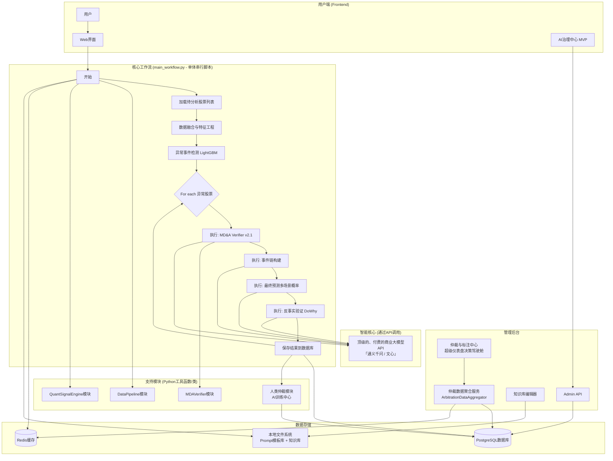
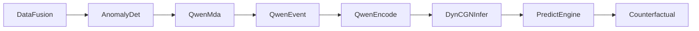
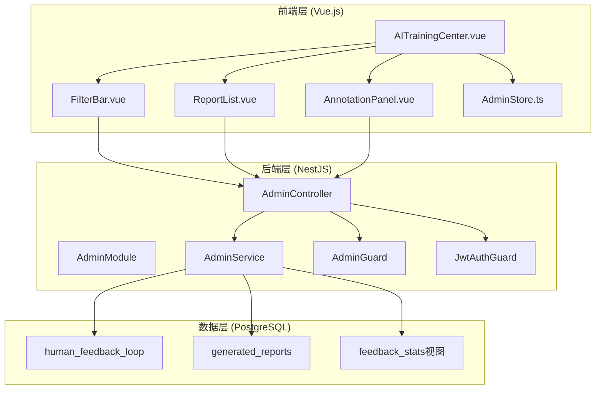

# 第4章：技术架构

## 4.1 系统架构概述 (v13.0 TDD最终版)

### 4.1.0 极简主义核心特点 (2025-01-17)

**健壮的单体串行脚本架构**:
- ✅ **单体串行脚本**: 整个在线流程由一个单一的Python脚本 `main_workflow.py` 驱动
- ✅ **商业LLM API**: 所有"思考"工作全部外包给顶级的商业LLM API
- ✅ **API优先策略**: 相信并利用最强大的商业大脑，聚焦于Prompt工程和业务逻辑
- ✅ **人机协同**: 人类专家拥有最终的、无可争议的仲裁权
- ✅ **核心资产**: 聚焦于Prompt模板库、知识库、仲裁判例集等核心资产
- ✅ **极简部署**: 单一Docker容器 + 简化的管理后台
- ✅ **成本控制**: 通过智能缓存和批量处理降低API调用成本
- ✅ **仲裁界面升级**: 超级仪表盘决策驾驶舱，实现信息聚合和原始数据访问
- ✅ **TDD驱动**: 测试驱动开发作为核心开发哲学，确保系统可靠性

### 4.1.1 极简主义架构图



### 4.1.2 架构说明

这套极简主义架构通过**健壮的单体串行脚本**和**商业LLM API**，实现了简单、可控、易于维护的系统设计：

**核心工作流**:
- **单体串行脚本**: 整个在线流程由一个单一的Python脚本 `main_workflow.py` 驱动
- **模块化设计**: 脚本内部逻辑高度模块化，通过函数/类调用执行支持模块功能
- **容错机制**: 每个核心步骤都用 `try...except` 块包裹，确保单只股票的失败不会中断整个流程

**智能核心**:
- **商业LLM API**: 所有"思考"工作全部外包给顶级的商业大模型API
- **API优先策略**: 相信并利用最强大的商业大脑，聚焦于Prompt工程和业务逻辑
- **成本控制**: 通过智能缓存和批量处理降低API调用成本

**支持模块**:
- **DataPipeline模块**: 数据获取和预处理
- **QuantSignalEngine模块**: 量化信号计算
- **MDAVerifier模块**: MD&A分析验证
- **HumanArbitrator模块**: 人类仲裁系统

**核心资产**:
- **Prompt模板库**: 存储在 `config/prompts/`，由AI训练师维护
- **知识库**: 存储在 `config/attribution_rules.json`、`config/event_tags.json`
- **仲裁判例集**: 存储在 `human_feedback_loop` 数据库表，持续注入专家智慧

**人机协同**:
- **人类仲裁**: 人类专家拥有最终的、无可争议的仲裁权
- **智能筛选**: 只有"AI内部分歧大"或"风险高"的案例才需要人工仲裁
- **MVP管理后台**: 简化的AI治理中心，聚焦于最高频、最核心的人工参与点

### 4.1.2.1 v10.1 仲裁界面重大升级

**升级理念**: 将"AI治理中心"中的"仲裁"环节，从一个简单的"反馈"功能，**升级**为一个功能完备、信息丰富的**"决策驾驶舱"**。

**核心特点**:
- **多面板仪表盘**: 采用灵活的、可拖拽、可缩放的仪表盘布局（类似 Grafana 或 TradingView）
- **信息聚合**: 将与当前仲裁案件相关的**所有**结构化和非结构化数据，都清晰地、聚合地呈现
- **原始数据访问**: 人类仲裁官拥有查阅所有"原始卷宗"的权力，不受AI过滤和提炼的影响

**五大核心数据面板**:

1. **【必选】原始文本浏览器 (Raw Text Explorer)**
   - 展示AI分析的**原文**，判断AI是否存在"断章取义"或"理解偏差"
   - 自动高亮与"AI结论"或"核心关键词"相关的句子
   - 数据源：`processed_events` 表、`generated_reports` 表

2. **【必选】核心财务数据快照 (Financial Snapshot)**
   - 展示该公司**过去8个季度的核心财务指标**
   - 包括营收、净利润、毛利率、净利率、现金流、研发费用率等
   - 数据源：`financial_reports` 表

3. **【必选】量化信号仪表盘 (Quant Signal Dashboard)**
   - 个股信号：收益率Z分数、成交量Z分数、管理层可信度因子得分
   - 市场背景信号：宏观风险偏好、市场风格、行业板块表现
   - 数据源：`quant_signals` 表、`mda_verification` 表

4. **【可选】资金流向与筹码分布 (Flow & Chips Viewer)**
   - 资金流向：主力/超大单净流入图表
   - 龙虎榜数据：详细买卖席位信息
   - 筹码分布图：可视化筹码分布和成本区间
   - 数据源：`money_flow` 表、`top_list` 表、`chip_distribution` 表

5. **【可选】历史仲裁记录 (Personal Precedent Viewer)**
   - 展示过去一年中，对该公司或同行业类似公司的所有历史仲裁判决
   - 帮助维持决策逻辑的一致性
   - 数据源：`human_feedback_loop` 表

**后端架构升级**:
- **新服务**: `ArbitrationDataAggregator.service.ts`
- **核心职责**: 并行、异步地聚合所有相关数据，一次性返回给前端
- **API升级**: `GET /api/v1/admin/arbitration-cases/:caseId`
- **性能要求**: 通过异步并行处理，确保响应时间在2秒内

### 4.1.3 极简主义工作流程

这套极简主义架构通过**单体串行脚本**和**商业LLM API**，实现了简单、可控、易于维护的工作流程：

#### 离线训练流程 (Offline Training Mode)

**目标**: 训练四个核心专家模型，用于"铸造大脑"

**触发方式**: 手动触发，在MacBook Air M4上夜间执行

**核心步骤**:
1. **【数据准备】**: 准备训练数据集（500-1000份MD&A样本、800-1200份事件链样本等）
2. **【模型训练】**: 
   - Qwen3-4B-MD&A-Extractor: QLoRA微调，约8-10小时
   - Qwen3-4B-Event-Linker: 事件链构建训练
   - Qwen3-4B-Predictive-Encoder: 预测编码训练
   - DynCGN: 因果图网络训练
3. **【模型注册】**: 将训练好的模型及其性能指标注册到MLflow
4. **【版本管理**: 设置模型版本状态（candidate/production_best/archived）

#### 在线推理流程 (Online Inference Mode)

**目标**: 使用训练好的模型，实时处理用户请求

**触发方式**: 用户请求触发，通过API网关

**核心步骤**:
1. **【任务创建】**: API接收请求，向Redis任务队列推送DataFusion任务
2. **【数据融合】**: DataFusion_Worker获取最新数据，存储到MongoDB和本地文件
3. **【异常检测】**: AnomalyDet_Worker使用LightGBM模型检测异常
4. **【MD&A提取】**: QwenMda_Worker使用微调的Qwen模型提取结构化信息
5. **【事件链构建】**: QwenEvent_Worker构建时序事件链
6. **【预测编码】**: QwenEncode_Worker将多模态信息编码为向量
7. **【因果推理】**: DynCGNInfer_Worker执行因果关系推理
8. **【预测生成】**: PredictEngine_Worker生成最终预测结果
9. **【反事实分析】**: Counterfactual_Worker提供深度洞察
10. **【结果返回】**: 将最终结果返回给用户

#### 任务依赖关系



## 4.2 详细软件架构设计

### 4.2.1 前端架构 (Frontend)

**技术选型**:
- **框架**: Vue 3 或 React (现代Web开发主流，生态成熟)
- **UI库**: Element Plus (for Vue) 或 Ant Design (for React)
- **打包工具**: Vite (启动快、热更新迅速，开发体验极佳)

**部署方式**:
- 打包成**静态文件 (HTML, CSS, JS)**
- 可以直接部署在**Nginx**上，或使用**Vercel / Netlify / Cloudflare Pages**等免费或低成本的静态网站托管服务

**核心职责**:
- 用户注册、登录、订阅管理
- 股票池的增删改查
- 通过调用后端API，展示"每日快报"、"归因快照"等数据
- (未来) 通过WebSocket实现盘中实时推送

### 4.2.2 后端服务架构 (Backend Service)

**技术选型**:
- **语言/框架**: Node.js + TypeScript + NestJS (强烈推荐)
  - **为什么是NestJS？** 它是一个基于Express.js的、高度结构化的Node.js框架。它强制使用模块化、依赖注入等设计模式，非常适合构建复杂的、可维护的后端应用
- **ORM**: Prisma 或 TypeORM (用于安全、高效地与数据库交互)
- **API规范**: OpenAPI (Swagger) (自动生成API文档，方便前后端协作)

**部署方式**:
- 使用 **Docker** 进行容器化部署
- 使用 **PM2** 作为Node.js的进程管理器，确保服务稳定运行和自动重启

**核心职责 (拆分为多个微服务或NestJS模块)**:
- **用户与认证服务**: 处理注册、登录、JWT令牌生成与验证
- **股票池管理服务**: 提供股票池的CRUD API
- **公共版分析服务 (`PublicWorkflowOrchestrator`)**: 实现公共版盘前/盘后工作流的API
- **私人版分析服务 (`PersonalizedWorkflowOrchestrator`)**: 实现私人版盘前/盘后工作流的API
- **API网关**: 统一的请求入口、路由、限流和日志记录

### 4.2.3 计算引擎架构 (Computation Engine)

**技术选型**:
- **语言/框架**: Python + FastAPI
  - **为什么是Python？** 因为所有的数据科学库（Pandas, Numpy, Tushare）都是Python生态
  - **为什么是FastAPI？** 它是一个高性能的Python Web框架，可以轻松地将Python计算逻辑包装成一个内部API，供Node.js后端调用
- **任务队列**: Celery + Redis
  - 这是**关键**！所有耗时的任务，如历史数据回溯、批量计算Z分数、调用LLM分析等，都应该作为任务被发送到Celery任务队列中，由独立的Worker进程在后台异步执行

**部署方式**:
- 同样使用 **Docker** 进行容器化部署
- 需要至少两个容器：一个是FastAPI服务，另一个是Celery Worker

**核心职责**:
- **`DataPipeline`**: 实现Tushare数据获取、三大核心量化信号计算等
- **`LLM_Service`**: 封装对LLM API的调用，包括Prompt构建、请求发送、结果解析
- **异步任务执行**: 接收来自Node.js后端的计算任务，在后台执行，完成后将结果写入数据库或通过回调通知后端

### 4.2.4 基础设施架构 (Infrastructure)

**数据库 (Database)**:
- **主数据库**: PostgreSQL (强烈推荐) - 相比SQLite，它更适合多用户并发读写的生产环境，性能和稳定性都高一个数量级
- **缓存/消息队列**: Redis - 用于缓存常用数据（如用户信息、热点板块列表）、管理用户Session，并作为Celery的任务队列Broker

**反向代理 (Reverse Proxy)**:
- **Nginx**:
  - 作为所有请求的入口，将API请求转发给Node.js后端服务
  - 托管前端的静态文件
  - 处理HTTPS证书 (SSL Termination)

**部署与容器化 (Deployment & Containerization)**:
- **Docker & Docker Compose**: 使用`docker-compose.yml`文件，一键编排和启动所有服务（前端Nginx, Node.js后端, Python计算引擎, Celery Worker, PostgreSQL, Redis）。这极大地简化了部署和环境一致性问题

### 4.2.5 硬件资源分配与可行性分析

**训练 (MacBook Air M4)**:
- **可行性**: **完全可行**。训练过程主要是拉取历史数据并进行Pandas计算，这主要消耗CPU和内存。M4芯片性能强大，足以胜任这个一次性的批处理任务。LLM的训练是在云端，只是调用API。

**运行 (服务器: 4CPU, 8GB内存, 60GB硬盘)**:
- **可行性**: **可行，但需要精细化管理**。这个配置对于支持100人同时在线是**"经济适用型"**的。
- **内存分配 (关键)**: 8GB内存是主要瓶颈
  - PostgreSQL: 建议限制在 ~1-2GB
  - Redis: ~500MB
  - Node.js后端: ~1GB
  - Python计算引擎 (FastAPI + Celery Worker): **这是内存消耗大户**，建议设置Worker的并发数为1或2，并严格限制其内存使用在 ~2-3GB
  - 操作系统和其他: ~1GB
- **CPU分配**: 4核CPU对于这个用户量是足够的，因为大部分请求都是IO密集型（读写数据库、调用API），而不是CPU密集型
- **硬盘**: 60GB对于存储几年的日线数据和分析结果是足够的，但需要定期监控和清理日志

### 4.2.6 详细架构图

```mermaid
graph TD
    subgraph "用户设备"
        User[用户 (浏览器/App)]
    end

    subgraph "云服务器 (4C8G)"
        Nginx[Nginx<br>(反向代理/静态文件)]
        
        subgraph "后端服务 (Docker)"
            Backend[Node.js (NestJS)<br>API / 业务逻辑]
        end
        
        subgraph "计算引擎 (Docker)"
            PythonAPI[Python (FastAPI)<br>内部计算API]
            CeleryWorker[Celery Worker<br>异步任务执行]
        end
        
        subgraph "基础设施 (Docker)"
            Postgres[PostgreSQL<br>主数据库]
            Redis[Redis<br>缓存 / 任务队列]
        end
    end

    subgraph "外部服务"
        Tushare[Tushare Pro API]
        LLM[LLM API]
    end

    User --> Nginx;
    Nginx --> Backend;
    Nginx -- 托管 --> User;
    
    Backend -- 同步请求 --> Postgres;
    Backend -- 同步请求 --> Redis;
    Backend -- 异步任务 --> Redis;
    Redis -- 任务 --> CeleryWorker;
    
    CeleryWorker -- 执行计算 --> PythonAPI;
    CeleryWorker -- 写入结果 --> Postgres;
    
    PythonAPI -- 调用 --> Tushare;
    PythonAPI -- 调用 --> LLM;
    PythonAPI -- 读/写 --> Postgres;
```

## 4.3 动态双层股票宇宙管理技术实现

### 4.3.1 股票宇宙管理器 (StockUniverseManager)

**核心组件**:
- **`StockUniverseManager`**: 负责股票宇宙的构建、维护和动态调整
- **`stock_universe_mapping`表**: 存储股票分类信息

**数据库设计**:
```sql
CREATE TABLE stock_universe_mapping (
  stock_code VARCHAR(20) PRIMARY KEY,
  universe_type VARCHAR(20) NOT NULL CHECK (universe_type IN ('core', 'observation')),
  update_date DATE NOT NULL,
  promotion_reason TEXT,
  demotion_reason TEXT,
  user_added BOOLEAN DEFAULT FALSE,
  market_cap_rank INTEGER,
  liquidity_score DECIMAL(10,2),
  attention_score DECIMAL(10,2),
  created_at TIMESTAMP DEFAULT CURRENT_TIMESTAMP,
  updated_at TIMESTAMP DEFAULT CURRENT_TIMESTAMP
);
```

**核心算法**:
1. **初始构建算法**:
   - 获取指数成分股（沪深300、中证500、中证1000）
   - 流动性筛选（日均成交额 ≥ 5亿元）
   - 关注度筛选（人气榜前100名）
   - 用户自选股合并

2. **动态晋升算法**:
   - 成交额激增检测（≥ 10亿元）
   - 极端Z分数异动检测（|Z| > 3.5）
   - 概念板块热度检测
   - 用户自选股触发

3. **月度降级算法**:
   - 流动性不足检测（连续30天 < 5000万元）
   - 关注度下降检测

### 4.3.2 工作流编排器 (WorkflowOrchestrator)

**核心职责**:
- 根据股票分类执行不同的处理策略
- 协调各个组件的执行顺序
- 管理任务调度和依赖关系

**处理策略**:
- **核心宇宙**: 完整处理（复杂信号 + 预测 + 深度归因）
- **观察宇宙**: 基础处理（仅个体Z分数）

**调度逻辑**:
```typescript
// 核心宇宙处理
const coreStocks = await stockUniverseManager.getCoreUniverseStocks();
for (const stock of coreStocks) {
  await quantSignalEngine.calculateComplexSignals(stock);
  await predictionEngine.generatePrediction(stock);
  await attributionEngine.performDeepAttribution(stock);
}

// 观察宇宙处理
const observationStocks = await stockUniverseManager.getObservationUniverseStocks();
for (const stock of observationStocks) {
  await quantSignalEngine.calculateBasicSignals(stock);
}
```

### 4.3.3 量化信号引擎优化

**基础信号计算** (观察宇宙):
- 仅计算个体Z分数
- 成本低，计算快

**复杂信号计算** (核心宇宙):
- 个体Z分数
- 宏观风险Z分数
- 市场风格Z分数
- 量化指纹Z分数

**性能优化**:
- 批量计算减少数据库查询
- 缓存常用计算结果
- 异步处理提升响应速度

## 4.4 四级监控体系技术实现

### 4.4.1 宽基指数异常计算方法

**核心定义与通用符号**:
- **`t`**: 代表当前交易日
- **`i`**: 代表某个历史交易日或某个具体的指数
- **`N`**: 代表滚动计算窗口的长度 (建议值: **`N = 90`** 天)
- **`R_code(t)`**: 代表代码为`code`的指数在`t`日的**涨跌幅 (%)**
- **`μ_Series(t, N)`**: 代表某个时间序列`Series`在`t`日计算的、过去`N`天的**滚动算术平均值**
- **`σ_Series(t, N)`**: 代表某个时间序列`Series`在`t`日计算的、过去`N`天的**滚动样本标准差**
- **`Z_Series(t)`**: 代表某个时间序列`Series`在`t`日计算的**最终Z分数**

**模块一：宏观风险偏好诊断公式**

**目的**: 判断市场整体资金是在**冒险 (Risk-On)** 还是在**避险 (Risk-Off)**

**核心输入**:
- 万得全A指数 (`881001.WI`) - A股市场整体代表 (风险资产)
- 上证10年期国债ETF (`511260.SH`) - 无风险资产代表 (安全资产)

**计算步骤**:
1. **获取基础日涨跌幅数据**:
   - `R_Stock(t) = R_881001.WI(t)`
   - `R_Bond(t) = R_511260.SH(t)`

2. **计算每日"股债相对强度"差值序列**:
   - `Spread_SvB(t) = R_Stock(t) - R_Bond(t)`

3. **计算滚动统计指标**:
   - `μ_Spread_SvB(t, N) = (1/N) * Σ(i=t-N+1 to t) Spread_SvB(i)`
   - `σ_Spread_SvB(t, N) = sqrt[ (1/(N-1)) * Σ(i=t-N+1 to t) (Spread_SvB(i) - μ_Spread_SvB(t, N))^2 ]`

4. **计算宏观风险偏好Z分数**:
   - `Z_MacroRisk(t) = (Spread_SvB(t) - μ_Spread_SvB(t, N)) / σ_Spread_SvB(t, N)`

**模块二：市场内部风格轮动诊断公式**

**目的**: 诊断A股内部资金流向，判断哪种风格（大/中/小盘，价值/成长/科技）的强弱分化达到了极端水平

**核心输入**:
- 沪深300 (`000300.SH`) - 大盘价值
- 创业板指 (`399006.SZ`) - 大盘成长
- 科创50 (`000688.SH`) - 硬科技
- 中证500 (`000905.SH`) - 中盘风格
- 中证2000 (`932000.CSI`) - 小盘风格
- 万得全A指数 (`881001.WI`) - 市场平均基准

**计算步骤** (对每个风格指数独立计算):
1. **获取基础日涨跌幅数据**:
   - `R_Style_i(t)`: 风格指数`i`在`t`日的涨跌幅
   - `R_Market(t) = R_881001.WI(t)`

2. **计算每日风格超额收益序列**:
   - `Excess_i(t) = R_Style_i(t) - R_Market(t)`

3. **计算滚动统计指标**:
   - `μ_Excess_i(t, N) = (1/N) * Σ(j=t-N+1 to t) Excess_i(j)`
   - `σ_Excess_i(t, N) = sqrt[ (1/(N-1)) * Σ(j=t-N+1 to t) (Excess_i(j) - μ_Excess_i(t, N))^2 ]`

4. **计算风格Z分数**:
   - `Z_Style_i(t) = (Excess_i(t) - μ_Excess_i(t, N)) / σ_Excess_i(t, N)`

**最终输出**:
- **1个**宏观风险偏好Z分数 (`Z_MacroRisk`)
- **5个**风格Z分数 (`Z_Style_000300`, `Z_Style_399006`, `Z_Style_000688`, `Z_Style_000905`, `Z_Style_932000`)

### 4.4.2 自适应异常发现系统

**核心特性**:
- **滚动统计计算**: 基于滑动窗口的动态统计计算
- **多维度异常检测**: 个体异常、层级异常、相对强度异常
- **自适应阈值**: 基于历史数据的动态阈值调整
- **综合信号生成**: 多种异常信号的组合和分类
- **实时监控**: 支持实时异常检测和告警

**技术实现特性**:
- **高性能计算**: 优化的滚动统计算法
- **内存管理**: 大数据量计算的内存优化
- **并行处理**: 支持多目标并行异常检测
- **缓存机制**: 智能缓存减少重复计算
- **监控告警**: 完整的异常检测监控体系

## 4.5 通用组件系统

### 4.5.1 缓存系统

**多级缓存设计**:
- **L1缓存**: 内存缓存（最快访问）
- **L2缓存**: Redis缓存（快速访问）
- **L3缓存**: 数据库缓存（持久存储）

**缓存策略**:
- **TTL策略**: 基于时间过期
- **LRU策略**: 最近最少使用淘汰
- **一致性管理**: 分布式锁保证数据一致性

### 4.5.2 任务调度系统

**核心功能**:
- **任务队列管理**: 优先级队列、并发控制
- **任务依赖管理**: 有向无环图（DAG）依赖
- **任务持久化**: 数据库存储任务状态
- **故障恢复**: 自动重试、死信队列

### 4.5.3 监控告警系统

**监控指标**:
- **系统指标**: CPU、内存、磁盘、网络
- **业务指标**: 处理量、成功率、响应时间
- **LLM指标**: 调用次数、成本、延迟

**告警机制**:
- **阈值告警**: 基于指标阈值
- **异常检测**: 基于历史数据异常
- **多渠道通知**: 邮件、短信、钉钉等

### 4.5.4 API网关系统

**核心功能**:
- **请求路由**: 基于路径和方法的路由
- **负载均衡**: 轮询、加权轮询、最少连接
- **限流熔断**: 令牌桶、滑动窗口、熔断器
- **认证授权**: JWT令牌验证

## 4.6 数据库TDD开发流程 (v13.0 TDD for DB)

### 4.6.1 数据库实体TDD开发

**TDD开发流程 (TDD for DB)**:
1. **【红灯】** 先为每一个实体 (`entity.ts`) 编写**单元测试** (`.entity.test.ts`)，专门用于**验证其`class-validator`装饰器**。
2. **【绿灯 & 重构】** 编写实体代码，并确保所有可为空字段都使用 `string | null` 联合类型，直到测试通过。

**实体测试示例**:
```typescript
// tests/unit/entities/financial-reports.entity.test.ts
describe('FinancialReports Entity', () => {
  it('should validate required fields', () => {
    const report = new FinancialReports();
    const errors = validate(report);
    expect(errors).toHaveLength(4); // 4个必填字段
  });

  it('should accept null for optional fields', () => {
    const report = new FinancialReports();
    report.revenue = null;
    report.net_profit = null;
    const errors = validate(report);
    expect(errors).toHaveLength(2); // 只有2个必填字段错误
  });

  it('should validate data types', () => {
    const report = new FinancialReports();
    report.stock_code = '000001';
    report.quarter = '2025Q1';
    report.revenue = 1000000;
    report.net_profit = 100000;
    const errors = validate(report);
    expect(errors).toHaveLength(0);
  });
});
```

### 4.6.2 数据库迁移TDD

**迁移测试流程**:
1. **【红灯】** 编写迁移测试，验证迁移前后的数据完整性
2. **【绿灯】** 实现迁移脚本，确保测试通过
3. **【重构】** 优化迁移脚本的性能和可读性

## 4.7 配置管理架构 (v11.4 中心化配置革命)

### 4.7.1 配置管理统一化

**架构原则**:
- **单一事实来源**: 所有配置通过 `ConfigModule` 统一加载和管理
- **确定性优先级**: 代码定义的配置加载顺序，完全可预测
- **类型安全**: 强类型配置接口，编译时错误检查
- **环境感知**: 自动加载对应环境配置
- **零配置混乱**: 删除所有冗余配置文件

**配置加载优先级**:
```
1. 环境变量 (.env.${NODE_ENV})
2. 服务配置 (config/llm.service.json, config/mda_verifier.service.json)
3. 默认配置 (config/default.json)
```

**技术实现**:
- **统一入口**: `backend/src/config/config.module.ts` - 系统唯一的配置入口
- **类型安全**: `ConfigFactory` 提供强类型配置访问
- **环境隔离**: 开发/测试/生产环境完全分离

### 4.6.2 配置文件结构

**最终目录结构**:
```
config/
├── default.json                    # 默认配置 - 所有服务的默认值
├── llm.service.json                # LLM服务专属配置
├── mda_verifier.service.json       # MD&A Verifier服务专属配置
├── attribution_rules.json          # 业务规则配置
├── event_tags.json                 # 事件标签配置
└── prompt_templates/               # Prompt模板
    ├── mda_verification_prompts.json
    ├── event_chain_building_prompts.json
    ├── prediction_generation_prompts.json
    └── counterfactual_validation_prompts.json

# 环境变量文件
env.development                     # 开发环境变量
env.production                      # 生产环境变量
env.test                           # 测试环境变量
```

**配置分类**:
- **应用配置**: `config/` 目录 - 定义系统行为，部署产物
- **包配置**: `package.json`, `tsconfig.json` - 定义构建方式，开发阶段

### 4.6.3 配置使用方式

**在服务中获取配置**:
```typescript
@Injectable()
export class DatabaseService {
  constructor(private configService: ConfigService) {
    this.configFactory = new ConfigFactory(configService);
  }

  async connect() {
    const dbConfig = this.configFactory.getDatabaseConfig();
    // 使用配置连接数据库
  }
}
```

**配置验证**:
- **环境变量验证**: Joi schema验证
- **配置完整性检查**: 启动时检查关键配置
- **类型安全**: 编译时配置错误检查

## 4.7 Prompt工程与后处理验证

### 4.7.1 Prompt自我修正链

**核心特性**:
- **4步修正流程**: 生成初稿→对照检查→修正→输出终稿
- **格式严格性**: 强制要求100%符合JSON Schema的输出
- **置信度集成**: 所有Prompt都包含confidence_score字段要求

**实现位置**:
- `config/prompt_templates/prediction_generation_prompts.json`
- `config/prompt_templates/mda_verification_prompts.json`
- `config/prompt_templates/counterfactual_validation_prompts.json`
- `config/prompt_templates/event_chain_building_prompts.json`

### 4.7.2 后处理验证器

**核心功能**:
- **格式校验**: JSON解析和修复（只尝试一次）
- **Schema验证**: 使用Zod进行严格的类型和结构验证
- **业务规则校验**: 概率之和、置信度范围等业务逻辑检查
- **置信度过滤**: 根据阈值过滤低置信度结果

**技术实现**:
- **PostProcessingValidator.ts**: 核心验证器类
- **Zod Schema**: 为每个任务类型定义严格的数据结构
- **智能修复**: 使用廉价模型进行JSON修复
- **错误分类**: 专门的错误类型和处理机制

### 4.7.3 健壮LLM调用工作流

**7步处理流程**:
1. 调用商业LLM API
2. 获取Schema和置信度阈值
3. JSON解析
4. JSON修复（如需要）
5. Schema验证
6. 业务规则验证
7. 置信度过滤

**使用方式**:
```typescript
const response = await llmService.callLLMWithValidation(
  prompt, 
  'prediction_generation',
  { maxTokens: 4000, temperature: 0.7 }
);
```

## 4.8 系统集成与优化

### 4.8.1 系统集成器 (SimpleSystemIntegrator)

**功能概述**: 系统集成器是整个智能分析系统的核心管理组件，负责统一管理所有服务的启动、停止、监控和协调。

**核心功能**:
- **服务启动管理**: 顺序启动、健康检查、错误处理
- **服务状态监控**: 运行状态、健康状态、性能指标
- **优雅关闭**: 优雅关闭、强制关闭、紧急关闭
- **服务重启**: 单个服务重启、批量服务管理

**实现特性**:
- 支持基础设施服务、业务服务、API服务、监控服务的统一管理
- 提供完整的服务状态监控和健康检查机制
- 支持服务间的依赖关系管理和启动顺序控制
- 提供统一的错误处理和恢复机制

### 4.7.2 性能优化器 (SimplePerformanceOptimizer)

**功能概述**: 性能优化器负责监控和优化系统性能，提供多维度的性能监控和优化建议。

**核心功能**:
- **性能监控**: 响应时间、内存使用、CPU使用、数据库指标
- **缓存优化**: 查询缓存、结果缓存、预加载、缓存清理
- **数据库优化**: 连接池、查询优化、索引优化、统计信息分析
- **内存优化**: 垃圾回收、内存阈值监控、内存泄漏检测

**实现特性**:
- 支持实时性能指标收集和监控
- 提供智能缓存优化和预加载机制
- 支持数据库查询优化和索引管理
- 提供内存使用优化和垃圾回收管理

## 4.8 AI训练中心技术实现 🆕 新增

### 4.8.1 整体架构设计

AI训练中心采用前后端分离的架构，通过RESTful API进行数据交互，支持实时状态更新和批量操作。



### 4.8.2 前端技术实现

#### 4.8.2.1 组件架构
- **主页面组件**: `AITrainingCenter.vue` - 整体布局和状态管理
- **筛选组件**: `FilterBar.vue` - 多维度筛选功能
- **列表组件**: `ReportList.vue` - 报告列表展示和交互
- **标注组件**: `AnnotationPanel.vue` - 专家标注表单
- **状态管理**: `AdminStore.ts` - Pinia状态管理

#### 4.8.2.2 技术特性
- **响应式设计**: 支持桌面和移动端访问
- **实时更新**: 基于WebSocket的实时状态同步
- **批量操作**: 支持批量选择和状态更新
- **快捷键支持**: 提高标注效率
- **数据缓存**: 智能缓存减少API调用

#### 4.8.2.3 用户体验优化
- **加载状态**: 优雅的加载动画和进度提示
- **错误处理**: 友好的错误提示和重试机制
- **操作反馈**: 即时的操作反馈和状态更新
- **性能优化**: 虚拟滚动和懒加载

### 4.8.3 后端技术实现

#### 4.8.3.1 模块架构
- **AdminModule**: NestJS模块，提供依赖注入和配置
- **AdminService**: 核心业务逻辑，处理所有数据操作
- **AdminController**: RESTful API接口，权限保护
- **权限守卫**: JWT认证和管理员权限验证

#### 4.8.3.2 数据访问层
- **ORM映射**: TypeORM实体映射
- **查询优化**: 复杂查询的性能优化
- **事务管理**: 确保数据一致性
- **缓存策略**: Redis缓存热点数据

#### 4.8.3.3 安全机制
- **JWT认证**: 基于Token的身份验证
- **角色控制**: 细粒度的权限管理
- **操作审计**: 完整的操作日志记录
- **数据验证**: 严格的输入验证和清理

### 4.8.4 数据库技术实现

#### 4.8.4.1 表设计优化
- **外键约束**: 确保数据完整性
- **索引优化**: 针对查询模式优化索引
- **分区策略**: 大表的分区管理
- **触发器**: 自动状态同步

#### 4.8.4.2 性能优化
- **查询优化**: 复杂查询的SQL优化
- **连接池**: 数据库连接池管理
- **读写分离**: 查询和写入的分离
- **缓存策略**: 多级缓存机制

#### 4.8.4.3 数据一致性
- **事务管理**: ACID事务保证
- **并发控制**: 乐观锁和悲观锁
- **数据同步**: 实时数据同步机制
- **备份恢复**: 数据备份和恢复策略

### 4.8.5 集成与部署

#### 4.8.5.1 微服务集成
- **服务发现**: 自动服务注册和发现
- **负载均衡**: 请求分发和负载均衡
- **熔断机制**: 服务降级和熔断保护
- **监控告警**: 全面的监控和告警

#### 4.8.5.2 容器化部署
- **Docker化**: 容器化部署
- **Kubernetes**: 容器编排和管理
- **配置管理**: 环境配置管理
- **日志收集**: 集中化日志管理

#### 4.8.5.3 CI/CD流水线
- **自动化测试**: 单元测试和集成测试
- **代码质量**: 代码质量检查
- **自动部署**: 自动化部署流程
- **回滚机制**: 快速回滚能力

### 4.8.6 监控与运维

#### 4.8.6.1 性能监控
- **响应时间**: API响应时间监控
- **吞吐量**: 请求处理能力监控
- **错误率**: 错误率统计和告警
- **资源使用**: CPU、内存、磁盘使用监控

#### 4.8.6.2 业务监控
- **标注效率**: 标注速度和准确率
- **用户行为**: 用户操作行为分析
- **数据质量**: 反馈数据质量监控
- **系统健康**: 整体系统健康状态

#### 4.8.6.3 告警机制
- **实时告警**: 关键指标异常告警
- **分级告警**: 不同级别的告警处理
- **通知机制**: 多渠道通知方式
- **自动恢复**: 自动故障恢复机制

## 4.9 技术优势

### 4.9.1 架构优势

**模块化设计**:
- **数据获取层**: 独立的数据源模块，易于扩展
- **分析引擎层**: 独立的LLM分析模块，易于替换
- **流程编排层**: 清晰的工作流控制，易于维护

**可扩展性**:
- **水平扩展**: 支持多实例部署和负载均衡
- **垂直扩展**: 支持硬件资源升级
- **功能扩展**: 支持新功能模块的快速集成

### 4.9.2 性能优势

**高性能计算**:
- **异步处理**: 基于Node.js的异步IO处理
- **并行计算**: 支持多任务并行执行
- **缓存机制**: 多级缓存提升响应速度

**资源优化**:
- **内存管理**: 智能内存分配和垃圾回收
- **CPU优化**: 任务调度和负载均衡
- **存储优化**: 数据库索引和查询优化

### 4.9.3 可靠性优势

**容错机制**:
- **服务降级**: 关键服务故障时的降级处理
- **故障恢复**: 自动故障检测和恢复
- **数据备份**: 完整的数据备份和恢复策略

**监控告警**:
- **实时监控**: 系统状态实时监控
- **智能告警**: 基于阈值的智能告警
- **日志管理**: 完整的日志记录和分析

---

**文档版本**: v9.3 (工业级系统优化版)  
**最后更新**: 2025-01-17  
**维护者**: AI Assistant  
**优化说明**: 集成"终极统一架构"，实现双核智能引擎和双模工作流，支持自学习进化，新增预测引擎、闭环协调器详细技术实现方案，以及精益归因流水线和公告重要性评分算法的工业级优化
