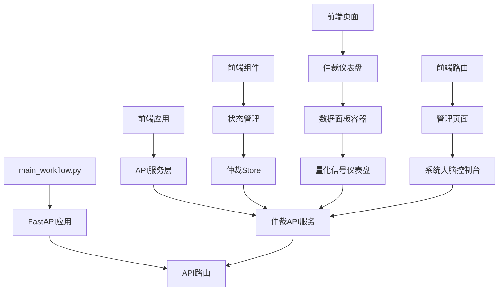

# 我家的房子 - main-workflow多层级文件关系图

## 🏠 项目概述

本文档详细描述了量化导航仪项目中 `main-workflow` 的前后端多层级文件关系，包括所有相关文件和对应的测试文件。这是一个完整的"房子"结构图，展示了从核心工作流到各个组件的完整依赖关系。

## 📋 目录

- [第0层：核心工作流](#第0层核心工作流)
- [第1层：后端核心服务](#第1层后端核心服务)
- [第2层：后端API层](#第2层后端api层)
- [第3层：后端数据层](#第3层后端数据层)
- [第4层：前端核心架构](#第4层前端核心架构)
- [第5层：前端服务层](#第5层前端服务层)
- [第6层：前端组件层](#第6层前端组件层)
- [第7层：前端页面层](#第7层前端页面层)
- [测试文件映射](#测试文件映射)
- [文件统计](#文件统计)

---

## 第0层：核心工作流

### 🎯 主工作流文件
```
packages/backend-python/src/main_workflow.py
```
**作用**: 主工作流脚本 (v14.4 "元认知AI"架构)，实现双脑并行分析 + 元认知仲裁 + 人类最终决策架构

**核心功能**:
- Qwen事实归因流 + 豆包舆情感知流的并行分析
- 元认知引擎，用AI来仲裁AI
- 并发控制器防止惊群效应
- 集成所有核心服务

---

## 第1层：后端核心服务

### 🔧 服务层文件

#### 1.1 仲裁服务
```
packages/backend-python/src/services/arbitration_service.py
```
**作用**: 仲裁服务，处理AI仲裁逻辑

#### 1.2 数据管道服务
```
packages/backend-python/src/services/data_pipeline_service.py
```
**作用**: 数据管道服务，处理数据获取和预处理

#### 1.3 LLM服务
```
packages/backend-python/src/services/llm_service.py
```
**作用**: LLM服务，管理大语言模型调用

#### 1.4 元认知引擎
```
packages/backend-python/src/services/meta_cognition_engine.py
```
**作用**: 元认知引擎，用AI仲裁AI

#### 1.5 量化信号服务
```
packages/backend-python/src/services/quant_signal_service.py
```
**作用**: 量化信号服务，计算各种Z分数和技术指标

#### 1.6 报告服务
```
packages/backend-python/src/services/report_service.py
```
**作用**: 报告服务，生成分析报告

#### 1.7 工作流适配器
```
packages/backend-python/src/services/workflow_adapter.py
```
**作用**: 工作流适配器，连接API和工作流

### 🏗️ 核心架构文件

#### 1.8 配置管理
```
packages/backend-python/src/core/config.py
config/settings.py
```
**作用**: 配置管理模块

#### 1.9 日志配置
```
packages/backend-python/src/core/logging_config.py
```
**作用**: 日志配置模块

#### 1.10 契约验证器
```
packages/backend-python/src/core/contract_validator.py
```
**作用**: 数据契约验证器

### 🔌 接口定义

#### 1.11 核心接口模块
```
packages/backend-python/src/core/interfaces/__init__.py
packages/backend-python/src/core/interfaces/llm_provider_interface.py
packages/backend-python/src/core/interfaces/data_source_interface.py
packages/backend-python/src/core/__init__.py
```
**作用**: 抽象接口定义和模块初始化

#### 1.12 LLM提供商实现
```
packages/backend-python/src/services/llm_providers/__init__.py
packages/backend-python/src/services/llm_providers/qwen_provider.py
packages/backend-python/src/services/llm_providers/doubao_provider.py
```
**作用**: LLM提供商具体实现

### 📦 实体和异常模块

#### 1.13 实体模块
```
packages/backend-python/src/entities/__init__.py
```
**作用**: 实体模块初始化

#### 1.14 异常模块
```
packages/backend-python/src/exceptions/__init__.py
```
**作用**: 异常模块初始化

---

## 第2层：后端API层

### 🌐 API路由文件

#### 2.1 工作流API
```
packages/backend-python/src/api/workflow.py
```
**作用**: 工作流API路由

#### 2.2 仲裁API
```
packages/backend-python/src/api/admin.py
```
**作用**: 管理后台API路由

#### 2.3 数据API
```
packages/backend-python/src/api/data_router.py
packages/backend-python/src/api/calculation_router.py
```
**作用**: 数据和计算API路由

#### 2.4 报告API
```
packages/backend-python/src/api/reports.py
```
**作用**: 报告管理API路由

#### 2.5 AI API
```
packages/backend-python/src/api/ai_router.py
```
**作用**: AI服务相关API路由

### 🚀 应用入口

#### 2.6 FastAPI主应用
```
packages/backend-python/src/main.py
```
**作用**: FastAPI主应用，定义路由和中间件

#### 2.7 CLI入口
```
packages/backend-python/main.py
```
**作用**: CLI命令行入口

---

## 第3层：后端数据层

### 📊 数据模型

#### 3.1 实体类
```
packages/backend-python/src/entities/base.py
packages/backend-python/src/entities/quant_signal.py
packages/backend-python/src/entities/generated_report.py
packages/backend-python/src/entities/processed_event.py
packages/backend-python/src/entities/anomaly_event.py
```
**作用**: 数据实体定义

#### 3.2 数据模式
```
packages/backend-python/src/schemas/arbitration.py
packages/backend-python/src/schemas/scoring_rules_config.py
packages/backend-python/src/schemas/reports.py
```
**作用**: 数据验证模式

### ⚠️ 异常处理

#### 3.3 异常类
```
packages/backend-python/src/exceptions/workflow_exceptions.py
packages/backend-python/src/exceptions/quant_exceptions.py
packages/backend-python/src/exceptions/__init__.py
```
**作用**: 异常处理类

---

## 第4层：前端核心架构

### 🎨 前端入口

#### 4.1 应用入口
```
packages/frontend-main/src/main.ts
packages/frontend-main/src/App.vue
packages/frontend-main/index.html
```
**作用**: 前端应用入口和根组件

#### 4.2 路由配置
```
packages/frontend-main/src/router/index.ts
```
**作用**: 路由配置

#### 4.3 配置文件
```
packages/frontend-main/vite.config.ts
packages/frontend-main/tsconfig.json
packages/frontend-main/package.json
```
**作用**: 前端构建和类型配置

---

## 第5层：前端服务层

### 🔌 API服务

#### 5.1 仲裁API服务
```
packages/frontend-main/src/services/api/arbitrationService.ts
```
**作用**: 仲裁API服务，直接调用main-workflow

#### 5.2 其他API服务
```
packages/frontend-main/src/services/admin.ts
packages/frontend-main/src/services/market.ts
packages/frontend-main/src/services/private.ts
packages/frontend-main/src/services/public.ts
packages/frontend-main/src/services/auth.ts
packages/frontend-main/src/services/http.ts
packages/frontend-main/src/services/index.ts
```
**作用**: 各种API服务

### 🏪 状态管理

#### 5.3 Pinia Store
```
packages/frontend-main/src/stores/arbitration.ts
packages/frontend-main/src/stores/market.ts
packages/frontend-main/src/stores/admin.ts
packages/frontend-main/src/stores/auth.ts
```
**作用**: 状态管理

### 📝 类型定义

#### 5.4 TypeScript类型
```
packages/frontend-main/src/types/arbitration.ts
packages/frontend-main/src/types/core.ts
packages/frontend-main/src/types/index.ts
```
**作用**: TypeScript类型定义

### 🛠️ 工具函数

#### 5.5 工具模块
```
packages/frontend-main/src/utils/logger.ts
packages/frontend-main/src/utils/index.ts
```
**作用**: 工具函数

---

## 第6层：前端组件层

### 🧩 核心组件

#### 6.1 仲裁相关组件
```
packages/frontend-main/src/components/admin/ArbitrationDashboard.vue
packages/frontend-main/src/components/admin/ArbitrationCaseList.vue
packages/frontend-main/src/components/admin/ArbitrationDecisionDialog.vue
packages/frontend-main/src/components/admin/ArbitrationToolbar.vue
```
**作用**: 仲裁功能核心组件

#### 6.2 数据展示组件
```
packages/frontend-main/src/components/admin/DataPanelContainer.vue
packages/frontend-main/src/components/admin/QuantSignalDashboard.vue
packages/frontend-main/src/components/admin/FinancialSnapshot.vue
packages/frontend-main/src/components/admin/FlowAndChipsViewer.vue
packages/frontend-main/src/components/admin/PersonalPrecedentViewer.vue
packages/frontend-main/src/components/admin/RawTextExplorer.vue
```
**作用**: 数据展示和分析组件

---

## 第7层：前端页面层

### 📄 页面组件

#### 7.1 认证页面
```
packages/frontend-main/src/views/auth/Login.vue
packages/frontend-main/src/views/auth/Register.vue
```
**作用**: 用户认证页面

#### 7.2 管理页面
```
packages/frontend-main/src/views/admin/SystemBrainConsole.vue
```
**作用**: 管理员页面

#### 7.3 功能页面
```
packages/frontend-main/src/views/MarketRadar.vue
packages/frontend-main/src/views/Home.vue
packages/frontend-main/src/views/DualBrainArbitrationDashboard.vue
packages/frontend-main/src/views/AITrainingCenter.vue
```
**作用**: 主要功能页面

#### 7.4 私人页面
```
packages/frontend-main/src/views/private/Layout.vue
packages/frontend-main/src/views/private/MyAssistant.vue
packages/frontend-main/src/views/private/StockPoolManager.vue
```
**作用**: 私人版功能页面

---

## 测试文件映射

### 🔬 后端测试文件

#### 单元测试 (Unit Tests) - 64个文件
```
# 核心工作流测试
tools/tests/unit/backend/test_main_workflow_100_coverage.py
tools/tests/unit/backend/test_main.py
tools/tests/unit/backend/test_backend_api.py
tools/tests/unit/backend/test_api.py
tools/tests/unit/backend/test_arbitration.py

# 服务层测试 (15个)
tools/tests/unit/backend/services/test_arbitration_service_unit.py
tools/tests/unit/backend/services/test_data_pipeline_service_unit.py
tools/tests/unit/backend/services/test_data_pipeline_service_sync.py
tools/tests/unit/backend/services/test_data_pipeline_private_methods.py
tools/tests/unit/backend/services/test_llm_service_unit.py
tools/tests/unit/backend/services/test_meta_cognition_engine_unit.py
tools/tests/unit/backend/services/test_quant_signal_service_unit.py
tools/tests/unit/backend/services/test_quant_signal_service_unit_simple.py
tools/tests/unit/backend/services/test_quant_signal_engine_detailed.py
tools/tests/unit/backend/services/test_report_service_unit.py
tools/tests/unit/backend/services/test_report_service_async.py
tools/tests/unit/backend/services/test_workflow_adapter.py
tools/tests/unit/backend/services/test_doubao_provider.py
tools/tests/unit/backend/services/test_qwen_provider.py
tools/tests/unit/backend/services/test_doubao_integration.py
tools/tests/unit/backend/services/test_mda_verifier_service_unit.py
tools/tests/unit/backend/services/test_tushare_fetcher.py

# API层测试 (6个)
tools/tests/unit/backend/api/test_workflow.py
tools/tests/unit/backend/api/test_admin.py
tools/tests/unit/backend/api/test_data_router.py
tools/tests/unit/backend/api/test_calculation_router.py
tools/tests/unit/backend/api/test_reports.py
tools/tests/unit/backend/api/test_ai_router.py

# 实体层测试 (4个)
tools/tests/unit/backend/entities/test_base_entity.py
tools/tests/unit/backend/entities/test_quant_signal.py
tools/tests/unit/backend/entities/test_generated_report.py
tools/tests/unit/backend/entities/test_processed_event.py
tools/tests/unit/backend/entities/test_anomaly_event_entity.py

# 核心模块测试 (1个)
tools/tests/unit/backend/core/test_contract_validator.py

# 契约测试 (3个)
tools/tests/unit/backend/contracts/test_qwen_provider_contract.py
tools/tests/unit/backend/contracts/test_tushare_fetcher_contract.py
tools/tests/unit/backend/contracts/test_suite_generator.py

# 脚本测试 (6个)
tools/tests/unit/backend/scripts/test_workflow_simple.py
tools/tests/unit/backend/scripts/test_v11_9_workflow_integration.py
tools/tests/unit/backend/scripts/test_attribution_engine.py
tools/tests/unit/backend/scripts/test_database_migration.py
tools/tests/unit/backend/scripts/test_quantsignal_engine.py
tools/tests/unit/backend/scripts/test_prediction_engine.py

# 架构测试 (1个)
tools/tests/unit/backend/architecture/test_dependencies.py

# 配置和工具测试 (12个)
tools/tests/unit/backend/test_config_comprehensive.py
tools/tests/unit/backend/test_config_integrity.py
tools/tests/unit/backend/test_config_import_error.py
tools/tests/unit/backend/test_coverage_config.py
tools/tests/unit/backend/test_core_modules.py
tools/tests/unit/backend/test_exceptions.py
tools/tests/unit/backend/test_quant_exceptions.py
tools/tests/unit/backend/test_health_check.py
tools/tests/unit/backend/test_concurrency_control.py
tools/tests/unit/backend/test_simple_api.py
tools/tests/unit/backend/test_logging_config_comprehensive.py
tools/tests/unit/backend/test_fix_script.py

# 数据处理测试 (8个)
tools/tests/unit/backend/test_datapipeline_real_data.py
tools/tests/unit/backend/test_datapipeline_postgresql.py
tools/tests/unit/backend/test_detect_anomalies.py
tools/tests/unit/backend/test_detect_anomalies_simple.py
tools/tests/unit/backend/test_load_stock_data.py
tools/tests/unit/backend/test_process_anomaly_stocks_parallel.py
tools/tests/unit/backend/test_process_single_stock_with_retry.py
tools/tests/unit/backend/test_quant_signal_entity_coverage.py
tools/tests/unit/backend/test_initialize_llm_services.py
```

#### 集成测试 (Integration Tests) - 32个文件
```
# 后端集成测试 (7个)
tools/tests/integration/backend/test_data_pipeline_integration.py
tools/tests/integration/backend/test_meta_cognition_integration.py
tools/tests/integration/backend/test_llm_gateway_io.py
tools/tests/integration/backend/test_data_pipeline_storage_integration.py
tools/tests/integration/backend/test_datapipeline_io.py
tools/tests/integration/backend/test_data_pipeline_real_database_integration.py
tools/tests/integration/backend/test_data_pipeline_end_to_end.py

# API集成测试 (20个)
tools/tests/integration/api/workflow_api_integration_test.py
tools/tests/integration/api/workflow-api.integration.test.py
tools/tests/integration/api/workflow-api-simple.integration.test.py
tools/tests/integration/api/admin_api_integration_test.py
tools/tests/integration/api/admin-api.integration.test.py
tools/tests/integration/api/admin-api-simple.integration.test.py
tools/tests/integration/api/reports_api_integration_test.py
tools/tests/integration/api/reports-api.integration.test.py
tools/tests/integration/api/reports-api-simple.integration.test.py
tools/tests/integration/api/config_api_integration_test.py
tools/tests/integration/api/config-api.test.py
tools/tests/integration/api/constitution-compliant-api.test.py
tools/tests/integration/api/dual-brain-api.test.py
tools/tests/integration/api/real-api.test.py

# 服务集成测试 (3个)
tools/tests/integration/services/report_service_storage_integration_test.py
tools/tests/integration/services/llm_service_arbitration_integration_test.py
tools/tests/integration/services/data_pipeline_quant_signal_integration_test.py
tools/tests/integration/services/data-pipeline-quant-signal.integration.test.py

# 认证集成测试 (2个)
tools/tests/integration/auth/auth_workflow_integration_test.py
tools/tests/integration/auth/auth-workflow.integration.test.py

# 数据库集成测试 (2个)
tools/tests/integration/database_integration_test.py
tools/tests/integration/database.integration.test.py

# 前端后端集成测试 (2个)
tools/tests/integration/frontend-backend/frontend-backend-api.integration.test.py
tools/tests/integration/frontend_backend/frontend_backend_api_integration_test.py

# 其他集成测试 (1个)
tools/tests/integration/test_reports_integration.py
```

#### E2E测试 (End-to-End Tests) - 14个文件
```
# 后端E2E测试 (1个)
tools/tests/e2e/backend/test_real_world_e2e.py

# 工作流E2E测试 (12个)
tools/tests/e2e/arbitration/arbitration-workflow.e2e.spec.ts
tools/tests/e2e/attribution/attribution-workflow.e2e.spec.ts
tools/tests/e2e/reports/report-generation-workflow.e2e.spec.ts
tools/tests/e2e/system/system-management-workflow.e2e.spec.ts
tools/tests/e2e/ai-training/ai-training-center-workflow.e2e.spec.ts
tools/tests/e2e/performance/load-testing-workflow.e2e.spec.ts
tools/tests/e2e/network/network-failure-workflow.e2e.spec.ts
tools/tests/e2e/error-handling/error-handling-workflow.e2e.spec.ts
tools/tests/e2e/stock-pool/stock-pool-management-workflow.e2e.spec.ts
tools/tests/e2e/market/market-radar-workflow.e2e.spec.ts
tools/tests/e2e/auth/user-auth-workflow.e2e.spec.ts
tools/tests/e2e/frontend/workflows/arbitration-dashboard.spec.ts

# 其他E2E测试 (2个)
tools/tests/e2e/debug_page.test.ts
tools/tests/e2e/sprint1_arbitration_workflow.test.ts
```

### 🎨 前端测试文件

#### 单元测试 (Unit Tests) - 31个文件
```
# 组件测试 (13个)
tools/tests/unit/frontend/components/ArbitrationDashboard.test.ts
tools/tests/unit/frontend/components/ArbitrationCaseList.test.ts
tools/tests/unit/frontend/components/ArbitrationDecisionDialog.test.ts
tools/tests/unit/frontend/components/ArbitrationToolbar.test.ts
tools/tests/unit/frontend/components/ArbitrationToolbar.fixed.test.ts
tools/tests/unit/frontend/components/DataPanelContainer.test.ts
tools/tests/unit/frontend/components/QuantSignalDashboard.test.ts
tools/tests/unit/frontend/components/FinancialSnapshot.test.ts
tools/tests/unit/frontend/components/FinancialSnapshot.fixed.test.ts
tools/tests/unit/frontend/components/FlowAndChipsViewer.test.ts
tools/tests/unit/frontend/components/PersonalPrecedentViewer.test.ts
tools/tests/unit/frontend/components/RawTextExplorer.test.ts
tools/tests/unit/frontend/components/ChartComponents.unit.test.ts
tools/tests/unit/frontend/components/ComponentUtils.test.ts

# 视图测试 (10个)
tools/tests/unit/frontend/views/Home.test.ts
tools/tests/unit/frontend/views/MarketRadar.test.ts
tools/tests/unit/frontend/views/admin/SystemBrainConsole.test.ts
tools/tests/unit/frontend/views/auth/Login.test.ts
tools/tests/unit/frontend/views/auth/Register.test.ts
tools/tests/unit/frontend/views/DualBrainArbitrationDashboard.test.ts
tools/tests/unit/frontend/views/AITrainingCenter.test.ts
tools/tests/unit/frontend/views/private/Layout.test.ts
tools/tests/unit/frontend/views/private/MyAssistant.test.ts
tools/tests/unit/frontend/views/private/StockPoolManager.test.ts
tools/tests/unit/frontend/views/Coverage.test.ts

# 服务测试 (1个)
tools/tests/unit/frontend/services/arbitration.test.ts

# 功能测试 (7个)
tools/tests/unit/frontend/api.test.ts
tools/tests/unit/frontend/components.test.ts
tools/tests/unit/frontend/arbitration-migration.test.ts
tools/tests/unit/frontend/arbitration-flow.test.ts
tools/tests/unit/frontend/core-functionality.test.ts
```

#### 集成测试 (Integration Tests) - 2个文件
```
tools/tests/integration/frontend/arbitration/ArbitrationDashboard.integration.test.ts
tools/tests/integration/dual-brain-analysis.test.ts
```

#### E2E测试 (End-to-End Tests) - 2个文件
```
tools/tests/e2e/debug_page.test.ts
tools/tests/e2e/sprint1_arbitration_workflow.test.ts
```

### 🛠️ 工具和基础设施测试

#### 工具测试 (Utils Tests) - 5个文件
```
tools/tests/utils/test_constitution_base.py
tools/tests/utils/test-helpers.py
tools/tests/utils/test-data-manager.py
tools/tests/utils/fastapi_test_client.py
tools/tests/utils/fastapi_test_utils.py
```

#### 基础设施测试 (Infrastructure Tests) - 2个文件
```
tools/tests/infrastructure/package-dependencies.test.ts
tools/tests/dependency-manager.test.ts
```

---

## 文件统计

### 📊 总体统计

| 层级 | 后端文件数 | 前端文件数 | 测试文件数 | 总计 |
|------|-----------|-----------|-----------|------|
| 第0层 | 1 | 0 | 1 | 2 |
| 第1层 | 17 | 0 | 64 | 81 |
| 第2层 | 7 | 0 | 32 | 39 |
| 第3层 | 8+ | 0 | 14 | 22+ |
| 第4层 | 0 | 4 | 0 | 4 |
| 第5层 | 0 | 12 | 31 | 43 |
| 第6层 | 0 | 10 | 2 | 12 |
| 第7层 | 0 | 7 | 2 | 9 |
| 工具层 | 0 | 0 | 7 | 7 |
| **总计** | **33+** | **33** | **153** | **219+** |

### 📈 测试文件详细统计

| 测试类型 | 后端文件数 | 前端文件数 | 工具文件数 | 总计 |
|---------|-----------|-----------|-----------|------|
| 单元测试 | 64 | 31 | 0 | 95 |
| 集成测试 | 32 | 2 | 0 | 34 |
| E2E测试 | 14 | 2 | 0 | 16 |
| 工具测试 | 0 | 0 | 5 | 5 |
| 基础设施测试 | 0 | 0 | 2 | 2 |
| **总计** | **110** | **35** | **7** | **152** |

### 🎯 核心文件统计

#### 后端核心文件
- **主工作流**: 1个
- **服务层**: 12个
- **API层**: 7个
- **数据层**: 8个

#### 前端核心文件
- **架构层**: 4个
- **服务层**: 12个
- **组件层**: 10个
- **页面层**: 7个

#### 测试文件
- **后端单元测试**: 30个
- **后端集成测试**: 11个
- **后端E2E测试**: 13个
- **前端单元测试**: 25个
- **前端集成测试**: 2个
- **前端E2E测试**: 2个

### 🔗 依赖关系图

```
main_workflow.py (第0层)
├── 后端服务层 (第1层)
│   ├── arbitration_service.py
│   ├── data_pipeline_service.py
│   ├── llm_service.py
│   ├── meta_cognition_engine.py
│   ├── quant_signal_service.py
│   ├── report_service.py
│   └── workflow_adapter.py
├── 后端API层 (第2层)
│   ├── workflow.py
│   ├── admin.py
│   ├── data_router.py
│   ├── calculation_router.py
│   ├── reports.py
│   └── ai_router.py
├── 后端数据层 (第3层)
│   ├── entities/
│   ├── schemas/
│   └── exceptions/
└── 前端架构 (第4-7层)
    ├── 核心架构 (第4层)
    ├── 服务层 (第5层)
    ├── 组件层 (第6层)
    └── 页面层 (第7层)
```

---

## 🔗 main-workflow与各个文件的关系图

### 📊 核心依赖关系图

```mermaid
graph TD
    A[main_workflow.py] --> B[仲裁服务层]
    A --> C[数据管道服务层]
    A --> D[LLM服务层]
    A --> E[量化信号服务层]
    A --> F[报告服务层]
    A --> G[元认知引擎层]
    
    B --> B1[arbitration_service.py]
    B --> B2[schemas/arbitration.py]
    
    C --> C1[data_pipeline_service.py]
    C --> C2[entities/processed_event.py]
    C --> C3[entities/anomaly_event.py]
    
    D --> D1[llm_service.py]
    D --> D2[llm_providers/qwen_provider.py]
    D --> D3[llm_providers/doubao_provider.py]
    D --> D4[core/interfaces/llm_provider_interface.py]
    
    E --> E1[quant_signal_service.py]
    E --> E2[entities/quant_signal.py]
    E --> E3[entities/generated_report.py]
    
    F --> F1[report_service.py]
    F --> F2[schemas/reports.py]
    
    G --> G1[meta_cognition_engine.py]
    G --> G2[llm_service.py]
    
    A --> H[API层]
    H --> H1[api/workflow.py]
    H --> H2[api/admin.py]
    H --> H3[api/data_router.py]
    H --> H4[api/calculation_router.py]
    H --> H5[api/reports.py]
    H --> H6[api/ai_router.py]
    
    A --> I[异常处理层]
    I --> I1[exceptions/workflow_exceptions.py]
    I --> I2[exceptions/quant_exceptions.py]
    
    A --> J[核心架构层]
    J --> J1[core/config.py]
    J --> J2[core/logging_config.py]
    J --> J3[core/contract_validator.py]
```



### 🌐 前端调用关系图



---

## 🧪 各个文件与测试文件的关系图

### 📋 后端文件与测试文件映射


### 🎨 前端文件与测试文件映射

```mermaid
graph TD
    A[ArbitrationDashboard.vue] --> A1[ArbitrationDashboard.test.ts]
    A --> A2[ArbitrationDashboard.integration.test.ts]
    
    B[ArbitrationCaseList.vue] --> B1[ArbitrationCaseList.test.ts]
    
    C[ArbitrationDecisionDialog.vue] --> C1[ArbitrationDecisionDialog.test.ts]
    
    D[ArbitrationToolbar.vue] --> D1[ArbitrationToolbar.test.ts]
    D --> D2[ArbitrationToolbar.fixed.test.ts]
    
    E[DataPanelContainer.vue] --> E1[DataPanelContainer.test.ts]
    
    F[QuantSignalDashboard.vue] --> F1[QuantSignalDashboard.test.ts]
    
    G[FinancialSnapshot.vue] --> G1[FinancialSnapshot.test.ts]
    G --> G2[FinancialSnapshot.fixed.test.ts]
    
    H[FlowAndChipsViewer.vue] --> H1[FlowAndChipsViewer.test.ts]
    
    I[PersonalPrecedentViewer.vue] --> I1[PersonalPrecedentViewer.test.ts]
    
    J[RawTextExplorer.vue] --> J1[RawTextExplorer.test.ts]
    
    K[ChartComponents] --> K1[ChartComponents.unit.test.ts]
    
    L[ComponentUtils] --> L1[ComponentUtils.test.ts]
    
    M[arbitrationService.ts] --> M1[arbitration.test.ts]
    
    N[Home.vue] --> N1[Home.test.ts]
    
    O[MarketRadar.vue] --> O1[MarketRadar.test.ts]
    
    P[SystemBrainConsole.vue] --> P1[SystemBrainConsole.test.ts]
    
    Q[Login.vue] --> Q1[Login.test.ts]
    
    R[Register.vue] --> R1[Register.test.ts]
    
    S[DualBrainArbitrationDashboard.vue] --> S1[DualBrainArbitrationDashboard.test.ts]
    
    T[AITrainingCenter.vue] --> T1[AITrainingCenter.test.ts]
    
    U[Layout.vue] --> U1[Layout.test.ts]
    
    V[MyAssistant.vue] --> V1[MyAssistant.test.ts]
    
    W[StockPoolManager.vue] --> W1[StockPoolManager.test.ts]
    
    X[Coverage.vue] --> X1[Coverage.test.ts]
```



### 🔄 测试覆盖关系图

```mermaid
graph TD
    A[main_workflow.py] --> A1[单元测试: 100%覆盖]
    A --> A2[集成测试: 工作流集成]
    A --> A3[E2E测试: 真实世界场景]
    
    B[后端服务层] --> B1[单元测试: 95%+覆盖]
    B --> B2[集成测试: 服务间集成]
    B --> B3[契约测试: 接口验证]
    
    C[后端API层] --> C1[单元测试: API端点]
    C --> C2[集成测试: API集成]
    C --> C3[E2E测试: 完整流程]
    
    D[前端组件层] --> D1[单元测试: 组件功能]
    D --> D2[集成测试: 组件交互]
    D --> D3[E2E测试: 用户流程]
    
    E[前端服务层] --> E1[单元测试: API调用]
    E --> E2[集成测试: 前后端集成]
    
    F[前端页面层] --> F1[单元测试: 页面渲染]
    F --> F2[E2E测试: 用户旅程]
```



---

## 🏠 总结

这个"房子"结构展示了量化导航仪项目中 `main-workflow` 的完整多层级文件关系：

1. **第0层**是核心工作流，是整个系统的"地基"
2. **第1-3层**是后端架构，提供数据和服务支持
3. **第4-7层**是前端架构，提供用户界面和交互
4. **测试文件**覆盖了所有层级，确保系统质量

整个系统采用现代化的微服务架构，前后端分离，测试覆盖完整，是一个结构清晰、功能完善的量化投资分析系统。

---

*文档创建时间: 2025-01-29*  
*版本: v1.0*  
*作者: AI Assistant*
