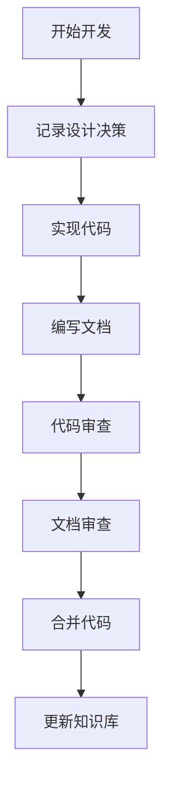
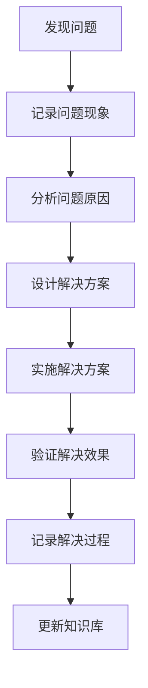

# 知识传承框架

**版本**: v1.0
**维护者**: AI Assistant
**最后更新**: 2025年1月17日

---

## 概述

本框架基于《测试宪法》第八章"文档即基石"的要求，建立系统化的知识传承机制，确保项目中的设计决策、架构权衡和业务逻辑背景能够被完整记录和传承。

## 核心原则

### 1. 知识即资产
- 项目中的知识是比代码更宝贵的资产
- 知识的丢失比代码的丢失更难以恢复
- 知识传承是项目长期健康发展的基础

### 2. 文档即契约
- 文档是团队之间的知识契约
- 文档必须与代码保持同步
- 文档质量直接影响项目质量

### 3. 传承即责任
- 每个开发者都有知识传承的责任
- 知识传承是开发流程的组成部分
- 知识传承的质量需要被评估和改进

## 知识分类体系

### 1. 设计决策知识

#### 1.1 技术选型决策
**记录内容**:
- 选择的技术/框架/库
- 选择的原因和背景
- 考虑过的替代方案
- 预期的收益和风险

**记录位置**: `docs/ADR.md`
**更新时机**: 技术选型时
**维护责任**: 技术负责人

**示例**:
```markdown
## ADR-005: 选择FastAPI作为Web框架

**状态**: 已接受
**日期**: 2025年1月17日
**决策者**: 技术团队
**影响范围**: 后端API服务

### 背景
需要选择一个Python Web框架来构建RESTful API...

### 决策
选择FastAPI作为主要的Web框架...

### 理由
1. 性能优秀，接近Node.js和Go的性能
2. 自动生成OpenAPI文档
3. 类型提示支持完善
4. 异步支持良好

### 替代方案
- Django: 功能全面但性能相对较低
- Flask: 轻量级但需要更多配置
- Tornado: 异步性能好但生态相对较小

### 后果
**正面影响**:
- 开发效率提升
- API文档自动生成
- 性能表现优秀

**负面影响**:
- 学习曲线相对陡峭
- 生态相对较新

**风险缓解**:
- 提供详细的开发指南
- 建立最佳实践文档
- 定期进行技术培训
```

#### 1.2 架构模式决策
**记录内容**:
- 选择的架构模式
- 架构设计的考虑因素
- 模块间的关系和依赖
- 扩展性和维护性考虑

**记录位置**: `docs/架构设计-*.md`
**更新时机**: 架构变更时
**维护责任**: 架构师

#### 1.3 业务规则决策
**记录内容**:
- 业务规则的具体内容
- 规则的业务背景和原因
- 规则的实现方式
- 规则的变更历史

**记录位置**: `docs/业务规则-*.md`
**更新时机**: 业务规则变更时
**维护责任**: 产品经理 + 技术负责人

### 2. 实现细节知识

#### 2.1 算法实现知识
**记录内容**:
- 算法的原理和步骤
- 算法的参数和配置
- 算法的性能特征
- 算法的优化历史

**记录位置**: 代码注释 + `docs/算法说明-*.md`
**更新时机**: 算法实现或优化时
**维护责任**: 算法开发者

**示例**:
```python
def calculate_quant_signal(self, market_data: pd.DataFrame) -> QuantSignal:
    """
    计算量化信号，基于市场数据异常检测。

    算法原理：
    1. 使用Z-Score方法检测价格异常
    2. 结合成交量变化进行信号确认
    3. 应用滑动窗口平滑处理
    4. 根据历史表现调整权重

    性能特征：
    - 时间复杂度: O(n log n)
    - 空间复杂度: O(n)
    - 适用于实时数据处理

    优化历史：
    - v1.0: 基础Z-Score实现
    - v1.1: 添加成交量确认机制
    - v1.2: 优化滑动窗口算法
    """
    # 实现细节...
```

#### 2.2 性能优化知识
**记录内容**:
- 性能瓶颈的识别过程
- 优化方案的设计思路
- 优化效果的量化数据
- 优化过程中的经验教训

**记录位置**: `docs/性能优化-*.md`
**更新时机**: 性能优化时
**维护责任**: 性能优化负责人

#### 2.3 问题解决知识
**记录内容**:
- 遇到的问题和现象
- 问题的排查过程
- 解决方案的设计
- 预防措施和监控

**记录位置**: `docs/问题解决-*.md`
**更新时机**: 问题解决后
**维护责任**: 问题解决者

### 3. 业务背景知识

#### 3.1 业务需求背景
**记录内容**:
- 业务需求的来源和背景
- 需求的价值和意义
- 需求的优先级和依赖
- 需求的变更历史

**记录位置**: `docs/需求分析-*.md`
**更新时机**: 需求变更时
**维护责任**: 产品经理

#### 3.2 用户场景知识
**记录内容**:
- 用户的使用场景
- 用户的操作流程
- 用户的痛点和需求
- 用户体验的改进

**记录位置**: `docs/用户场景-*.md`
**更新时机**: 用户反馈时
**维护责任**: 产品经理 + UX设计师

#### 3.3 数据知识
**记录内容**:
- 数据的来源和含义
- 数据的处理流程
- 数据的质量要求
- 数据的变更历史

**记录位置**: `docs/数据说明-*.md`
**更新时机**: 数据结构变更时
**维护责任**: 数据工程师

## 知识传承流程

### 1. 知识捕获流程

#### 1.1 开发过程中的知识捕获


#### 1.2 问题解决过程中的知识捕获


### 2. 知识验证流程

#### 2.1 文档质量检查
- 使用自动化工具检查文档质量
- 定期进行文档审查
- 确保文档与代码同步

#### 2.2 知识传承效果评估
- 新团队成员的学习效果
- 知识查找的效率
- 重复问题的减少

### 3. 知识维护流程

#### 3.1 定期审查
- 每月审查文档的时效性
- 每季度更新过时信息
- 每年进行知识库重构

#### 3.2 知识更新
- 及时更新变更的信息
- 保持文档的准确性
- 维护知识的一致性

## 知识传承工具

### 1. 文档管理工具

#### 1.1 文档生成工具
```bash
# 生成API文档
npm run docs:generate

# 生成架构图
npm run docs:diagram

# 生成变更日志
npm run docs:changelog
```

#### 1.2 文档质量检查工具
```bash
# 检查文档质量
npm run docs:check

# 检查链接有效性
npm run docs:check-links

# 检查格式一致性
npm run docs:check-format
```

### 2. 知识搜索工具

#### 2.1 全文搜索
- 支持Markdown文档的全文搜索
- 支持代码注释的搜索
- 支持跨文件的内容搜索

#### 2.2 语义搜索
- 基于内容的语义搜索
- 相关文档推荐
- 知识关联分析

### 3. 知识可视化工具

#### 3.1 架构图生成
- 自动生成系统架构图
- 模块依赖关系图
- 数据流图

#### 3.2 知识图谱
- 构建项目知识图谱
- 展示知识间的关联
- 支持知识导航

## 知识传承质量保证

### 1. 质量指标

#### 1.1 文档覆盖率
- 代码文档覆盖率 > 90%
- API文档覆盖率 > 95%
- 架构文档完整性 > 85%

#### 1.2 文档质量
- 文档可读性评分 > 8.0
- 链接有效性 > 95%
- 格式一致性 > 90%

#### 1.3 知识传承效果
- 新员工上手时间 < 2周
- 知识查找成功率 > 90%
- 重复问题减少率 > 50%

### 2. 质量检查流程

#### 2.1 自动化检查
```bash
# 每日自动检查
npm run docs:check:daily

# 每周深度检查
npm run docs:check:weekly

# 每月全面检查
npm run docs:check:monthly
```

#### 2.2 人工审查
- 代码审查时检查文档
- 定期进行文档审查
- 新员工培训时验证文档

### 3. 持续改进

#### 3.1 反馈收集
- 收集文档使用反馈
- 分析知识查找模式
- 识别知识缺口

#### 3.2 流程优化
- 优化知识捕获流程
- 改进文档模板
- 提升工具效率

## 知识传承最佳实践

### 1. 文档编写最佳实践

#### 1.1 内容组织
- 使用清晰的标题结构
- 提供目录和导航
- 保持内容的逻辑性

#### 1.2 语言表达
- 使用简洁明了的语言
- 避免过度技术化
- 提供具体的示例

#### 1.3 格式规范
- 遵循统一的格式标准
- 使用一致的术语
- 保持视觉的一致性

### 2. 知识分享最佳实践

#### 2.1 定期分享
- 每周技术分享会
- 每月架构回顾
- 每季度知识总结

#### 2.2 经验传承
- 记录项目经验教训
- 分享最佳实践
- 建立知识库

### 3. 团队协作最佳实践

#### 3.1 知识共享
- 鼓励知识分享
- 建立学习文化
- 支持持续学习

#### 3.2 知识传承
- 建立导师制度
- 组织技术培训
- 促进知识交流

## 知识传承评估

### 1. 评估指标

#### 1.1 定量指标
- 文档数量和质量
- 知识查找效率
- 问题解决时间
- 新员工培训效果

#### 1.2 定性指标
- 团队知识水平
- 文档使用满意度
- 知识传承效果
- 持续改进能力

### 2. 评估方法

#### 2.1 自动化评估
- 使用工具进行定量分析
- 定期生成评估报告
- 跟踪指标变化趋势

#### 2.2 人工评估
- 定期进行团队调研
- 收集用户反馈
- 分析改进机会

### 3. 改进措施

#### 3.1 短期改进
- 修复发现的问题
- 补充缺失的文档
- 优化现有流程

#### 3.2 长期改进
- 建立知识传承文化
- 完善工具和流程
- 提升团队能力

---

## 总结

知识传承框架是项目长期健康发展的重要保障。通过系统化的知识管理，我们可以：

1. **保护知识资产**: 确保重要的设计决策和实现细节不被丢失
2. **提升团队效率**: 减少重复学习和问题解决时间
3. **保证项目质量**: 通过文档驱动开发，提高代码质量
4. **促进持续改进**: 基于知识积累，不断优化项目

记住：**知识传承不是一次性工作，而是持续的过程。每个开发者都是知识传承的参与者和受益者。**

---

**维护说明**:
- 本框架与《测试宪法》第八章保持一致
- 定期审查和更新框架内容
- 根据项目实际情况调整流程
- 持续收集反馈并改进
